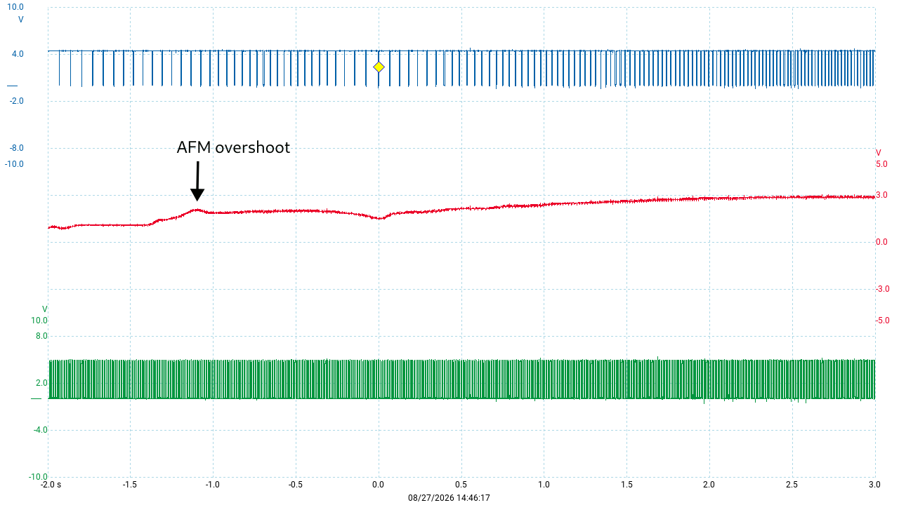
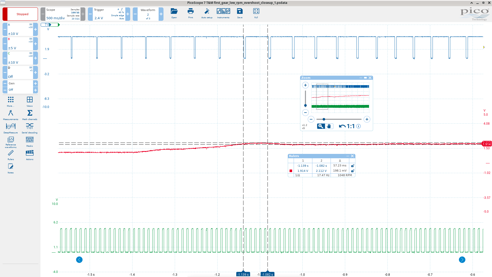
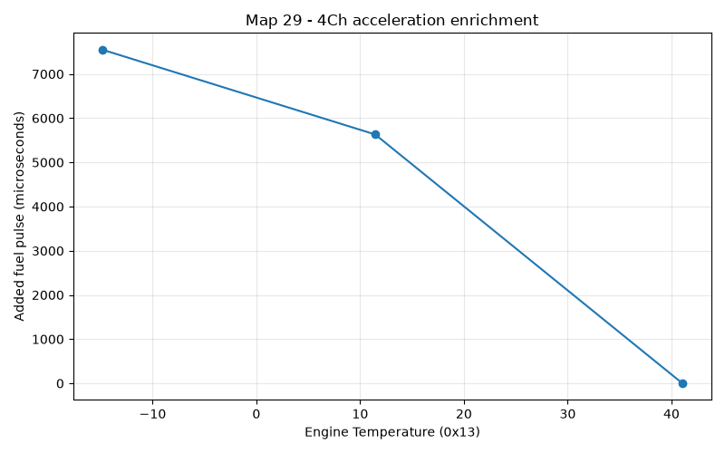
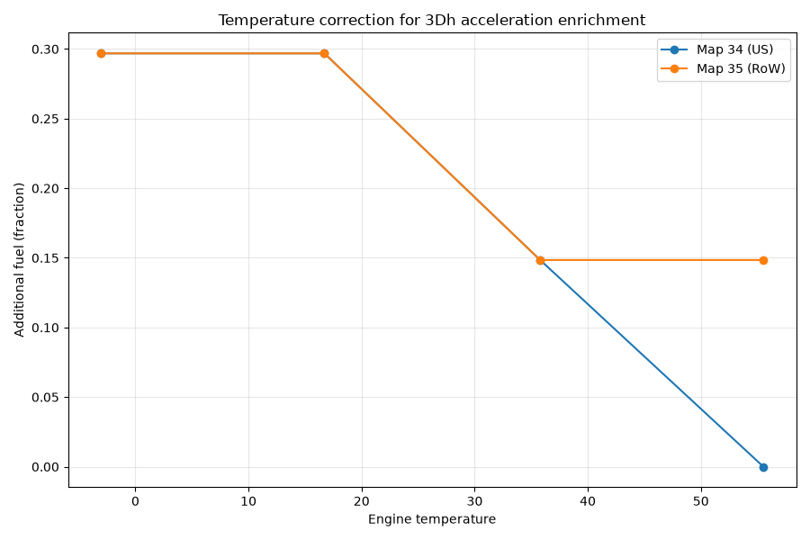
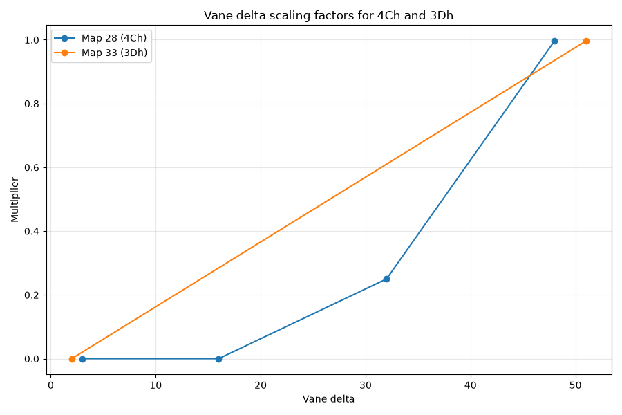

# Acceleration enrichment

The acceleration enrichment code is pretty simple - simple enough that understanding the context and what it's mean to achieve is the hardest part. So I'm including the code walkthrough and the high level explanation in one place for this one. 

## Why acceleration enrichment?
Before getting into the 944's acceleration enrichment, it's worth discussing what acceleration enrichment even is, and why its needed. This is a well documented topic, so I won't go into too much detail. And I should probably add that unlike most of what you read in these articles, I don't know this first hand. I'm basically summarizing what you can read elsewhere. But this is fairly well establshed, uncontroversial science. So here goes:

The fuel sprayed by the injectors doesn't all go directly into the cylinders. Some of it sticks to the walls of the intake, and can even condense and form a liquid pool. Obviously this means there's less fuel going into the cylinders than intended. But a portion of the pool evaporates, and this evaporated fuel *does* get injested by the cylinders. Eventually the pool grows to the point where the evaporation matches the fuel that's being added to the pool, which is exactly the amount that the cylinders were missing. So the AFR ends up being correct, and the pool is in equilibrium. 

Let's say we have 80% of the injected fuel going directly into the cylinders, 20% going into the pool, and the same 20% evaporating from the pool, and being consumed by the cylinders. Then imagine that the throttle is increased quickly. If the DME responds in proportion to the new airflow, then the cylinder will only get 80% of the increased fuel. The rest will go into making the pool bigger.  What we'd like to happen is that the evaoporation of the pool should also increase to make up the remainder - and this will happen eventually. But it doesn't happen immediately - in fact it's worse than that, because the evaporation of the pool actually *decreases* now, just when we need it to increase, because we increased the pressure in the manifold, slowing evaporation. In effect, the pool acts like a low-pass filter, damping down any attempt to suddenly increase fueling. 

So the engine will run lean for a brief moment, causing a stumble. Eventually, the pool will get bigger and evaporation will catch up, and the engine will return to a new steady-state with the correct AFR. But the fundamental problem is that the DME can only control a proportion of the fuel entering the cylinder. It can't control the evaporation from the pool directly. 

This problem is universal in port injected and carburettor engines. It's why carburettors have an accelerator pump. When you tip the throttle in, extra fuel is added, beyond what the airflow rate would suggest is needed. People call this "acceleration enrichment" - but it's really more about preventing that brief lean stumble. 

You might be accustomed to thinking of acceleration enrichment as the really rich AFR you see under high load, or under boost etc. But that's really there to keep temperatures under control, prevent knock, and make power. This enrichment is generally handled by the fuel maps. The fuel maps can't help us with this transient tip-in problem though, because they only take account of fairly steady-state conditions, and not the suddenness with which we *got* to that state. 

## How the 944 handles it
Now that we know why we need acceleration enrichment, we can get into how the 944 Motronic system handles it. There are actually three sources of enrichment:

1. the natural spike in airflow during throttle opening
2. software based low-rpm enrichment added during warmup
3. software based all-rpm enrichment (added during warmup only for O2/car equipped cars, otherwise present at all temperatures)

The first of these deserves some explanation even though it's not part of the software we're analyzing here. When the throttle setting is low, the pressure in the manifold is low. When the throttle is opened, airflow into the manifold accelerates quickly, and the pressure starts to increase quickly. At the same time, the cylinders start getting increased airflow due to the increasing manifold pressure. After a brief time, the manifold pressure will stabilize at a new steady pressure, but until this happens, the airflow through the AFM is significantly higher than the eventual new steady-state flow. This extra airflow is not all being consumed by the cylinders - it's raising the pressure of the manifold. You can think of the manifold as a kind of reservoir that has to be filled up to a new level. 

So, for a brief time, the AFM is signalling more airflow to the DME than the cylinders are actually consuming, causing the base fuel calculation to run rich. And that's exactly what we need!

To the best of my knowledge, the fact that this works well is basically luck. Considering it from first principles, there's no obvious reason why the amount of overshoot should match what we need. Obviously it's *directionally* correct - it creates enrichment at the right time. And it's at least *vaguely* proportional too - the more agressive the throttle increase, the bigger the overshoot in airflow we'd expect to see, which feels right. But will the overshoot be the *just* right size? There doesn't seem to be any pricinple that guarantees this. There's probably some tolerance here - as long as we get enough extra fuel, getting a bit more probably isn't a big deal. 

But another aspect of this solution that we shoudn't take for granted is: how long does this spike last? The load/base fuel pulse calculation is done in the timer routine that handles the idle stabilizer valve, during the low period of the ISV PWM signal. That means it runs at ~87Hz, or every ~11.5ms. At low rpm, that means that the base fueling is re-calculated multiple times between injection events (for instance at 1200rpm there's 50ms between injections, so up to 4 fuel calculations can happen). In fact we have to go above roughly 2600rpm to reach a point where only one fuel calculation can happen between injection events. So for this enrichment strategy to work, the AFM overshoot needs to last long enough that it can't practically be missed, and thus overwritten by a leaner calculation before it gets used. 

The code we're going to look at next does have the ability to help with these concerns, but apparently there is no real need for this on a fully warmed-up engine. 

Let's take a look at some real world data. This was captured while pulling away from a stop in first gear, at very low rpm. 

* Red is the raw AFM signal
* Blue is the fuel injector signal
* Green is the idle statbilizer valve (ISV) PWM signal



The reason that the ISV signal is relevant here is that the base fuel calculation happens during the same timer interrupt that controls the ISV, during the low period of the signal. So it provides some rough information on when the injector base pulse width is calculated, relative to the enrichment overshoot in the AFM signal. It's not precise because it's hard to say exactly when during the low period the calculation happens, but it's a useful hint. 

Zooming in to take some measurements, we can see a few interesting things:



I've positioned the AFM voltage cursors to measure the approximiate size of the overshoot, and the horizontal cursors roughly where the base fuel pulse calculation is happening for the two overlapping injection events. What does all this tell us? Well it clears up one thing: the overshoot clearly does last long enough to get picked up and factored into at least one fuel pulse calculation, even at low rpm. It only gets better at higher rpm, since there are more injection events in a given time. 

We can also get something from the magnititude of the overshoot. Here it's in the order of 190mv or so. That would be measured as ```255 * (0.19/5) ~= 10``` by the ADC. And we know that each such unit represents about a 1.9x increase in airflow (based on the curve fitting at the end of [this artcle on load calculation](dme_load_calculation.md)). Thus we can estimate the enrichment factor as ```1.019^10 ~= 1.2```. So this little bump could give us up to 20% enrichment for one injection, or a bit less than that for two successive injections. Of course one injection event provides only half the fuel for each cylinder due to the batch injection strategy, so we're probably looking at a ~10% enrichment here. This was light or moderate acceleration. If you give the throttle a good jab the overshoot can be quite a bit higher than this. 

Now that we have a good understanding of the basic enrichment strategy, let's look at a high level outline of how the software enhancements work. 

## Software based enrichments
Both of the software acceleration enrichments use a single measurement of vane speed. For this, the raw AFM signal (location 10h) is used, and it's rotated through a queue of 3 previous readings (not including the current reading). The current reading is compared with the last one in the queue. Since this code runs every 11.5ms (synchronized with the ISV) that means we're measuring the change in raw airflow roughly over a 35ms period. 

You might wonder why use the raw AFM signal, since this is the logarithm of the actual airflow. Wouldn't it make more sense to use the linearized measurement? Well it turns out the log measurement makes a lot more sense, because it represents a constant proportional change, regardless of airflow. That is, if we measure a change in vane position of say 16 units, then we know from ```1.019^16 ~=1.35``` that this represents a 35% increase in airflow *regardless* of the current baseline airflow. 

Both of our enrichment types use this proportional change in airflow as a scaling factor, which gets combined with a temperature map value. But that's more or less where the similarity ends. 

There are some minor differences but the really big one is what the final calculation represents. In the all-rpm enrichment (ultimately stored in 3Dh), it's unsurpisingly a fractional multiplier, just like the warmup and other enrichments discussed [here](dme_fuel_enrichments_overview.md). But the low-rpm enrichment (4Ch) is just *added* to the fuel pulse in the real time code, just before the injector is turned on. It's scaled by a constant (64), but the value of the current main fuel pulse plays no role. In this regard it's a lot like a carburettor "pump shot" - it represents a bigger proportional increase at low load/rpm conditions. 

Some other differneces in the two enrichment strategies:

* the all-rpm 3Dh version uses a load/rpm map for scaling in addition to the vane-delta and temperature maps
* both have mechanisms for ensuring that the enriched fuel pulse won't get overwritten before it's used, but they're different:
  * the 3D version is based around the [software counters](dme_software_timers.md), so it gets phased out over time, but new calculations can replace 3D if they are larger, extending the duration
  * the 4Ch (low-rpm) version is never integrated into the main fuel pulse. Instead a latch flag is used (21h.7) to ensure that 4C gets added to the final fuel pulse just before the injectors fire, but only once. Once this is done the flag is cleared and 4C gets calulated again from scratch. 
* the 4Ch version is only active above a vane-delta value of 16, that is ~35% increase in airflow within the last 35ms. 
* while both use temperature based maps that phase out the enrichment with increasing temperature, the all-rpm 3Dh version remains active for non O2/cat equipped cars at all temperatures. 

Let's take a look at some graphs of the key maps before we dive into the code. Firstly, here's the temperature based map for the low-rpm correction:



This is based on the raw map values, scaled by 128, since 4C gets multiplied by 64 before being added to the raw fuel timer count, and the timer ticksare 2us. These might look like insanely big adjustments, considering that at warm idle, the typical fuel pulse width is in the order of 2000s. But the really big values are only for very low temperatures, and even more importantly, this correction is tempered agressively by the vane-delta map which we'll see presently. 

Now here's the all-rpm (3Dh) temperature based enrichment, for US and RoW cars:



These values are proportional increases, so 0.30 means *add 30%*. Note that this value is phased out completely by around 55C for US (meaning O2 sensor equipped cars), but levels off around 35C for RoW cars. 

As I mentioned, each of these temperature based maps are reduced by the scaling factors in the vane-delta maps. Here are the 4Ch and 3Dh vane-delta maps overlayed:



Recall from earlier that each unit of the input value here represents around a 1.9% increase in airflow, so the maximum scale of 1 for these maps only happens at around a 2.5x increase in airflow, and this needs to happen within 35ms. 

## The code
The routine is located at 1F8E. The first part applies to both types of enrichment:

```
X1f8e:	
	jb	23h.2,X1fe1
	jb	23h.0,X1fe1
	clr	c
	mov	a,10h
	subb	a,53h
	jc	X1fe1
	mov	r3,a
	mov	a,#37h		; 37h = engine speed (teeth per 1/87.6th sec)
	movc	a,@a+dptr	; look up some map value for engine speed?
	clr	c
	subb	a,37h
	jnc	X1faa
	mov	b,#0
	ajmp	X1fb7
```

If the engine is cranking or at idle, we jump away to 1FE1 which just pushes the AFM vane measurement through the queue, applies the existing 3Dh value to the fuel calculation, and returns.

The locations 51, 52, 53 form the queue of previous raw AFM wiper values. 

Next we have the following logic:

```
If 10h (AFM raw value) < 53h (#3 in the queue), i.e. airflow is DECREASING:
	jump to 1FE1 (same bailout location as idle/cranking condition)
	
r3 = airflow delta
Look up 1160+37=1197=3E (62)
if rpm <= 62*40 (i.e. 2480rpm):
	jump to 1FAA
else:
	b = 0
	jump to 1FB7
	
```

Let's follow the branch for the low rpm (4Ch) part first:

```
X1faa:	
	mov	r2,#1ch ; Map 28, input is airflow delta based on r3
	lcall	X051d
	mov	b,a
	acall	X1ff2 ; select alternate
	lcall	X051d ; Map 29, 13h based, zero above 41C for US and RoW
	mul	ab
X1fb7:	
	jb	21h.7,X1fbd
	mov	4ch,b
```

This is about as simple as it gets: look up Map 28 (or alternate based on region coding), look up Map 29, multiply them and put the high byte in 4Ch *if* there wasn't already a pending enrichment in 4Ch (that's what 21h.7 signifies). 

In order for 4Ch to get used later, 21h.7 must be set, and that happens in the next section. The strange thing here is that we only set this latch flag 21h.7 after looking up Map 33, which is the vane-delta map for the all-rpm correction, 3Dh. But the minimum vane-delta value that returns a non-zero value from Map 28 is 16, so in the low-rpm path, Map 33 cannot return zero, so the Map 33 value gets stored in b, and 4Ch gets checked for zero, and if it's not zero, then finally 21h.7 gets set:

```
X1fb7:	
	jb	21h.7,X1fbd
	mov	4ch,b
X1fbd:	
	mov	r2,#21h ; Map 33, rpm delta based on r3
	lcall	X051d
	jz	X1fe1 ; bail out (same exit point as idle/cranking etc.)
	mov	b,a
	mov	a,4ch
	jz	X1fcc
	setb	21h.7
```

Now the above code overlaps a little with the all-rpm path, where we would have jumped from the first section to 1FB7 with b=0. So let's run through that logic again, this time assuming rpm>2480, and so b=0. Clearly we can't overwrite a pending 4Ch correction. (Bear in mind, it might be pending because we might be running this whole routine multiple times between injection events, and 21h.7 only gets cleared when the injectors fire). 

But suppose 21h.7 is clear, then there's still a value in 4Ch but it has been used once. Now we're above 2480 rpm, so the 1FB7 section will zero out 4Ch. 

As a result we'll skip setting 21h.7 this time, and move on to 1FCC, where we apply the other two maps in the 3Dh correction:

* Map 34 (temperature)
* Map 38 (rpm/load)

If anything about how these maps work is unclear, just read [the stuff on fractional values](dme_fuel_encrichments_code_walkthrough) in the fuel enrichments article. 

```
X1fcc:	
	acall	X1ff2 ; alternate map selection
	lcall	X051d ; Map 34 (13h, zero above 55C for US map, for RoW 55C->19)
	mul	ab ; b contains Map 33 value from earler, based on airflow delta in r3
	mov	r2,#26h ; Map 38, rpm/load, fractions /256
	lcall	X051d
	mul	ab
	mov	a,b
	cjne	a,3dh,X1fdd ; 
X1fdd:	
	jc	X1fe1
	mov	3dh,a ; 3Dh = max(a, 3Dh)
```

This last line ensures that 3Dh can only be overwritten with higher values. The only way 3Dh gets reduced is by the [counter](dme_software_timers.md).

The final section pushes the AFM value through the queue, integrates 3Dh into the current fuel correction (via 1DE7, explained in the __fractional values__ section I linked above), and then continues on with the rest of the fuel stuff, covered elsewhere:
```
X1fe1:	
	mov	53h,52h
	mov	52h,51h
	mov	51h,rb2r0 ; 10h (current airflow signal). So we're comparing current with 3 measurements ago, or 11.5*3 ~=35ms ago. 
	mov	a,3dh
	lcall	X1de7
	ljmp	X040d		; post-load routine
```

## Maps

### Map 28 - low rpm vane-delta - 4Ch
Address: 15DB

| 0x03 | Value |
|---|---|
| 3 | 0 |
| 16 | 0 |
| 32 | 64 |
| 48 | 255 |

### Map 29 - low rpm temperature - 4Ch
Address: 15D3

| Engine Temperature (0x13) | Value |
|---|---|
| -14.87 | 59 |
| 11.45 | 44 |
| 41.05 | 0 |

### Map 33 - all rpm vane-delta - 3Dh
Address: 15AC

| 0x03 | Value |
|---|---|
| 2 | 0 |
| 51 | 255 |

### Map 34 - all rpm temperature - 3Dh

* US (cat/o2 equipped cars):
Address: 15B2

| Engine Temperature (0x13) | Value |
|---|---|
| -3.03 | 38 |
| 16.71 | 38 |
| 35.79 | 19 |
| 55.53 | 0 |

* RoW cars:
Address: 18D0

| Engine Temperature (0x13) | Value |
|---|---|
| -3.03 | 38 |
| 16.71 | 38 |
| 35.79 | 19 |
| 55.53 | 19 |

### Map 38 - all rpm rpm/load - 3Dh
Address: 15BC

| Engine RPM (0x37) \ Load (0x49) | 40 | 70 | 100 | 130 |
|---|---|---|---|---|
| 1000 | 255 | 255 | 255 | 205 |
| 2000 | 255 | 255 | 255 | 205 |
| 3000 | 255 | 255 | 205 | 179 |
