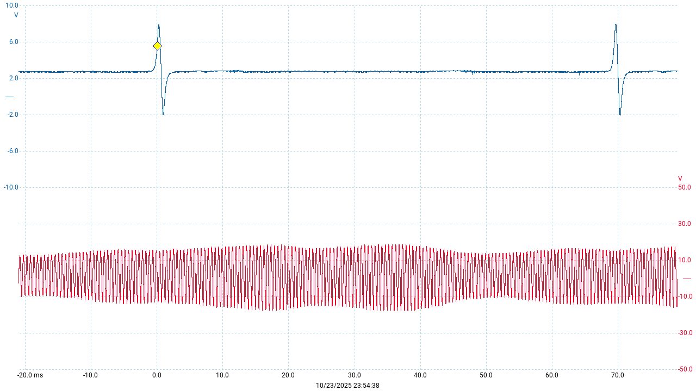
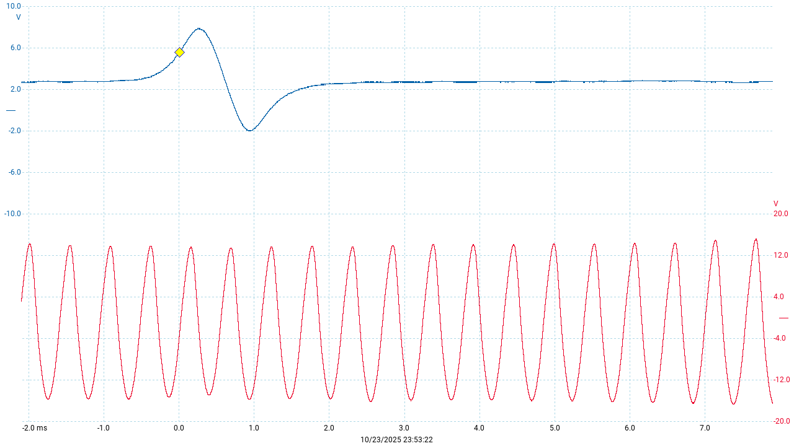
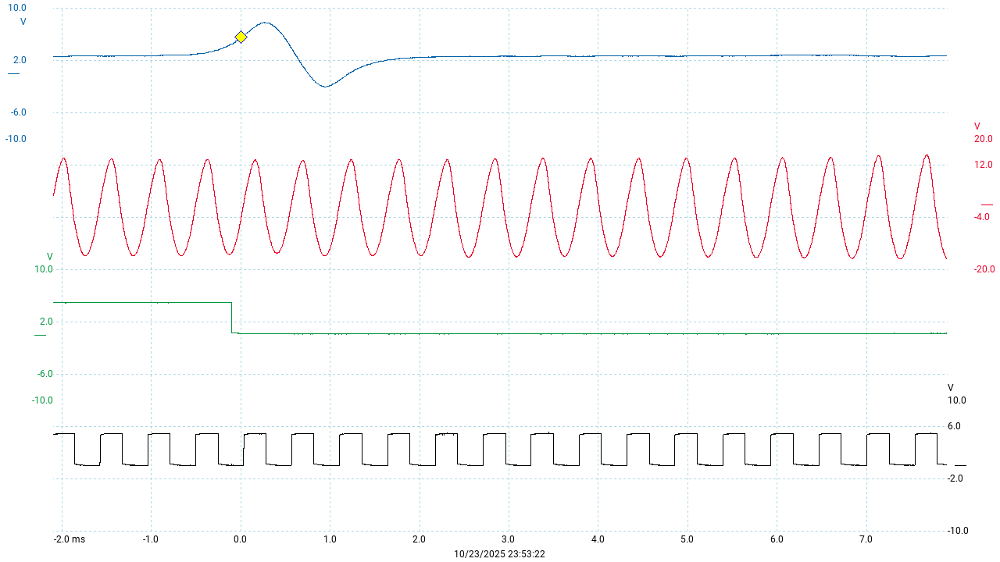
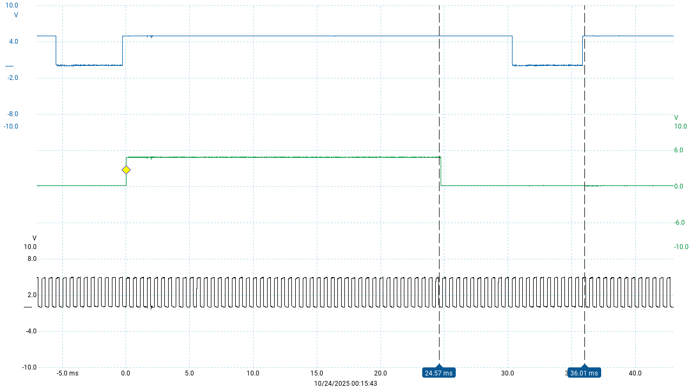
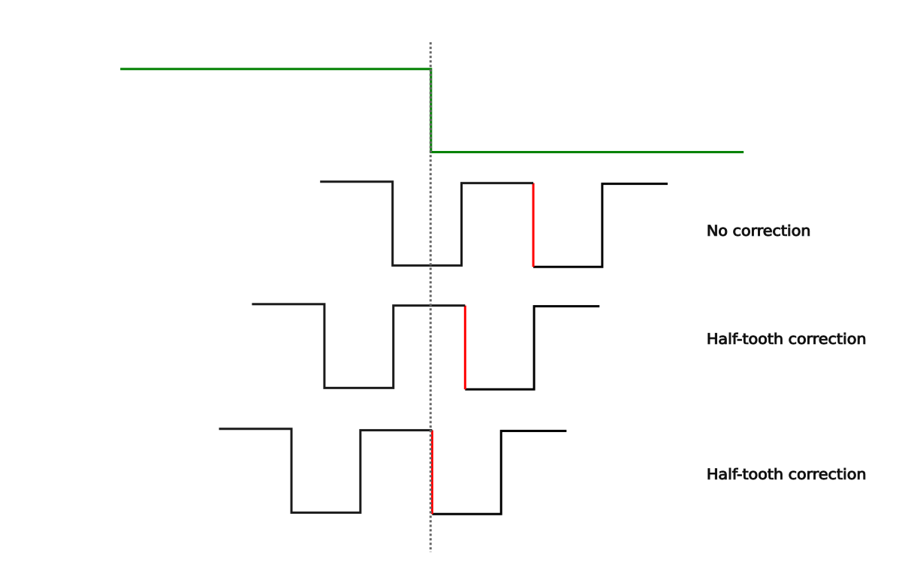
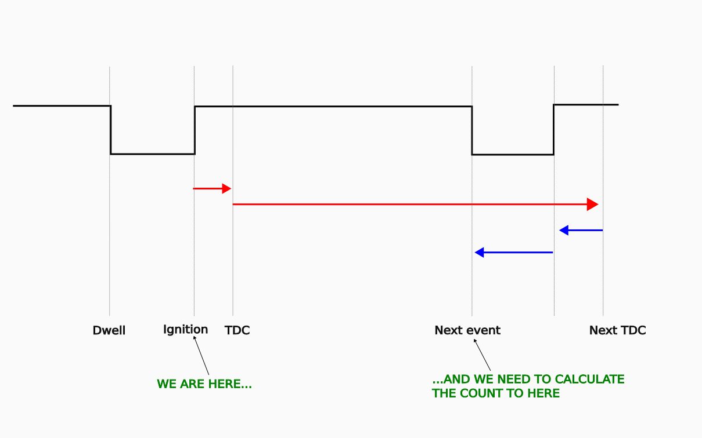
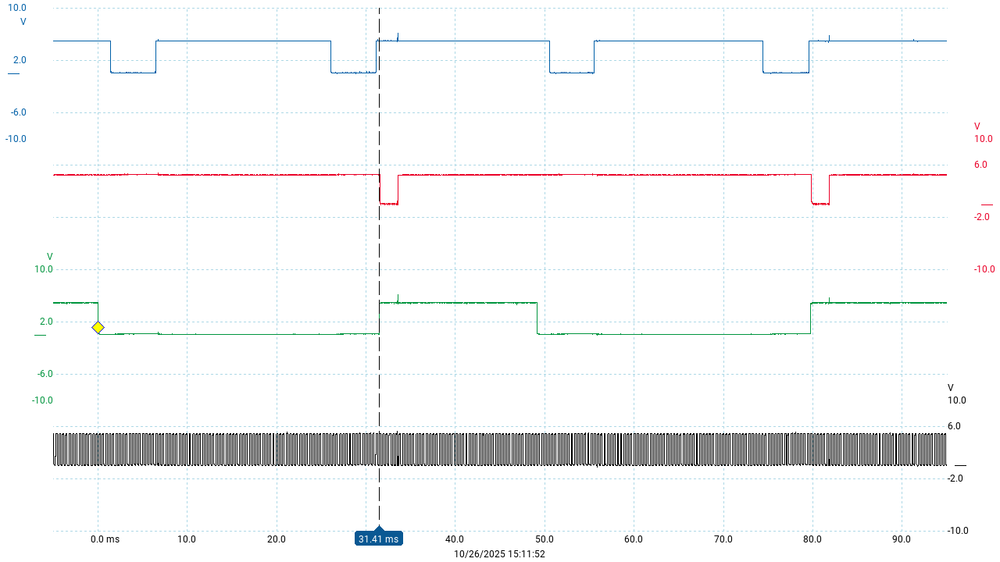
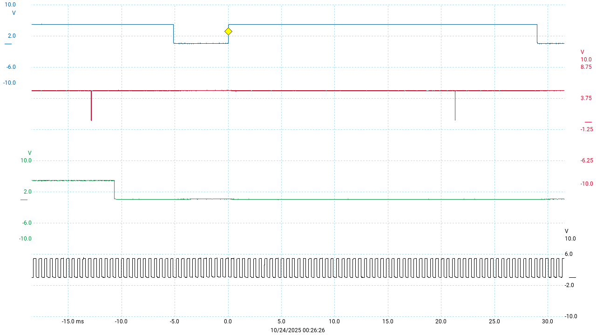

# DME crakshaft sensors

Now we'll take a close look at the crankshaft sensors, the signals they produce, and what these signals are for. We'll discuss what the DME program does with them in simple terms but we won't look directly at any code just yet. There are plenty of concepts to get used to before the code can be understood clearly. 

## Signal processing

In order to create the spark and inject the fuel at just the right time, the DME needs to know the position of the crankshaft with a fair degree of accuracy (ideally to within a couple of degrees at worst). We usually measure this relative to top-dead-centre (TDC) for the cylinder that's about to fire next. Most interesting things happen *before* TDC, so we will use the acronym __BTDC__ to mean "before TDC".  

On the 944, this measurement is done using two crankshaft sensors, which are commonly called the *speed sensor* and the *reference sensor* in Porsche 944 documentation. These are a pair of VR (variable reluctance) sensors installed in the clutch bellhousing so that they point at the flywheel. 

The term *speed sensor* is something of a misnomer. While it is used to measure engine speed, it's fundementally an angle sensor. This sensor produces a pulse every time a flywheel tooth passes the tip of the sensor. So by counting these pulses, we can measure angles relative to a known reference point. Both signals are routed to the 8051's external interrupt pins. 

But *what* known reference point? That's where the aptly-named reference sensor comes in. This sensor is triggered by a magnetic screw in the flywheel located at 58.64 degrees BTDC for cylinder 1. It produces just one pulse per revolution at exactly this angle. So if we have an angle we'd like to measure (represented as a number of flywheel teeth) then we can wait for the refereence sensor pulse to occur, and then simply count the number of speed sensor pulses until we have reached our target number. Now we know we are __58.64 degrees minus target angle__ away from TDC for cylinder 1. 

That's the basic idea. Now let's see what these VR sensor signals actually look like on an oscilloscope:




Here the reference sensor is shown in blue and the speed sensor in red. There's quite a bit of variation in the speed sensor strength, but there's no real significance to that. 

We can zoom in a little to get a clearer picture:



Of course these need to be digitized so that they can be processed by the 8051 microcontroller. This process deserves some explanation. As you can see the pulses are somewhat spread out horizontally. They ramp and down up smoothly. Where exactly is the point that the screw (or tooth in the case of the speed sensor) is directly in front of the sensor? This is particulatly important in the case of the ref sensor because we need to know when the crankshaft is at some exact angle BTDC. 

You might guess that the point where the pulse crosses zero volts on the way down is the exact moment that the object being sensed is closest to the sensor, and you'd be right. 

So ideally we want a circuit that produces a clear digital pulse every time the raw sensor signal crosses the zero-volt line. The type of circuit that does that is called a zero-cross detector. See the [MAX9924 series](https://www.analog.com/media/en/technical-documentation/data-sheets/MAX9924-MAX9927.pdf) for some great info on these. 

For some reason (possibly due to signal noise concerns) the DME's circuitry does something a little different. It uses an *adaptive peak threshold*, which triggers the digital pulse when the raw signal reaches around 40% of it's peak. How does it know how high the peak will be if it hasn't happened yet? It uses the value of the previous peak (or maybe an average of a few previous peaks). 

The result of this is that the digital pulse appears before the sensor is perfectly lined up, so there is an offset between the pulse and the zero crossing point. But because the ramp-up of the raw signal is very close to a straight line, the offset comes out to a pretty much constant angle of around 1.35 flywheel teeth, or 3.7 degrees. But because the 8051 generally just counts falling edges, we should be concerned with what this offset amounts to in those terms. 

Here's a scope capture of the raw signals next to their digitized counterparts





Here, the green trace is the digitized ref sensor and the black trace is the digitized speed sensor.

The device that does this digitization is a custom Bosch chip (known as S100 on the DME's PCB) and there isn't much information about it. What we know is that it takes 2 differential VR signals as inputs, and produces digital outputs. The reference sensor's digital latches, and needs to be reset every revolution by a pulse to the S100's pin 11. 

Note that the digitized reference sensor signal is pulled __low__ when the raw signal meets the threshold on the way *up*. The S100 actually pulls the output high for this event, but the signal is then inverted via one of the NOR gates of a 74LS02 (S705) before reaching the 8051. The speed sensor output pulses are not inverted. 

It can be pretty confusing to remember the polarity of these signals when reading the code. Here's a quick summary:

* the 8051's interrupts can only trigger on a falling edge
* The reference sensor trigger pulse is a falling edge that triggers INT0
* Most of the speed sensor pulse counting is done with the falling edge that triggers INT1
* Thus the interupt edge flag __ie1__ being *set* corresponds to INT1 being *low*
* The 8051 can read the state of these INT0/INT1 signals directly to check for rising edges

The 951 flywheel gear has 132 teeth, so each tooth is 360/132 = 2.72727... degrees. Since the S100 chip produces pulses for both edges of the tooth, the software can count these edges separately and thus measure angles to within 1.36363... degrees. This is the maximum precision that the DME is capable of. 

From here on, we can mostly ignore the raw analog signals and explore everything using the digitized versions. For example here's a scope trace of the ignition signal (in blue) along with the ref and speed sensor pulses - when the blue pulse goes low, the coil is turned on and the dwell period begins. When it goes high, coil current is stopped and the spark fires. 



Most of this discussion is centered on counting the tooth edges (black pulses) between the falling edge of the ref sensor pulse (green) and the falling and rising edges of the ignition signal. 

## Half-tooth errors and corrections

Because only the falling edges trigger the interrupt, it's much simpler for the program to count only falling edges, most of the time. So in general, when the counter variable is being prepared to measure some angle, it's loaded with the required angle in *whole* teeth. This is done by dividing the half-tooth count value by two. Of course if the half-tooth count was an odd number, we would lose the remainder. To deal with this, the remainder is stored separately and applied at the end of the count if necessary. This remainder represents a half-tooth, so the way it's applied is simply by delaying the ignition event for one more edge. 

When it's time to fire the ignition event, the general rule is that the program waits for the next rising edge, by polling the state of INT1. Thus the default behavior is to always add one half-tooth to the count. 

If if a half-tooth correction is required, the program waits for an extra falling edge. 

Now, looking at the signal traces above, you might notice that the reference sensor pulse is asserted roughly in the middle of the low period of the speed sensor - that is, halfway between two flywheel teeth. That's a consequence of the way that the ring gear bolts to the flywheel in the 951. But the Motronic program doesn't assume this particular phase relationship. It actually checks the state of the speed sensor signal at the moment the ref sensor asserts. If it looks like it does in my image, then all is well. But if the speed sensor pulse was already high at this moment, that means that the first falling edge that will be counted will be up to half a tooth earlier. If this situation occurs, then the program compensates with *another* half-tooth correction, similar to the division rounding error we just noted above. 

Here's a diagram illustrating the normal situation and a couple of other theoretical possiblities, and what correction is needed (if any) for each:





As with the traces shown earlier, the ref sensor pulse is shown here in green. The first falling edge after the ref sensor pulse in each case is highlighted in red. The first example is the normal situation; the second and third examples show how the first falling edge will be counted sooner than normal. 

As you can see, there's no guarantee that the phase error is exactly one half-tooth. But one half-tooth is the best we can do, and at 1.36363... degrees it's good enough. 

To the best of my knowledge, the second and third situations shown here can't actually occur on the 951 because the ring gear only bolts to the flywheel one way. See [this discussion on Carpokes for more detail on that](https://www.carpokes.com/viewtopic.php?t=4521). But, there are various plausible reasons why the Bosch programmers might have written the code to handle this:

* we might be wrong about the ring gear
* it might be different on the 944 non-turbo (NA) which has 130 teeth
* the Motronic system was used on other cars besides the Porsche 944, where maybe this situation can occur (some cars have a press-fit ring gear)
* it might be just been classic *defensive programming*, on principle

The truth could be one, or several, or none of these reasons - all we know for sure is that the code *does* handle this situation, and some parts of it would be tricky to understand if you didn't know about this!

In order to keep the half-tooth correction logic simple, these two sources of half-tooth error are always consolidated when the counter value is prepared. The logic is simple:

* if exactly one half-tooth correction is required (regardless of which source) then set a flag that will cause the correction to happen at the end of the count. 
* if *two* half-tooth corrections are needed, then __clear__ the flag and __add one__ whole tooth to the count
* if no corrections are needed then the flag is cleared and the count left as-is

This consolidation logic happens in the ref sensor interrupt handler. 

## Handling two cylinders per rotation

As we have seen, the reference sensor provides a critical sychronization pulse for every engine rotation. But two cylinders fire in every rotation, so we have to be able to calculate the timing for the second event without the benefit of a reference sensor pulse. 

The calculations to do this are not very complicated, but they can be hard to vizualize because of the way they overlap from one ignition event to the next. 

The best way to think about it is to assume that when the spark fires, we already have a next-TDC tooth count stored in a variable. Don't worry about where it came from just yet!

Now given that we have this next-TDC value, we can figure out when the next dwell period should begin with the simple expression

```
next_dwell = next_TDC - (next spark advance + next dwell duration)
```

Immediately after we do this calculation, we calculate the next-TDC value again for future use. The key to understanding this is that the next-TDC is always *current advance + 180 degrees* away; but the spark advance and dwell values that we will eventually subtract from that might be different from the ones we have now. So we calculate next-TDC, but then leave the *use* of this next-TDC value until the next cycle. In online discussions people will often say things like "the next ignition event is 180 degrees away" - that is *roughly* true, and good enough for casual discussions, but to be precse, it will vary from 180 as the ignition timing varies from one cycle to the next! 

Here's a diagram that might help to visualize what's going on with these calculations. In this diagram, the red arrows pointing to the right indicate addition and the blue arrows pointing left indicate subtraction:




Now, the program does this next-TDC business for every ignition event, not just the second one after the ref sensor pulse. As we just saw, the counter for the next ignition event is therefore based on the number of teeth between a given ignition event and the start of the next dwell period. 

But the ref sensor interrupt handler obviously must use a counter that's based on the refer sensor's location BTDC, which is totally different. This might seem like a contradiction. In fact, after every spark the program calculates two counter values for the next event: the next-TDC based count, and the ref sensor based count. When the ref sensor pulse happens, the ref sensor based count is swapped in. If the ref sensor pulse doens't happen before the next ignition event needs to happen, then the next-TDC based count will be used by default. 

Thus the next-TDC based calculation is really only needed for the second cylinder in the rotation, and is redundant for the first. But if the ref sensor pulse never arrives for some reason, the program will fall back to the next-TDC based count - so the engine will keep running without skipping a beat. 

You can try this if you like - start the engine and unplug the ref sensor. The engine will keep running and you can go for a drive without any problems. But if you stop the engine, you won't be able to start it again until you reconnect the sensor. 


## Other angle-based signals

The ignition events are the most complicated uses of the crank sensor signals, but there are other critical things that need to happen at very specific angles:

* fuel injection
* KLR trigger

The fuel injection pulse is always started just after the spark is fired for the second cylinder. The procedure is basically

* load timer0 with the fuel pulse duration
* turn on the injectors
* enable timer0 interrupt and start timer0
* return from the speed sensor interrupt
* the timer0 interrupt will turn the injectors off

Here's the injection pulse (shown in red) along with the ignition (blue) and the now-familiar crank sensor pulses:





Something that's clear in this image, that we haven't covered is the fact that the reference sensor signal remains low after being triggered by the actual sensor, and only gets reset to it's high state around the time the injectors fire. This latching behavior is built into the custom S100 chip, and the reset is achieved by the software via one of the 8051's output pins. It's not clear what purpose this serves since the state of the INT0 pin is never read directly. 

The KLR needs a pulse at a specific angle BTDC to prepare it for the upcoming ignition event. This is known as the trigger pulse. Inside the KLR, this signal actually resets the MCS48 microcontroller so that the KLR program starts from scratch for every ignition event. 

The KLR trigger signal is handled by the speed sensor interrupt handler and is always 4 teeth (11 degrees) before the reference sensor pulse. This corresponds to around 70 degrees BTDC. 

Here's a trace of the KLR trigger signal (red) along with the ignition (blue) and the others:




The KLR trigger pulses are brief but clear enough in the picture. 

## Summary

Now you should have a pretty good overview of the the way that the DME program measures angles and produces the all-important output signals. Of course, we didn't look at any code. That will come next. But it should be much easier to read the code with the images you've seen here in your head. 

Here's the [code walkthrough](ignition_timing_code.md) for the ignition signal generation. 
