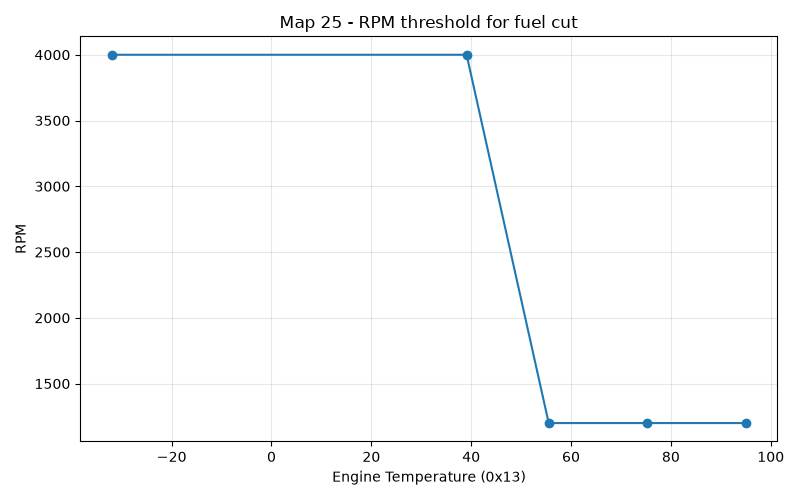
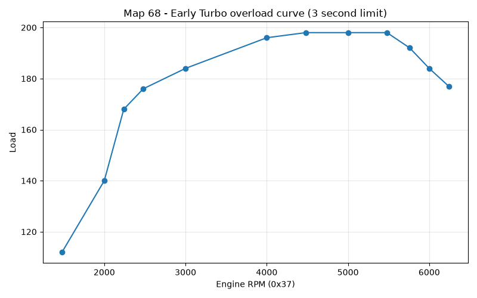
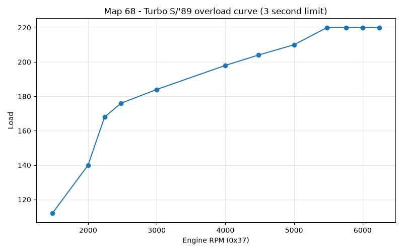

# DME fuel cut (coasting and overboost)

There are three situations where the fuel needs to be cut off completely. One of them is when we hit the rev limit (6480 rpm), and that one is handled by the post ignition routine, just before fuel injection is activated. The other two cases are

* coasting, aka decelleration fuel cut off or DFCO
* overload protection

The routine we'll look at here is responsible for triggering the fuel cutoff and reactivating it, but also for controlling how ignition timng is allowed to change from its current value. 

To elaborate on the timing issue a little: just before this routine, we do the [main timing calculation based on map lookups](dme_ignition_timing_calculation_overview). From that routine, we jump here without actually assigning the newly calculated timing value. That's because the conditions around fuel cut and reactivation affect how timing can change. 

Very briefly, when a new timing value is calculated, it represents a target value. The current value is never allowed to simply jump to the new target value. In fact progress towards the new value is throttled by a series of flags so that we have __1x_, __8x__, __16x__ and __64x__ speeds. 

The [post ignition routine code](dme_post_ignition_code_walkthrough.md) article shows the implementation of this timing speed control, but doesn't show the rules that control the relevant speeds. We'll see those rules here. But they are sometimes complicated rules. The code walkthrough for this section will show the details; here we'll just point out the highlights. 

We'll look at the two fuel cut cases separately next. 

## Coasting
When you close the throttle, and the rpm is high enough, fuel gets cut off until rpm returns to the idle range or you open the throttle again. 

What does "rpm high enough" mean? There are two thresholds, one for cutting fuel and a lower one for reactivating it. 

The reactivation threshold comes from this temperature based map, Map 25:

The actual cutoff threshold is just the reactivation threshold plus 360rpm. This +360 is controlled by the constant 9 at 1192h. 

So on a fully warmed up car, fuel will be cut off if you close the throttle above 1560rpm, and turned on again when you drop to 1200. The idle stabilizer also detects this condition and slows the rpm drop to make the transition smooth. 

However, fuel is never just cut *immediately* when these conditions are reached. Instead the DME waits for the timing to stabilize. The part throttle timing will usually be higher (more advance) than the idle map for the same rpm, so typically timing is reduced during this stabilization period. This might be intended to keep the transition smooth (for example see [1] below). 

During this time, timing changes are allowed to change at up to 16x normal speed (via flag 22h.5)

Similarly, timing controls are exercised when fuel is reactivated,whether by the rpm returning below the threshold, or the throttle being reopened. 

In either of these cases, the 8x speed is allowed for increasing timing (22h.6). 

## Overload protection
The 944 Turbo DME doesn't know about boost directly, so it can't directly detect an overboost condition the way the KLR can. But it does have a load safety curve that serves as a proxy for overboost. 

This condition is checked just after the timing calculation. 

The map the implements this curve uses rpm as input and load as output. 

Here's the load vs rpm curve for the early Turbos

And here's the equivalent for the '89+ model, and Turbo S:

To trigger overload protection, the actual calculated load must be above this curve for at least 3 seconds. 

Once triggered, fuel is cut immediately, and stays off until the load falls below this curve minus 50 units. It's hard to give a meaningful explanation of what unit of load correspond to, but this should correspond to about 75% of the peak of the safety curve. 

Once this "overboost jail" is entered, the car remains stuck in it for 60 seconds. Any time load goes above this new, lower limit, fuel is immediately cut again. After that the overboost flag is cleared and the minus 50 rule is removed. 

## [1] footnote

See https://forums.linkecu.com/topic/8932-overrun-fuel-cut-and-ignition-retard/:

*" 1. my overrun fuel cut settings shows torque reduction is 0.52s and ignition retard is 0. The help file says : 

Ignition Retard

To help smooth the transition as the fuel cut turns on and off, the ECU will progressively retard the ignition timing prior to cutting fuel.  The ignition timing will then be progressively advanced back to normal after the fuel has been restored. Changing the Ignition Retard adjusts the full amount of ignition retard the ECU will use. The amount of time taken to introduce and remove the ignition retard is controlled by the Torque Reduction/Introduction Time setting. "*

