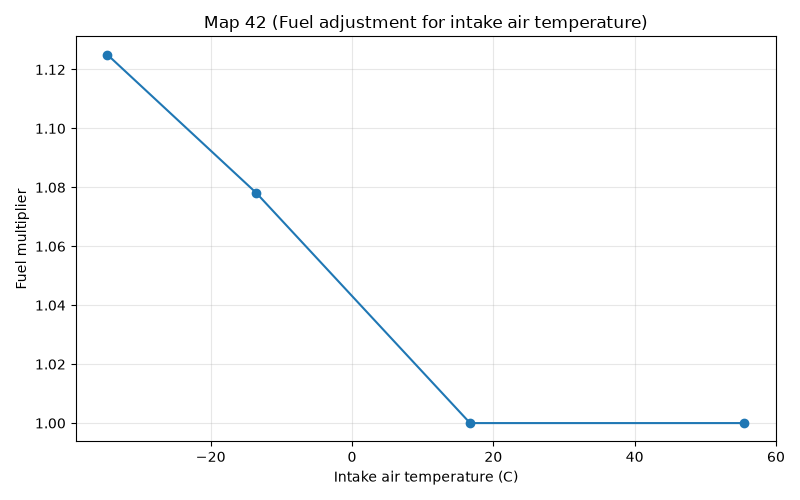
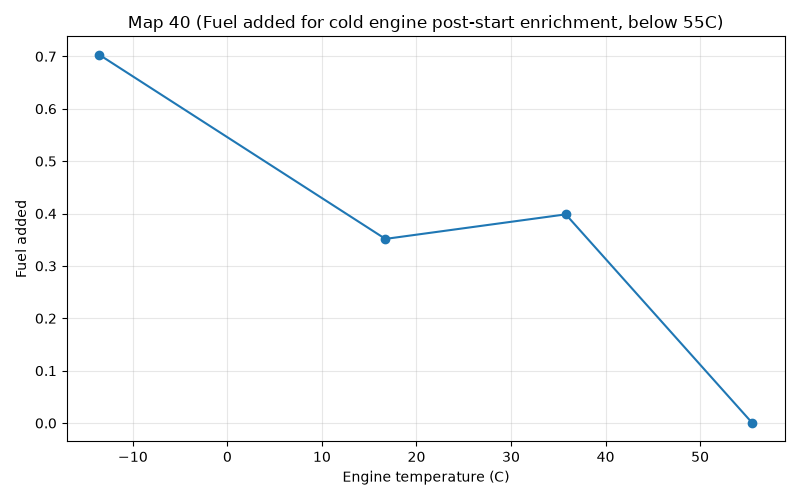
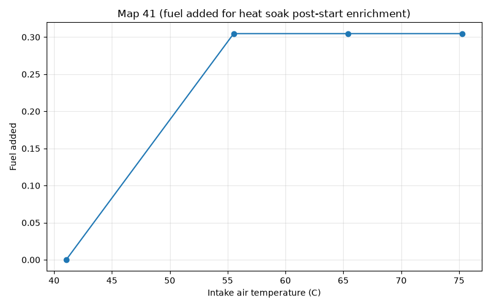
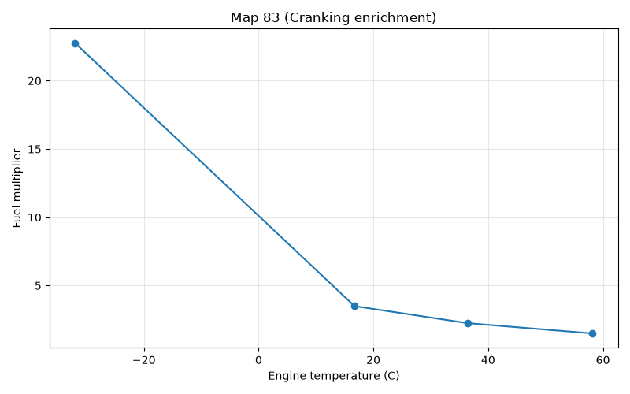
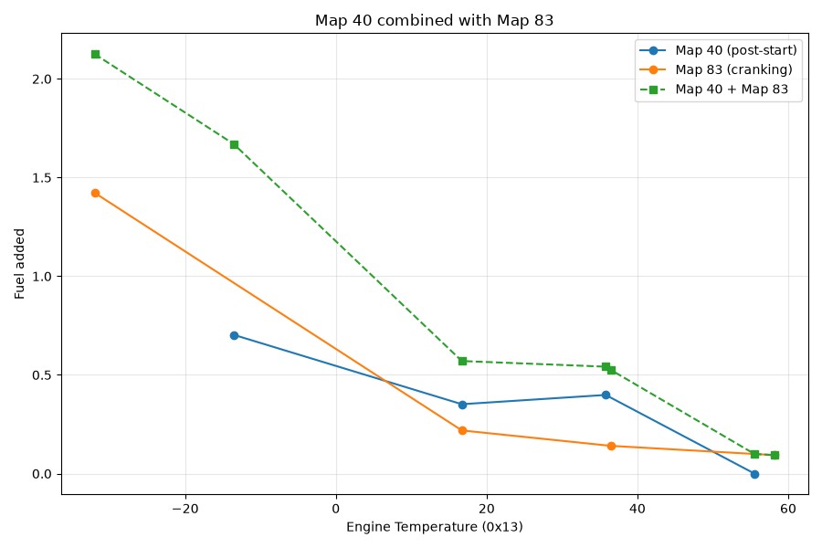
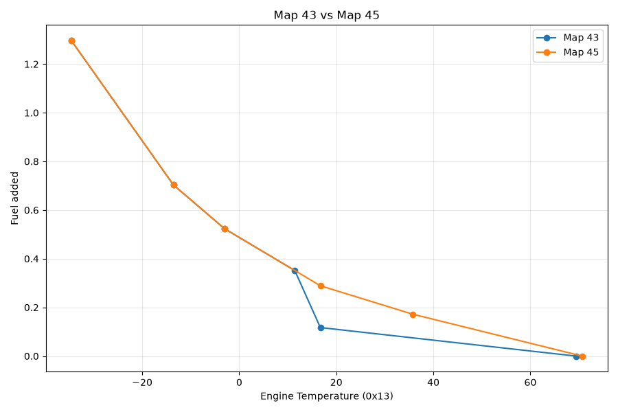
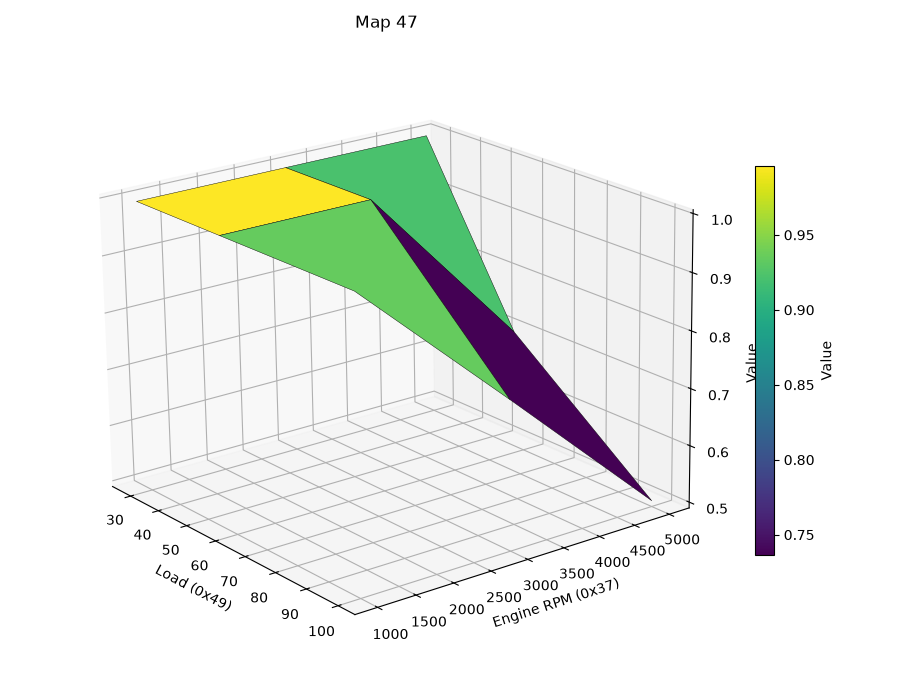

# DME fuel enrichments

This article covers various fuel enrichments performed in the 944 DME. This is a high level overview - for more detail on the code, see the [detailed code walkthrough](dme_fuel_enrichments_code_walkthrough.md).

This doesn't include everything - acceleration enrichment will be covered elsewhere. But those included here are handled together in one place, so it's natural to cover them together. 

This covers:
* Fuel quality switch (FQS)
* Intake air temperature (IAT)
* Altitude correction (above 1000M)
* Various temperature related adjustments
  
## Fuel quality switch
This is handled at 1D23. The FQS is connected to a resistor network so that each of the 8 positions creates a disctinct voltage at Channel 7 of the ADC. 

The voltage is then used as an input to this map located at 112E:

FQS voltage at ADC | 0 | 0.68 | 1.43 | 2.0 | 2.4 | 2.66 | 2.94 | 3.14
--|------|------|------|------|------|------|------|
FQS switch position | 0 | 1 | 2 | 3 | 4 | 5 | 6 | 7

The output is the FQS position as a number from 0 to 7. There are only four options for fuel adjustment: positions 4-7 do exactly the same thing to the fuel value as 0-3, but these upper four posistions also subtract some timing. 

The four fuel options are 0, +3.1%, -3.1% and +6.25%. 

FQS Position   | 0 | 1 | 2 | 3 | 4 | 5 | 6 | 7 |
---------------|---|---|---|---|---|---|---|---|
Effect on fuel | 0 | +3.1% | -3.1% | +6.25% | 0 | +3.1% | -3.1% | +6.25% |

## Intake air temperature
This is handled immediately after the FQS logic. Its's just a typical map lookup using 12h as its input (intake air temperature). 
Here's a graph showing how fuel is adjusted based on this map:

The purpose of the intake air temperatures sensor is shrouded in myth. It's commonly reported that the AFM measures air volume, and that therefore a temperature measurement is needed to convert this into mass. But it's clear that this map doesn't compensate for the changes in air density caused by temperature. 

Therefore I think it's more likely that the AFM measures the air mass accurately enough already, and the temperature correction is a cold air enrichment strategy.

## Altitude correction
The altitude sensor (only on US cars) is a simple switch that's triggered above 1000M. When it's triggered, the flag 25h.7 is set (via the routine at 1BD5). This results in a reduction of 6.25% fuel, based on the value stored at 11CB. This is applied immediately after the FQS and air temperature adjustments. 

It's worth noting that since US cars also have an O2 sensor providing closed loop control, the altitude sensor is probably just for passing cold idle emissions tests. 

## Cold start and warmup

The 944 DME has three distinct kinds of fuel enrichment related to starting a cold engine:

1. Start-up, i.e. cranking enrichment
2. Post-start enrichment
3. Warm-up enrichment

These three are applied independently, and all three depend on temperature, but each is also affected by other variables. Here's a breakdown:

* Start-up enrichment depends on coolant temperature and rpm. This is only applied while cranking.
* Post-start enrichment depends on coolant temperature below 65C, and on air temperature at or above that. It doesn't depend on rpm at all, but does depend on time - it's phased out quickly after the engine starts (in the order of 30 seconds or so)
* Warm-up enrichment depends almost entirely on coolant temperature. It doesn't expire based on time or rpm directly; it gets reduced as the engine warms, but remains in place until the engine reaches full operating temperature (around 70C). There is some variation based on rpm and load, however, as we'll see shortly.

All three of these are applied in the main fuel adjustment routine which starts at 1D23, just after FQS, air temp and altitude adjustments. 

### Post-start enrichment

The post-start enrichment is handled first, starting at 1D44. This calculation is only done if the engine is cranking, indicated by the flag 23h.2. This flag is set when the rpm is less than 160, but only cleared once it reaches a temperature-dependent value form 720-800rpm (determined by Map 84). 

The actual result of the enrichment calculation is stored in 3Ch and is applied afterwards regardless of rpm, but 3Ch itself is reduced periodically via the counter routine at 02EF. 

There are actually two distinct kinds of post-startup enrichment. The most typical is adjustment for a cold engine. This means a coolant temperature of less then 65C (determined by the threshold value A2h stored at 117F). Below that temperature, Map 40 is used to add fuel based on the coolant (NTC II) temperature:

It might seem strange that this map goes *up* between 15C and 35C, but bear in mind that this is just one of several maps that are applied, and the effects of the temperature inside the cylinders and intake have highly non-linear effects on the chemistry of fuel atomization and evaporation. As we'll see below, the overall combination of cranking enrichment and post-start enrichment still decreases consistently with temperature - it's just distribiuted differently between the two, probably as a result of empirical testing.

At or above a coolant temperature of 65C, Map 41 is used instead, and this is an air temperature based map:

Note that this map does nothing below around 42C, which is a pretty high temperature for air. So we can probably conclude that this map is meant for heat-soak enrichment. I'm not sure what it is about really hot air that makes an engine run lean, but it is a known phenomenon that you can read more about [here](https://www.hpacademy.com/forum/efi-tuning/show/lean-hot-start/).

## Cranking enrichment

This is handled immediatley after the post-startup code. It's a bit more complicated than the others but we'll stay out of the weeds of comlicated code for now. The base cranking enrichment calculation starts with Map 83:

| Engine Temperature (0x13) | Value |
|---|---|
| -31.97 | 182 |
| 16.71 | 28 |
| 36.45 | 18 |
| 58.16 | 12 |

These raw values get multplied by 32 and divided by 256, resulting in a overall effect of division by 8. So their true meanings (as multipliers) are

| Engine Temperature (0x13) | Value |
|---|---|
| -31.97 | 22.75 |
| 16.71 | 3.5 |
| 36.45 | 2.25 |
| 58.16 | 1.5 |

As a graph

Earlier we saw that the post-start enrichment map (Map 40) has a peculiar bump between 15C and 35C, increasing where we might have expected enrichment to drop. Since the cranking and post-start enrichment values are calculated at the same time, it's worth looking at their combined effect:

Although other effects are not shown here, this does indicate that the overall enrichment calculated at this point does still decrease consistently with temperature as expected. Also interesting to note is the similatiry in overall shape of this combined graph with the shape of the IAT Map 42, strenghtening the evidence that Map 42 is really a compensation for air temperature, rather than for air density as is commonly assumed. 

But this cranking adjustment - which as the graph shows is very extreme at lower temperatures (22x) - is only in full force for up to 12 cycles during cranking. The counter variable 4D counts fuel injection events, and after 12, the adjustment routine starts to scale the cranking enrichment down. The scaling down is also triggered by reaching 600rpm if that happens before 12 cycles (determined by Map 84). Once triggered, this reduction is done by the combination of two maps, 85 and 86. 

Here's Map 85:

| Fuel injection event count (0x4D) | Value |
|---|---|
| 0 | 251 |
| 20 | 83 |

And Map 86:

| Engine RPM (0x37) | Value |
|---|---|
| 320 | 248 |
| 440 | 203 |
| 600 | 147 |

Clearly Map 85 just describes a straight line, and is indexed by the counter 4D. In other words, this map calls for a linear reduction in cranking enrichment with respect to the number of revolutions (after 12 revolutions, or after reaching 600rpom - whichever comes first). 

Map 86 is also a straight line.

The values from Maps 85 and 86 are multiplied together with the value from 83, and the result is divided by 256 twice, so 85 and 86 can be thought of as fractions of 256. 

The code also guards the case where the overall multiplier gets below 1: in that case the cranking enrichment is simply not applied at all. 

## Warm-up enrichment

Warm-up enrichment is essentially a 2-map process, though there is a choice for each map. The first is a 1-axis engine temperature map. US cars use Map 43 for temperatures above ~15C, and Map 45 below that. RoW cars use Map 44 which is more or less identical to 45. 

Overlaying Maps 43 and 35 shows that they're basically the same below 15C anyway, so this doesn't really matter in practice. But clearly US cars have a sudden drop in warmup enrichment around that point:

Thi sudden drop in Map 43 between roughly 10C and 16C probably corresponds to the O2 sensor starting to wake up. The coolant temperature threshold for the closed loop fuel control is around 21C. Clearly from the maps there's still signficant extra fuel at that temperature (about 11% in the US map, and 26% in the RoW map).It would take some experimentation to see exactly what happens at this point. We might expect that the closed loop routine will remove this extra fuel, but that's not necesarily guaranteed, because there are two reasons why extra fuel gets injected:

* to compensate for poor atomization causing a lean AFR
* to actually enrich the AFR

In other words, when the engine is cold, some extra fuel is needed just to maintain a normal 14.7 AFR. So injecting 11% extra fuel (beyond the base pulse width) might not bring the AFR below 14.7 - in fact the closed loop control might even be adding fuel at that point! But the only way to know for sure is to monitor a running engine, and at the time of writing, it's not cold enough where I live for that. 

The second Map in this calculation is a 2-axis rpm/load map for part throttle, and a 1-axis rpm map for idle. 

The values read from these two maps are multiplied together to get the current warm-up enrichment multiplier. This process is repeated constantly - there's no short circuit based on any counter or flags. If it takes a long time for the engine to warm up, or (very unusual) the temperature drops while the engine is running, this enrichment will always compensate. 

Here's the part throttle/WOT map plotted as a surface in 3D space:

In case that's not a clear visualization, here's the tabular form:

| Engine RPM (0x37) \ Load (0x49) | 40 | 80 | 140 |
|---|---|---|---|
| 1000 | 1.00 | 1.00 | 1.00 |
| 3000 | 1.00 | 1.00 | 0.75 |
| 5000 | 1.00 | 0.70 | 0.50 |

The idle version if trivial - both entries are 1 so it does nothing:

| Engine RPM (0x37) | Value |
|---|---|
| 520 | 1.00 |
| 1520 | 1.00 |
