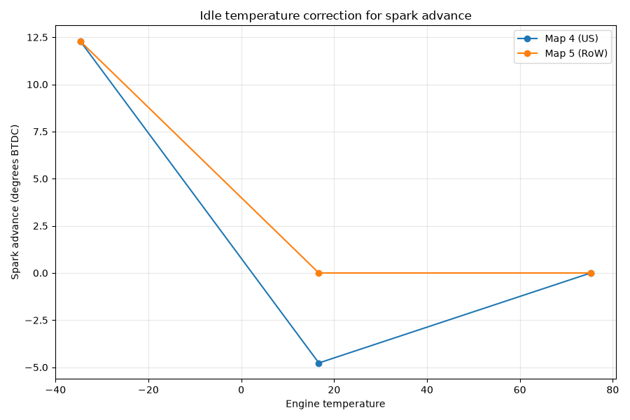
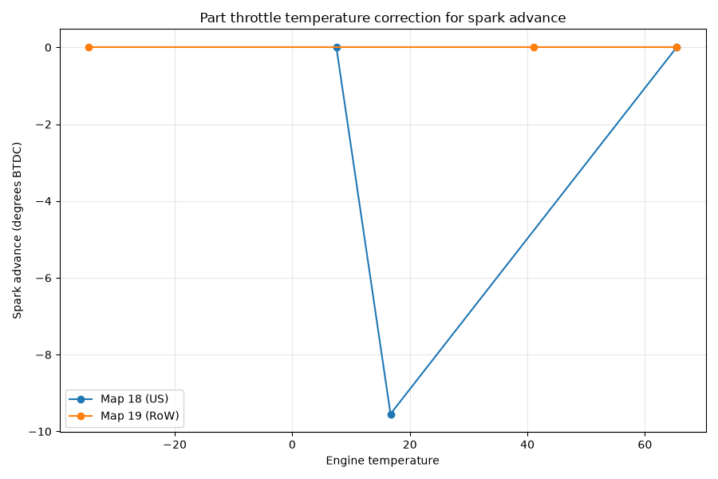
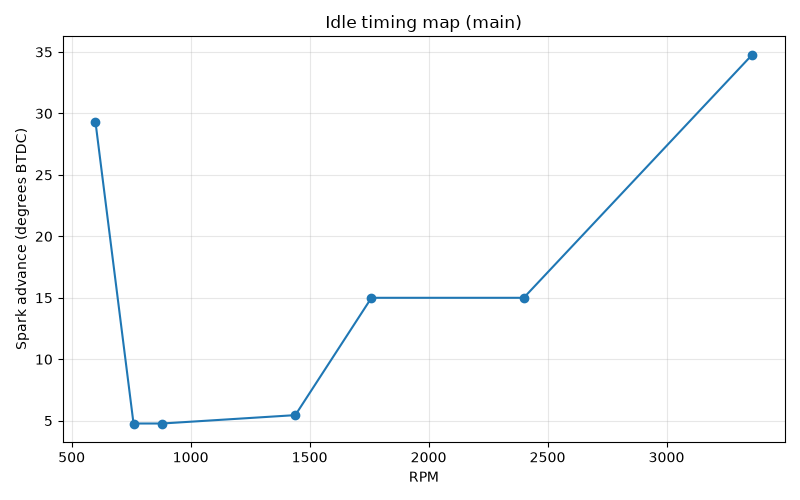
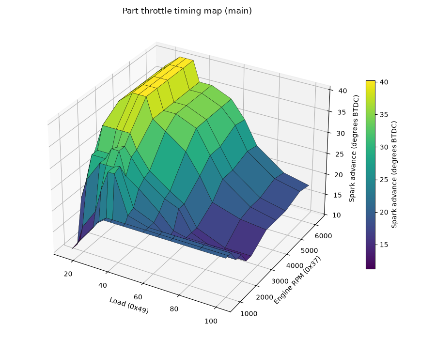
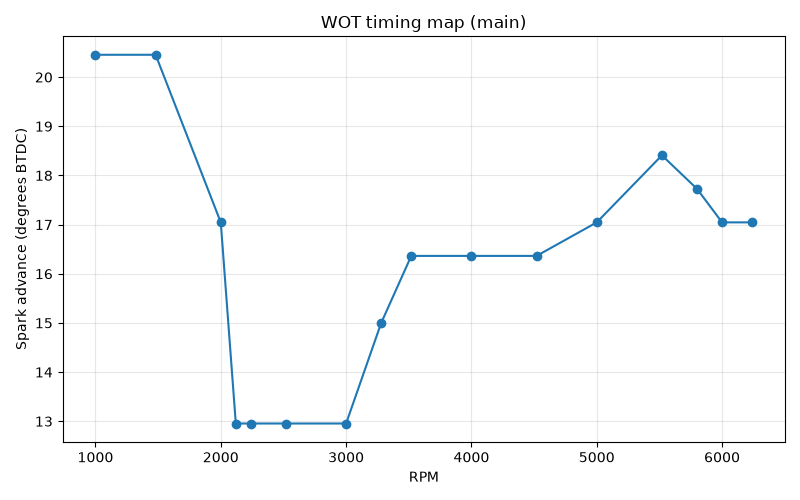

# DME ignition timing calculation

In the [ignition timing signal](ignition_timing_code.md) discussion we examine how the dwell/spark signal is actually generated in the real time part of the DME code. But there, we assumed that the values used had been calculated somewhere. In this article, we'll take a look at that somewhere! Specifically it starts at __1C24__, which is called from the main loop. It's mostly just a series of map lookups, and doesn't contain anything very complicated. 

## Overview
The timing maps contain values that represent quarter-teeth, that is about 0.618 degrees. The actual timing signal itself has only half-tooth resolution, that is 1.363 degrees. Keeping the map values in querter teeth is probably to increase precision before the inevitable rounding happens. 

The map values are also offset by +20, so that a value of 20 in any timing map really means zero. Values below 20 represent negative values. Since there's a presumption that timing angles are *before* TDC, a final timing value that's negative will fire the spark after TDC. 

Other than that, the timing map lookup routine is pretty simple - certainly far simpler than the fuel enrichments logic. There's a complication with timing that we won't cover here, but I'll mention it briefly: you might expect that after calculating the next timing value, it'll get assigned to the variable that the real-time signal generation logic uses more or less directly. But it's not that simple! Unlike fueling, timing is *never* allowed to change abruptly. 

Instead, after the spark is fired, the timing value is allowed to advance a little bit in the direction of the new value. How little a bit are we talking about? Well it turns out that's more complicated than you might think. It's not a fixed speed. It varies according to some complicated rules. These rules are implemented by a set of flags, and the flags have to be finalized before it's safe to assign the newly calculated timing value to the main variable. 

So we will see the next *target* timing value being calculated here, but to see how it's assigned and used, we'll have to wait for a different article. 

## Outline of the code
The steps here are roughly like this:

* if cranking, look up some appropriate maps and bail out early
* for other conditions, look up temperature correction maps
* if WOT, or part throttle above a certain load threshold, check air temp and FQS setting for corrections
* look up the main idle/part throttle/WOT map as appropriate
* clamp the final final value to between +50 and -4 degrees BTDC

Timing maps contain absolute values, unlike fuel maps, so the way we combine them is additive. Because of the peculiar offset of 20 that the maps use, a helper routine (1CAE) is used throughout this code to accumulate the final value into __r5__. It just looks up the curret map (pointed to by r2 as usual), adds the value to r5, subtracts 20, and returns. Note that timing values in these maps are interpreted as 2's complement signed numbers (after subtracting 20), so 128=-128, 129=-127 etc. 

There are some noteworthy things about the corrections made in this routine. 

* the FQS part only uses bit 2. In other words, only FQS positions from 4-7 are relevant for timing, and they all result in the same change of -4 quarter teeth, that is -2.72 degrees. Also this is only applied above 1600rpm, and for part throttle, its only done if load > 80, which is approximately half of the maximum load. 
* there's an air temperature correction map, which is Map 13, but on the Turbo image, all values are set to 20 (zero). The 944NA image actually does pull a few quarter teeth starting around 31C - it's worth noting that this version of the car doesn't have knock control. 
* in temperature correction maps, the cat/o2 equipped cars have a peculiar dip in timing that bottoms out around 16C that the RoW cars don't have. This appears to be a cat warm-up strategy. 

Some map visualizations are always useful for context. Here are the O2/cat vs other maps for temperature based timing correction. 

Idle:



And part throttle:



There's a WOT warmup map, but there's no alternative for O2 vs non-O2, and all values are zero anyway. 

We might as well take a look at the main timing maps for each driving mode too. 

Here's idle:



Note the sudden increase at the low rpm end - this starts down around 760rpm. When the rpm drops below this, the sudden increase in spark advance helps to bring it back up again, providing a crude but very fast form of idle control. As idle speed increases beyond the normal target of 840rpm, the advance barely increases, which helps to stop it from getting too high. 

Part throttle:



WOT:



## Code walkthrough
```
X1c24:	
	mov	r5,#0
	clr	c
	jnb	23h.2,X1c32 ; cranking
	mov	r2,#49h ; Map 73 (rpm)
	acall	X1cae
	acall	X1cae ; r2=Map 74, engine temp
	ajmp	X1c8c
```

This first section handles timing for cranking. it accumulates the values from Map 73 and 74 into r5. 1C8C ends up in the clamping routine, which is the end of the calculation for this condition. 

```
;
X1c32:	
	jnb	23h.0,X1c47
	mov	r2,#4 ; Map 4 engine temp
	jb	25h.4,X1c3e ;25h.4=1 means NTCII <= ~15C during cranking
	acall	X1ff2 ; region based alternate map selection
	ajmp	X1c41
;
X1c3e:	
	lcall	X1d10; just adds 2 to r2, selecting +2 alternate map
X1c41:	
	acall	X1cae
	mov	r2,#8
	ajmp	X1c88
;
```
If we're at idle, this code looks up Map 4 (or 6 if we had a cold start, but Map 6 is identical to 4 anyway) and accumulates the result into r5, then intializes r2 with Map 8 which is the idle timing map, and jumps to 1C88, which is where the main idle/PT/WOT map lookup is done. 

```
X1c47:	
	jnb	23h.1,X1c50
	mov	r2,#0ch ; Map 12, temp
	acall	X1cae
	ajmp	X1c69
;
X1c50:	
	mov	r2,#12h ; Map 18, temp
	jb	25h.4,X1c59 ; 24h.4=1 means we had a cold start (<15C)
	acall	X1ff2 ; select alternate map based on region coding
	ajmp	X1c5c
;
X1c59:	
	lcall	X1d10 ; just adds 2 to r2, selecting +2 alternate map, but Map 20=Map 18
X1c5c:	
	acall	X1cae
	mov	a,#20h
	movc	a,@a+dptr
	subb	a,49h
	jc	X1c69
	mov	r2,#5bh
	ajmp	X1c88
;
```

Here we handle WOT and part throttle cases. For WOT, r5 accumulates Map 12 and jumps away to 1C69 where we do the FQS and air temperature corrections. 

For parth throttle, (1C50), we accumulate either Map 18 (or region alternate) or Map 20 (if we had a cold start). These maps are different. 

Next (still part-throttle only) we look up 1180, which contains 50h/80 dec. and if load is > 80 then we jump to 1C69, same location we jump for WOT, where we perform FQS and temp correction. Otherwise we skip that and jump to 1C88, the main driving mode map lookup, with r2=91. Map 91 is the main PT map. 


```
X1c69:	
	mov	r2,#0dh ; Map 13, air temp 12h, all values 20 for the Turbo (i.e. 0)
	acall	X1cae
	jb	23h.1,X1c72 ; WOT - r2 will have Map 14 from previous lookup
	mov	r2,#5bh ; Map 91, rpm/load - main PT timing map
X1c72:	
	mov	dptr,#X112e ; FQS switch map
	lcall	X05cd ; simple map lookup (no interpolation)
	jnb	acc.2,X1c88 ; if bit 3 is clear, it's 0-3 which is fuel only
	mov	a,#21h
	movc	a,@a+dptr ; 1181h, contains 28h/40 dec., that is 1600rpm
	clr	c
	subb	a,37h
	jnc	X1c88 ; jump if rpm <=1600
	mov	a,#22h
	movc	a,@a+dptr ; 1182h, contains FCh/252 dec. (i.e. -4)
	add	a,r5
	mov	r5,a
```
The above section is where the FQS and air temp adjustments are made. This code was skipped earlier if we are at idle or part throttle with load < 80. 

The Turbo air temp map 13 has all cells 20, which means zero since 1CAE always subtracts 20. The NA Map 13 does have a reduction in timing for increasing temps, above ~30C however (NA cars don't have a knock sensor). 

We only perform the FQS based adjustment if rpm > 1600. The adjustment is the same for all FQS positions with bit 3 set (4-7) and is -4 quarter teeth. 

This code also leaves r2 with either 14 (main WOT timing map) or 91 (main PT timing map). 


```
X1c88:	
	acall	X1ff2
	acall	X1cae
X1c8c:	
	ljmp	X104a ;this just jumps back to 1C8F (below)
;
```
At this point, r2 should have either
* Map 8 (idle, rpm only)
* Map 91 (PT, rpm/load)
* Map 14 (WOT, rpm only)

These are the main timing maps. Here we select alternates based on region and call the accumulation routine, so r5+= map_value - 20 as usual. 

```
X1c8f:	
	mov	r2,#48h ; Map 72 (rpm based)
	acall	X1cae ; r5+= Map 72 value - 20
	mov	r0,a ; r0 = new r5 value
	mov	c,acc.7 ; c = (r5 > 127)
	mov	a,#23h ; 35 decimal
	jnc	X1c9b ; jump if r5 <= 127
	inc	a
X1c9b:	
	movc	a,@a+dptr ;23h if r5 <= 127 (contains 73 dec), 24h otherwise (contains 249 dec.)
	mov	r1,a
	jnc	X1ca0 ; c=1 still indicates r5 > 127, so this jumps if r5 <= 127
	xch	a,r0 ; r5 > 127, so r0 now gets 249 and a gets whatever r0 was, which was the same as r5
X1ca0:	
	clr	c
	subb	a,r0 ; if r5<=127, then a=73 and r0=r5. Otherwise if r5>127,then a=r0=r5 and r0=249
	jnc	X1ca6 ; For r5<=127, jump if r5<=73. FOr r5>127, jump if r5>249
	mov	a,r1
	mov	r5,a ; 
X1ca6:	
	mov	a,r5
	mov	c,acc.7
	rrc	a
	mov	r5,a
	ljmp	X104d
;
```
If the calculated r5 <= 127 (i.e positive), then it's clamped at 73. If negative, it's clamped at 249, that is -6. 

We divide by 2, turning the final value into half-teeth. 

Map 72
**1-Axis Map** (address `12c0`, input variable `Engine RPM (0x37)`)

| Engine RPM (0x37) | Value |
|---|---|
| 520 | 17 |
| 1480 | 20 |
| 3240 | 25 |
| 6120 | 33 |

X1cae:	
	lcall	X051d ; map lookup routine, input in r2, output in a
	add	a,r5
	clr	c
	subb	a,#14h
	mov	r5,a
	ret	
```

This routine simply does:

```
r5 += map_lookup(r2) - 20

```


## Maps

Map 4:

**1-Axis Map** (address `13bc`, input variable `Engine Temperature (0x13)`)

| Engine Temperature (0x13) | Value |
|---|---|
| -34.61 | 38 |
| 16.71 | 13 |
| 75.26 | 20 |

Map 6 (identical to Map 4)

Map 13:

**1-Axis Map** (address `1398`, input variable `0x12`)

| 0x12 | Value |
|---|---|
| 77.89 | 20 |
| 81.84 | 20 |
| 84.47 | 20 |
| 85.79 | 20 |

Map 13 from the 944NA:

**1-Axis Map** (address `1398`, input variable `0x12`)

| 0x12 | Value |
|---|---|
| -3.03 | 20 |
| 16.71 | 20 |
| 31.18 | 19 |
| 41.05 | 16 |

Map 73:

**1-Axis Map** (address `13cc`, input variable `Engine RPM (0x37)`)

| Engine RPM (0x37) | Value |
|---|---|
| 120 | 28 |
| 400 | 50 |
| 920 | 50 |

Map 74:
**1-Axis Map** (address `13d4`, input variable `Engine Temperature (0x13)`)

| Engine Temperature (0x13) | Value |
|---|---|
| -31.97 | 27 |
| 19.34 | 20 |
| 75.26 | 13 |
