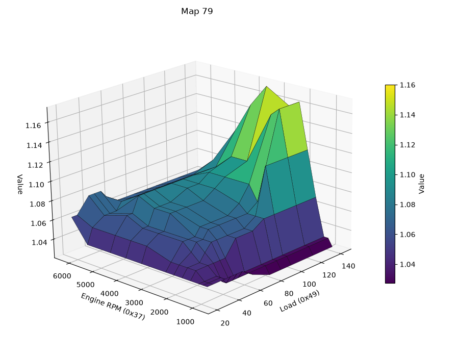
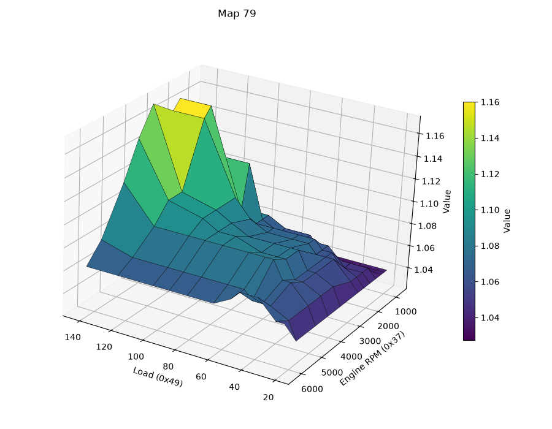

# DME closed loop AFR (lambda) control

Here we'll take a look at the closed loop fuel control section of the DME. 

The goal of this system is to keep the AFR as close as possible to 14.7, to protect the catlytic converter and keep it running optimally. What's written here applies to US cars and possibly one or two other countries, but generally not RoW cars, which mostly came without the cat/O2 sensor. 
The basic idea is that the O2 sensor provides feedback on the current AFR, and the DME uses that feedback to adjust the fuel, adding or subtracting as necessary to keep the ratio optimized. 

If you have looked at other control systems before (such as the idle stabilizer section in the 944 DME code, or the KLR's boost control loop etc.) you might expect that proportional control would be used here, as in those cases. But that's not really possible with the older "narrow-band" O2 sensor that the 944 uses. This sensor doesn't give very fine-grained feedback about the AFR. Instead, the sensor and it's associated circuitry just give the DME one of three possible signals: lean, rich, or neither. 

Since proportional control is out of the question, the strategy used by our DME is basically integral control. Roughly speaking an integral controller just keeps adding or subtracting a small fixed correction for as long as the system is off target. I say *basically* because there's a bit more to it than that. In our case, the steps are not really fixed. They're variable based on rpm/load based maps. One interesting thing is that when the lambda signal switches states (lean to rich, or vice-versa), the initial correction step used is quite big. In this sense it has something of the so-called "bang bang" control strategy mixed in - i.e. it's almost fully positive or negative immediately, so the integral part only makes small gradual changes after that. 

As I mentioned earlier the DME can read 3 different states from the O2 sensor circuit: rich, lean and neither. A lean condition sets p1.7 and clears p1.6. A rich condition does the opposite. If neither are set, that indicates a perfect 14.7 AFR. 

The control logic is split into two sections:

1. calculating the correction factor
2. applying the correction

Both sections use the raw O2 sensor states, but they use them a little differently. Obviously the calculation has to happen before we can apply it. But we're going to do things a little backwards here because most of the interesting things in the closed loop routine are in the application of the correction. So we'll look at that first. 

## Applying the lambda correction

For now we'll assume that the latest correction values have been calculated. Probably the most interesting stuff to say about lambda correction in an overview like this is the exact list of conditions that determine whether it happens or not, and what the limits are. So we'll focus on that now. 

Firstly, the flag 20h.7 is the ultimate master switch that controls whether we do closed loop fuel control at all. It's set for US cars and not for RoW cars. 

The lambda routine starts at 1B30. It's called soon after the base injector pulse width is calculated, and it bails out immediately if 20h.7 is not set. The real stuff starts at 0A75. 

Without getting into the weeds of the code, here's a list of things that temporarily prevent lambda correction:

* __startup (23h.4)__ - this is a startup flag that gets cleared once the engine has stabilized. If set, it causes the lamda correction high byte 1B to be set to 128, effectively neutralizing correction
* __cranking__, __WOT__, and __coasting fuel cutoff__ - these all short circuit lamnda control temporarily
* __rpm > 6640__ - closed loop control is disabled any time the rpm is over this limit
* __load > 102 for a few seconds__ - closed loop control is disabled in part throttle at high loads (more below)
* __engine temp__ < 21C

Additionally a clamping routine limits the closed loop correction to between __0.7x__ and __1.14x__. 

By far the most interesting of these conditions is the load limit. Generally it's hard to say what raw "load" numbers mean without experimentation to determine the maximum, but a quick look at typical load-related maps shows that the map axis values usually range from a low of 21 to a high of 140. The cutoff value here for closed loop control is 102, which roughly corresponds to the 3rd last column in most maps. 

Let's take a look at the part throttle fuel map, Map 79 - I'll show the same map surface from a couple of angles for clarity:

It's pretty clear that just above a load value of 100, the maps shoots up into very rich AFRs. This area of the map will actually result in closed loop control being disabled, even though we stay well away from WOT. 

## Calculating the lambda correction

If you have read the fuel overview documentation, you may know that there's a base pulse width which is stored as a 16-bit number, and corrections made to this for things like temperature, FQS etc. are generally in the form of a multiplier, so that a value in the middle (32767) does nothing, less than that reduces the final fuel pulse, and more than that increases it. This is the same for the closed loop control. Throughout the control routine, the closed loop correction is stored in r1:r0, and ultimately this will multiply r7:r6 which is our main fuel adjustment variable. 

This section is concerned with how r1:r0 is calculated. Since this is primarily an integral control loop, the latest correction is generally added to r1:r0 on each iteration. So r1:r0 is a running total, though it can be reset under various conditions as we'll see later. 

To calculate the correction, we only use the lean signal, p1.7. We distinguish between *lean* and *not lean*, but never explicitly check for a rich condition. The not-lean condition could mean that the AFR is OK, or that it's rich. The code that actually applies the correction does check both lean and rich conditions, however. 

Additionally, this calculation section keeps track of whether the latest lean/not-lean condition was also present at the last check, or whether it changed. This gives us four possible paths, in total:

| Previous state | Current state |
|----------------|---------------|
| not lean | not lean |
| not lean | lean |
| lean | not lean|
| lean | lean|

There are 3 maps used for the intergal control step values, all 2-axis rpm/load maps. 

* Map 62 - used for correcting an unchanged condition (lean or not-lean)
* Map 63 - used for correction a lean condition
* Map 64 - used for correcting a not-lean condition

When the state is unchanged from the last time, the logic is relatively simple: we use the value from Map 62. But for the changing cases, it's a little trickier. 

When the state has changed from not-lean to lean, then we use Map 63 and multiply the value by 16.

When the state has changed from lean to not-lean, then we subtract the Map 64 value from Map 63, and multiply the result by 16. 

Then we determine the direction - for lean conditions we add our result to r1:r0, for not-lean conditions we subtract it. Note that not-lean includes the OK condition (neither rich nor lean), so this logic deliberately pulls that condition back in the lean direction. 

So to summarize:
* unchanged conditions use the raw value from Map 62, in either direction
* transition *to* lean uses Map 63 *  16
* transition *from* lean uses (Map 63 - Map 64) * 16

The raw maps are shown at the end. Let's consider what these raw map values actually mean. The fuel correction is a 16-bit number, and the smallest map value is 4. In the unchanged case, this value is added or subtracted from the 16-bit fuel correction, representing just 4/32768 or ~0.0001. So the lambda correction steps can be tiny! But values that small are only found at very low rpm (~600) and the lowest load values. A more typical value for part throttle driving might be 40, which is around 0.001. 

But how big can they be? For the changing condition, the map value is multiplied by 16, and the lowest values from these maps are in the order of 40, giving us almost 2%. But these maps also max out at 100 at fairly low rpm/load combinations, so values of (16*100)/32768 = 4.8% should be pretty common as the first step when a transition happens, under part throttle driving. 
If you have an AFR gauge, you might notice that the AFR dithers back and forth quite slowly at idle or low throttle. Under high load or high rpm, based on the maps below, the corrections get more agressive, and the transitions therefore happen faster, which is why you see the gauge suddenly speeding up. 

## Maps

Map 62 - unchanged:

| Engine RPM (0x37) \ Load (0x49) | 30 | 40 | 50 | 60 | 80 | 100 |
|---|---|---|---|---|---|---|
| 600 | 4 | 7 | 10 | 10 | 14 | 14 |
| 1000 | 8 | 15 | 18 | 22 | 22 | 22 |
| 1400 | 12 | 19 | 24 | 29 | 35 | 35 |
| 1800 | 20 | 32 | 35 | 39 | 45 | 45 |
| 2200 | 30 | 32 | 39 | 45 | 45 | 45 |
| 3000 | 40 | 40 | 45 | 45 | 45 | 45 |
| 4000 | 40 | 40 | 45 | 45 | 45 | 45 |

Map 63 - changed to lean:

| Engine RPM (0x37) \ Load (0x49) | 30 | 40 | 50 | 60 | 80 | 100 |
|---|---|---|---|---|---|---|
| 1000 | 40 | 60 | 70 | 80 | 90 | 90 |
| 1400 | 40 | 65 | 80 | 95 | 95 | 95 |
| 1800 | 52 | 77 | 100 | 100 | 100 | 100 |
| 2200 | 75 | 100 | 100 | 100 | 100 | 100 |

Map 64 changed to not-lean:

| Engine RPM (0x37) \ Load (0x49) | 30 | 40 | 50 | 60 | 80 | 100 |
|---|---|---|---|---|---|---|
| 1000 | 5 | 5 | 5 | 5 | 5 | 5 |
| 1400 | 5 | 5 | 5 | 5 | 5 | 5 |
| 1800 | 9 | 9 | 9 | 9 | 12 | 12 |
| 2200 | 5 | 8 | 10 | 12 | 16 | 16 |
