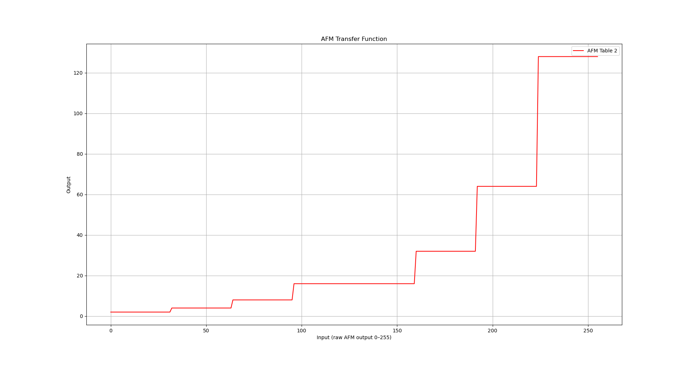
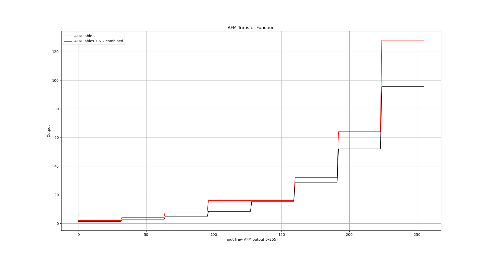
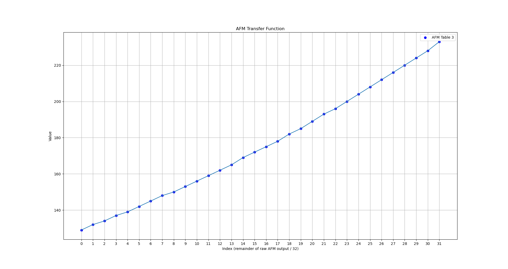
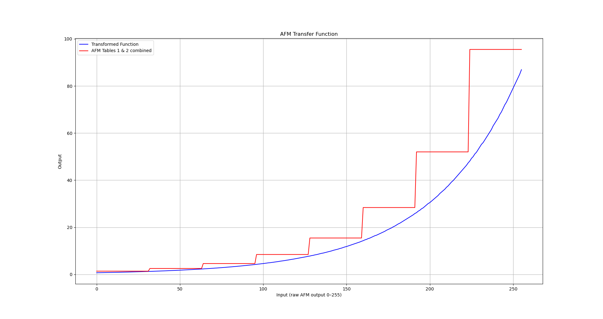
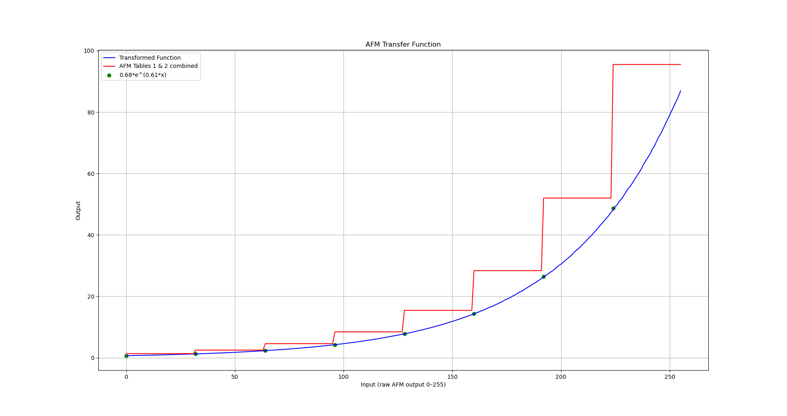

# DME load calculation

In this article, we'll take a look at the DME's load calculation, which happens to double as the base fuel injector pulse width. We will avoid getting into the actual details of the code and stick to high-level concepts. Nevertheless, we will have to look at some real numbers and maps because this is a strange part of the code and there really isn't a simpler way to understand it. 

We'll break down the actual code and work through a a real life fuel pulse example from my running car in [this separate article](dme_load_code_walkthrough.md).

## Overview

As you know, the fuel requirements of an engine depend largely on the mass of air entering the engine. You may also know that the Motronic engine management system meausres air flow by volume using a mechanical "barn-door" airflow meter (*AFM* for short). This AFM has a built-in temperature sensor (that works exactly like the coolant temperature sensor described [here](ntc_info.md)). Even though the fuel requirement is based on the mass of air, this volume measurement combined with the air temperature measurement is good enough for fuel calculations (as well as ignition timing calculations). For some simpler airflow-based calculations in the DME, the air temperature isn't used at all. 

The airflow measurement is typically *not* used in its raw measured form in the way that, say engine speed is. This is partly because the AFM's output is not linear with respect to airflow, but also partly because raw airflow (even if linear) isn't really what determines fuel control requirements in a fuel injected engine. The reason for this is that fuel is injected in pulses once per revolution. So a change in engine speed is always automatically compensated for; doubling the rpm doubles the fuel, all other things being equal. So it's really the airflow *per revolution* that determines how the injector pulse width should be modulated. 

To that end, the airflow measurement is combined with rpm and transformed in various ways to produce a number commonly called *load*. Here's a quick rundown of how the raw AFM signal is processed (not necessarily in the exact order that it happens in the code):

1. It is divided by rpm to produce an airflow-per-cycle quantity; this is what really determines fuel pulse requirements, and is the essence of the concept of *load*
2. It is *linearized*; the physical AFM produces a voltage signal that's logarithmic with respect to airflow volume
3. It is *scaled* using various constants, and turned into __two__ numbers:
   * a 16-bit number that serves as the fuel injector pulse width in appropriate units, namely *timer ticks*. 
   * an 8-bit number that's used as an input for map lookups and various other calculations


The second step listed above (linearization) is a surprisingly complicated affair. The concept is very similar to the process of linearizing the NTC temperature sensors. However, unlike the processing of those sensors (which uses a simple 1-axis map) the AFM linearization process involves *three* maps, each one more confusing than the last! This was probably done for compactness; together these three maps implement an exponential curve, compressed into a much smaller size than it would take in its raw form. This exponential curve compensates for the logarithmic output of the AFM. Other DME hackers and tuners throughout the years have referred to this 3-step mapping as the "AFM transfer function". 

The third of the steps above is pretty simple. Fuel is metered by the lengh of time for which the injectors are turned on. This time is controlled using the 8051's built in timer *timer0*. Now, the 8051 is clocked by a 6Mhz crystal, and it takes 12 crystal clock pulses to make one *machine cycle*. The internal timers count these machine cycles (commonly called *ticks*) and thus one timer tick is 2us. At some point we need to load the timer with the desired number of ticks for the required fuel quantity. There are many factors that influence the required fuel pulse duration, but the basic idea is that there is a base pulse width that depends only on load, and the other variables are used to modify that base pulse in one direction or the other. For convenience, the load value is scaled into the appropriate number of timer ticks, and is then used directly as the timer value for base fuel pulse width.

The 8-bit load value is scaled differently and used as an input to various maps. This 8-bit *pseudo-load* value is stored in location 49h. The true 16-bit load is stored in 47h (high byte) and 46h (low byte). 

## The transfer function tables

As discussed in the Overview, the AFM's output signal is logarithmic. We need to linearize that signal, so we need an exponential transformation (since that has exactly the opposite shape of a logarithmic curve). 

You might expect a 256-step map to be used for this, or maybe even a more compact map with linear interpolation similar to the way the [DME temperature sensor map works](ntc_info.md). The Motronic code doesn't do this however. Instead, it uses a very obscure technique that involves 3 separate, smaller tables.

Why not use a single table? Firstly, a smaller map with linear interpolation would probably not be accurate enough, so we can rule that out. 

Secondly, as you may recall the load value is airflow *per cycle*, so it must be divided by rpm. The resulting number must be of an appropriate scale to serve as the base fuel injector pulse width, in 2us timer ticks. A 256-step map with 8 bit values would not give the kind of precision needed for this. The 3-table solution that Motronic uses results in a 24-bit output for this transformation, and a 256-step map with 24 bit values would require 768 bytes. Even though only 16 bits of the result are used, and the final version of the DME program has a lot of wasted space, with unused/unreachable code and duplicate maps, my guess is that this excessive size is probably the reason for the obscure system they used. The 3 tables that the DME actually uses are 8, 8 and 32 bytes respectively, for a total of just 48. 


Let's look at the three AFM tables in their raw form.


Table 1 (10F4):

|  0  |  1  |  2  |  3  |  4  |  5  |  6  |  7  |
|-----|-----|-----|-----|-----|-----|-----|-----|
| 174 | 160 | 147 | 135 | 247 | 227 | 208 | 191 |


Table 2 (10FC):

| 0 | 1 | 2 | 3 | 4 | 5 | 6 | 7 |
|---|---|---|---|---|---|---|---|
| 1 | 2 | 3 | 4 | 4 | 5 | 6 | 7 |

(Note, that's not a typo in Table 2, the number 4 really is repeated twice!)

Table 3 (1104):

|  0  |  1  |  2  |  3  |  4  |  5  |  6  |  7  |  8  |  9  | 10  | 11  | 12  | 13  | 14  | 15  | 16  | 17  | 18  | 19  | 20  | 21  | 22  | 23  | 24  | 25  | 26  | 27  | 28  | 29  | 30  | 31  |
|-----|-----|-----|-----|-----|-----|-----|-----|-----|-----|-----|-----|-----|-----|-----|-----|-----|-----|-----|-----|-----|-----|-----|-----|-----|-----|-----|-----|-----|-----|-----|-----|
| 129 | 132 | 134 | 137 | 139 | 142 | 145 | 148 | 150 | 153 | 156 | 159 | 162 | 165 | 169 | 172 | 175 | 178 | 182 | 185 | 189 | 193 | 196 | 200 | 204 | 208 | 212 | 216 | 220 | 224 | 228 | 233 |


These tables are of the simplest [form of map](dme_map_info.md) in the Motronic software - they have no headers and no interpolation is used. Here, I've shown a header for each one with consecutive numbers to make them easier to read. 

The raw AFM value read from the ADC is an 8-bit number from 0 to 255. The transfer function logic divides this by 32 using integer division, resulting in a quotient value from 0-7 and a remainder from 0 to 31. As you may guess, the quotient is used as the input to Tables 1 & 2, and the remainder is used as the input to Table 3. 

But how are the outputs of the three tables combined?

Tables 1 and 2 work together: the values in Table 1 are fractions which are used to scale the corresponding values in Table 2. The values in Table 2 are used as powers of 2, which multiply the 0-7 quotient value. 

It's very helpful to visualize these so let's do that now. Here's what we get when we graph the powers of 2 in Table 2, as a function of the raw AFM values from 0 to 255, divided by 32:





As I mentioned above, the purpose of the fractions in Table 1 is simple to make small adjustments to this stepped function, to produce a discrete exponential function, i.e. a *geometric progression*. Let's compare the graph of Table 2 with the adjusted version after the scaling effect of Table 1 is applied:





Next we'll take a look at Table 3 - this is a 32-step exponential curve that is used to "stitch" the blocks together to create a smooth exponential function:





Now we can summarize the AFM transfer algorithm as follows:

* the raw AFM voltage value is integer-divided by 32 to scale it into the range 0-7
* the resulting value is used as an index look up one of the values from Table 1
* the value read from Table 1 is multiplied by 2^n where n is the corresponding value from Table 2
* the remainder of the original integer division is used as an index into Table 3, which multiplies the output

Believe it or not, that results in an exponential curve! And here is that curve overlayed with the stepped function:




It might be interesting to know exactly *which* exponential function the AFM transfer funciton encodes. I won't bore you with the details, but working backwards from the stepped values we started with, it's easy to figure out that a close approximation is

```0.68 * 1.83^x```

or, more conventionally

```0.68 * e^(0.61x)```




This can be varied to scale the function vertically and horizontally (within reason) by changing only the map values -  but without changing the code, it can't be changed to anything other than an exponential function if we want it to be smooth. The basic reason behind this is that the multiplication by 2^n used with Table 2 is hard coded. 

The good news is that despite the strangeness of this approach, the code that implements it is simple and easy to follow once you know what it does. So I recommend taking a look at the [code walkthrough](dme_load_code_walkthrough) next. 
