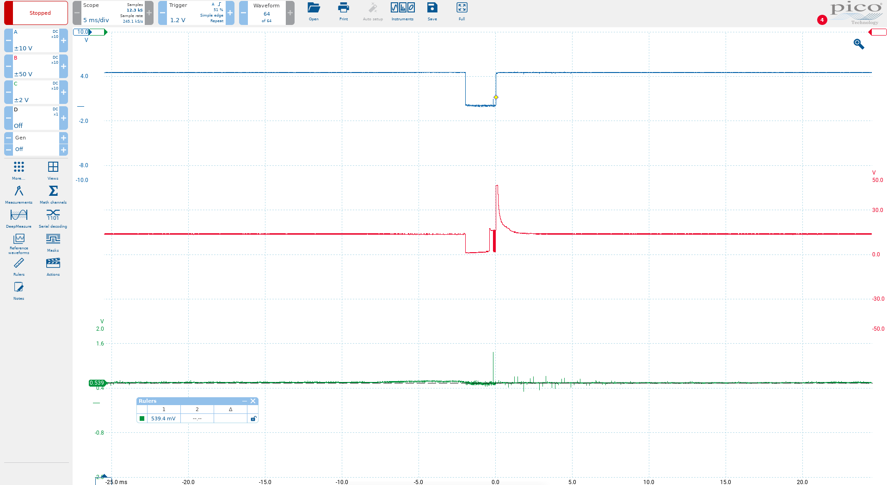
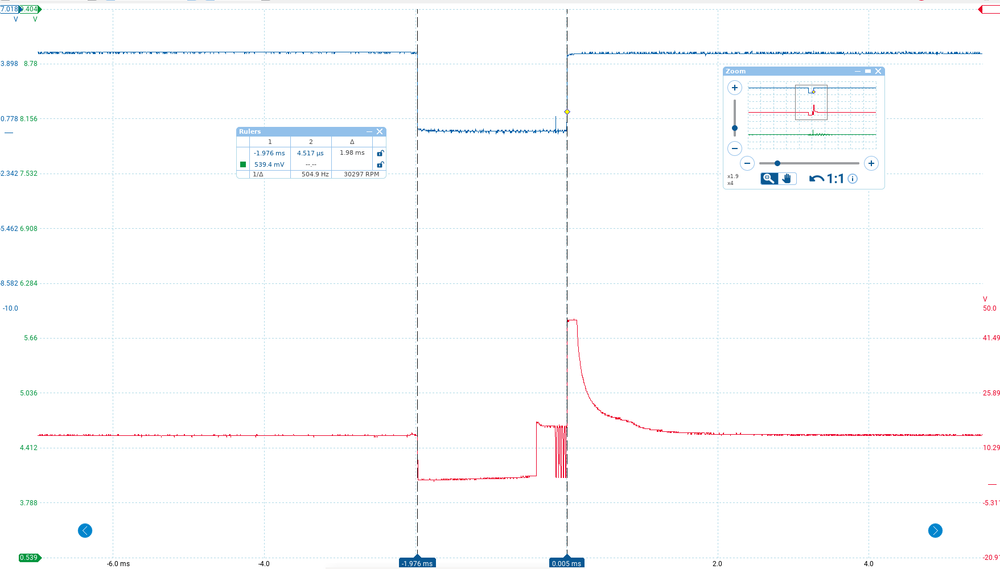

# Load calculation code

In [DME load calculation](dme_load_calculation.md) we explored the concept of how the DME calculates load without getting too deep in the weeds. Now we'll look more closely at the details!

This is a very straightfoward routine code-wise. It's hard to understand *why* it does what it does without the high-level discussion, so I recommend you read the overview linked above first. But once you have seen that, what follows here is pretty simple and there shouldn't be any need for c-like pseudo-code. Most of the tricky stuff is in the multi-byte division and multiplication routines which we won't get into here. 

## Code walkthrough

Load calculation begins at 0381. First we have the special case where the starter is cranking:

```
X0381:	jnb	23h.2,X03a7
	mov	r5,#0
	mov	a,#12h
	movc	a,@a+dptr
	mov	49h,a
	mov	b,#19h
	mul	ab
	mov	r6,a
	mov	r7,b
	mov	a,#1
	movc	a,@a+dptr
	mov	b,49h
	mul	ab
	mov	b,#19h
	mul	ab
	mov	46h,b
	mov	47h,a
	mov	48h,#0
	ajmp	X0405
;
```

We'll skip over that because it's not very interesting, and get to the section that usually applies to a running engine;

```
X03a7:	
	mov	r3,37h
	mov	a,#32h
	mov	b,r3
	div	ab
	mov	r7,a
	acall	X04ea
	mov	r6,a
```

This divides 50 by current rpm and stores the quotient in r7. The routine at 04EA returns

remainder * 256 / rpm.

So the end result is that r7:r6 = 12800/rpm (of course we're talking about the usual rpm/40 here, not true rpm). That might seem like an arbitrary number, but it results in the final load value having the units we want for __timer0__ to control the injector pulse width. 

```
X03b1:	
	mov	a,10h
	mov	b,#20h
	div	ab
	mov	r2,a
	mov	r3,b
```
This divides the raw airflow value by 32 storing:
r2 = a (quotient)
r3 = b (remainder)

So, now that the accumulator as well as r2 contain the scaled value from 0-7:

```
	mov	dptr,#X10f4	;AFM transfer table 1
	movc	a,@a+dptr
	acall	X04d9 ;multiply 8x16 (R7:R6:R5 = A * R7:R6)
	mov	dptr,#X10fc ;AFM transfer table 2
	mov	a,r2
	movc	a,@a+dptr
	acall	X0509 ;shift left a times (24-bit)
```

We look up Table 1 (10F4) using our 0-7 scaled AFM value. 

Next we call the 8x16 multliply at 04D9. This multiplies r7:r6 by a and returns a 24-bit value in r7:r6:r5. 

Next we look up Table 2, again using the scaled 0-7 AFM value. We shift r7:r6:r5 left by the number of times in the map. In other words, we mul by 2^n where n is the value in the map corresponding to the airflow range 0-7. 

Then,

```
	mov	dptr,#X1104
	mov	a,r3
	movc	a,@a+dptr
	acall	X04d9
```

Here, we read Table 3, this time using the *remainder* from the 0-7 scaling. We multiply r7:r6 by this value to get r7:r6:r5. Since we have discarded r5 in the input, this counts as a division by 256. 

```
	mov	dptr,#X1160
	mov	a,#13h
	acall	X043d
	mov	a,#14h
	acall	X043f
	mov	a,r6
	mov	r3,a
	mov	a,r7
	mov	r4,a
```

This code clamps the 16-bit value r7:r6 to the min/max values found in 1173 and 1174 (ecah multiplied by 25 in the 043D routine). Note r5 was discarded again - this is another division by 256. The clamping values are

MIN: 425
MAX: 5500


Next we filter the transformed load value using exponential smoothing, with a coefficient that depends on rpm:

```
	mov	r2,#1bh ; map 27 (filter coefficient by rpm)
	lcall	X051d
	mov	r5,a
	mov	r2,46h
	mov	r1,47h
	mov	r0,48h
	lcall	X05fa ;low pass filter function (R2:R1:R0 = R2:R1:R0 + (R4:R3 - R2:R1) * R5)
	mov	46h,r2
	mov	47h,r1
	mov	48h,r0
```

The values in map 27 can be thought of as x/256 because we're about to drop r5 again, i.e. another division by 256. Then we store the 24-bit load value into 48h:47h:46h. 


```
	mov	r7,46h
	mov	r6,47h
	mov	a,#0a4h
X03f9:	
	acall	X04d9
	mov	a,#4
	acall	X0509
	mov	49h,r7
	mov	r7,46h
	mov	r6,47h
X0405:	
	ljmp	X1032
```

Finally we store a 16-bit version in r7:r6 (another division by 256 as alluded to above - hence it's best to use this division to think of the values in map 27 as fractions.)

Now we multiply r7:r6 by 164 (A4h), and shift left 4 places (i.e. x16). So ultimately this is a multiplication by 2624. 

We store the high byte of the result, r7, in 49h. But then we restore the 2 high bytes of the previously stored 24-bit load value (48h:47h) into r7:r6. 

The value in r7:r6 is now the base pulse width for the fuel injection! The units are timer *ticks* of 2us. Because the 8051 timers count up from zero and overflow when they reach their 16-bit limit, the final step will be to complement this pulse width value, and load the resulting value into the timer, then turn the injectors on. When the timer overflows and triggers its interrupt, the interrupt routine will turn the injectors off. That final step happens in the real time part of the program, so we won't get into it here. 

## An example

Let's work through an example from real life, to sanity check this and make sure that it all comes out right. 

First we'll need to measure the raw AFM output on a running car:





Here, the green trace is the AFM output measured at the ADC channel 0 (pin 26). The blue trace is the fuel injector signal from the 8051 (p1.0) and the red trace is the actual fuel injector driver signal, which I just included for general interest. 

The car is fully warmed up and idling at around 840rpm. As the image shows, the AFM output is in the region of 540mv. I also unplugged the O2 sensor to simplify things a little, so there is no closed-loop fuel correction in play here. 

Let's convert these values into their respective representations in the code and see what fuel pulse width they should produce. The ADC reference is 5v and so 540mv corresponds to 255 * (0.54/5) = 27.54, let's call it 28.

We know that rpm is measured in units of 40, so the idle speed of 840 corresponds to 21. 

Clearly 28 mod 32 gives a quotient of 0 and a remainder of 28. So the values we get from the 3 AFM tables are

| Table # | Value|
|---------|-----|
| Table 1 | 174 |
| Table 2 | 1 |
| Table 3 | 220 |

Following the logic in the code we looked at, we get:

```((12800//21) * 174 * 2 * 220) // 256**2 = 711```

(Recall that the value from map 2 us used as the __n__ in __*2^n__ - that is where the multiplication by 2 comes from in the above formula).  

The timer ticks are 2us each, so double this to get 1422us. Now, we haven't covered this here, but there is a fixed latency value, commonly known as *injector dead-time* that needs to be added here, and for the conditions we have it comes out to about 500us. So add ~500us latency, and we get 1922us. But wait! There's one more thing I didn't tell you about. We'll cover this in far more detail when we discuss fuel maps, but the idle fueling strategy has the car running a little richer than the base pulse (recall that I disconnected the O2 sensor for this test to disable closed loop fuel control). The adjustment comes out to approximately 2.3% rich, which gives us a final injector pulse width of ```1967us```

Let's compare that to what we actually see in the scope measurement of the injector pulse width:





At around 1980us, it's pretty close to what we expected. Of course we can't expect it to be exact - I used an approximately for the dead time - but this is certainly in the neighborhood of what we should expect. 

Now you should have a pretty good understanding of the role that the airflow meter plays in the whole system, and how fuel is metered out. 

There remains the fuel maps to explore, along with closed loop correction and a few fuel related parts. For now I just want to point out that even though some of the fuel maps only use a single axis (rpm), you can see from this that air flow always plays the same basic role. 
