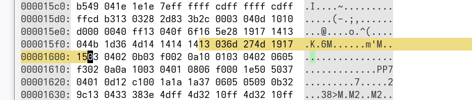

# How the Motronic DME Maps Work
The DME has many, many maps - over 80 in fact. They're stored in the second 4k of program memory. 

Extracting the map info can be useful for tools like TunerPro and also generally just for visualizing and understanding the parameters the engine was designed to work with. So let's dive into the Motronic map structure. 

We'll start with a small example to keep things simple. This map is located at 15F9 and it's the target rpm map for idle. The map in human readable form is like this

Temperature (degrees C) | 30 | 139 | 178
Target speed (in rpm) | 1000 | 920 | 840

But here's what it looks like in it's native setting, viewed in a hex editor:

 *KLR trigger and ignition signals*

It might be a little clearer to copy those raw bytes and format them here:

`13 03 6d 27 4d 19 17 15`

That's quite a bit different from the readable one we just looked at. So how does this pile of numbers represent a map of target engine speeds? In the following sections we'll break this down piece by piece and learn how that nice human-readable map is derived from the raw data. 

First, note that the values I pulled from the raw source are in hexadecimal form. When we want to help with readability, we'll convert them to decimal. (Sometimes, I might even remember to tell you when I do that). Here's a breakdown of the structure of the raw map:

* first byte: input variable 
* second byte: axis length (let's call it "n" - in this case, n=3)
* next n bytes: axis values, i.e headings
* next n bytes: the actual values (this is what TunerPro XDF files generally consider to be the "start" of the map) 

Now each of these might seem a little cryptic so I'll explain them one by one. 

## First byte: the input variable
This value is the RAM address of the input variable. In the Motronic code, key engine parameters live in certain memory locations. They're stored there after being read by the ADC (and possibly after some post-processing) and then they always stay there; those locations are reserved just for their respective parameters. So the maps are written with the appropriate input variable location hard-coded. Here are the most important ones:

```
37h: rpm
49h: load
13h: engine coolant temp
11h: system voltage
```

So in our example map above, the first byte is 13 and that tells us that this map depends on engine temp (NTC). 

## Second byte: the length of the axis
This is pretty straightforward; the number 3 in this example just tells us that there are 3 values in the axis! So this map only cares about 3 different temperature ranges. As a rule, the right-most value in the map applies to all input values to the right, and vice-versa for the left. So for instance if the right-most axis number was 0 deg. C, then the value corresponding to that would apply for all temperatures below 0C. 

## Next n bytes: the axis values
This is where things start to get a little more complicated. We said earlier that the 3 values following the axis length are the headings of the map. Let's look at these values in decimal to make things clearer:

```109 39 77```

Now you might ask things like: what do these numbers mean? Are they C, or F? Don't tell me they're Kelvins?! Let's leave the question of units until a little later and for now just deal with questions like: why are they spaced so unevenly, and why don't they go in one direction? 

For reasons that will be clearer later, Motronic software encodes map headings as diffs or deltas instead of the values you'd expect. The best way to explain this is to explain what the code does. Let's say we have an input value of 177. The map routine will start at the right-hand end of the axis, and start adding the headings, one at a time, to the intput value until the add results in an overflow. 

For example we'll get

```177 + 77 = 254``` (no overflow, keep going)
```254 + 39 = 293``` (this is > than 255, so we have an overflow). 

Once an overflow is detected, we have found the columns that our input falls between. Now we could just take the index of the column that triggered the overflow (2 in this example) and use that as an index into the values list, and return that value. In practice though, the Motronic code does something more sophisticated than that called linear interpolation. The short explanation of this is: for inputs that fall between column headings (which is what happens most of the time), the DME figures out the most appropriate in-between value and returns that even though it's not explicitly stored in the map. We'll leave the details til later.  

## Last n bytes: the actual map values
Finally we get to the part everyone actually cares about - the map values themselves! What do they represent? Generally to see what they represent we have to look at the code that uses them. Immediately after a map is read, the return value is usually compared to some known variable. For example, when the map in our example is read, the resulting value is then compared to the value in 37. You might recall that 37 is the location of engine speed. That tells us that this map contains engine speed values. Otherwise, why would the programmers want to compare the returned value to engine speed? You knew that at the start because I told you, but this is how I knew. 

What about units - what units are the map values in? That is the hardest question of all to answer. For one thing, there isn't one answer! Probably the most important observation we can make here is that it is not possible to figure out what the numbers in a map mean without knowing something about what's going on outside the little metal enclosure of the DME. 

Let's look at a few examples:

### Units: Engine speed
The short explanation here is that the units of engine speed are RPM/40. That is, the number 1 means 40RPM, 2 means 80RPM etc. 

How do we know that? The way engine speed is measured in Motronic is by counting the number of speed sensor pulses within a fixed timer interval. That part can be ascertained by reading the code. But to know that 1 unit equals 40RPM, someone had to go an count the teeth on the flywheel! And someone always has to do something like that to answer such questions. 

A word about units and naming conventions. Everyone and I mean everyone uses the term "rpm" interchangeably with "engine speed" and I don't want to be that guy so I will just keep doing that to avoid confusion. But the Motronic maps don't deal in rpm, strictly speaking they use units of rpm/40. 

### Units: Battery voltage
First let's address why this is necessary, and then how it's even possible. The DME needs to know the current battery voltage because many critial things in the engine perform differently depending on the voltage, for example fuel injectors, ignition coils etc. Pulse widths and dwell times need to be adjusted for the battery voltage. 

The DME measuring it's own supply voltage is possible because the ADC has a fixed 5v reference, and the supply voltage is divided by approximately 3.5 before being read into one of the ADC's channels. So it can measure voltages up to around 17.5v. 

My rough calculations give a conversion rate of 1 unit in the code equals 0.0686 volts. 


### Units: Engine temperature
Now we get into the territory that made me say this question of units is one of the hardest of all to answer. The DME uses an NTC temperature sensor which is not linear. Immediately after the temp sensor is read by the ADC, it's linearized using a special map. You can think of this map as a complementary curve that corrects the natural curve of the NTC sensor. The sensor value is also complemented (i.e. inverted) so that we end up with a linear scale where lower numbers correspond to lower temperatures. This is handy and intuitive, but the details of how all this is done can wait til another time. 


How Map Reading Works
----------------------
Throughout the code we see these maps being referred to with hex addresses, like 37h and so on. But what do these numbers mean?

Those numbers refer to the maps indirectly. The reason for this is simple: the actual map locations are big numbers that require multiple bytes to represent. But we'd like to be able to refer to maps using consecutive numbers, and have these maps at conseutive memory locations. 

To see why this is helpful, consider 2 closely related maps. Maybe one is an alternative for the other depending on some condition in the code. It's really useful to be able to switch between these maps with a simple inc or dec instruction. That requires them to be consecutive memory locations, which means each one is just a single byte. 

That byte is used to look up the true map address from a bigger table where each value is 2 bytes. 

Here's an overview of how it all works without getting into the weeds of the lookup code:

1. There is a base map list at location 1090. We can think of the bytes starting at 1090 as a map list or index of sorts. Whenever the program wants to look up a particular map, it adds the appropriate offset to 1090, and then reads the byte from the corresponding location. That byte will be used to find the map we want. As a convention, we'll use the offset that that program uses to name the map. So for example, when we see the value "37h" being used in the code as a map offset, we'll call that "map 37h" or more practically, "map 55". It's the 55th entry in the index starting at 1090. 

Following that last example, we add 1090 + 37h = 10C7. Now if we look in location 110C7 we find the value 4A. But this isn't the map, or even the location of the map. This is the offset to a map pointer index. Yes, there's another index! The reason for this is that the actual map address requires 2 bytes (being way above the 255 limit of a single byte). So the value we get here is an offset to another, bigger table containing 2-byte values that indicate the actual locations of the maps. 

We may ask, if the map locations must be two bytes, then why bother with the first table? Why is it important to have a table or index of maps at 1 byte, consecutive locations, if all it does is point to another table with the true 2-byte locations? The answer is: it's very convenient to be able to move to the next (or previous) map in the code by just incrementing or decrementing the value that's being used. This way we can have alternate versions of maps listed consecutively, and easily switch from one to the other with a simple inc or dec instruction. All the complexity of translating the short map number into the long map address is in the map read routine, so most of the time you don't need to worry about it. 

2. That bigger table (the one with the real map addreses) is located at 11E0. So now we have our offset, 4A, we know that the address of the map we want is at the location 11E0 + 4A = 122A. The address is 2 bytes long, and looking up those 2 bytes starting at 122A, we have 15 and F9. We put these together to get 15F9. Finally, that is the location of our map in program memory!

3. Now we have the location of our map, we can finally look up the value we want. Here's what the map at 15F9 actually looks like in raw hex bytes:

13 03 6d 27 4d 19 17 15

What's going on there?
