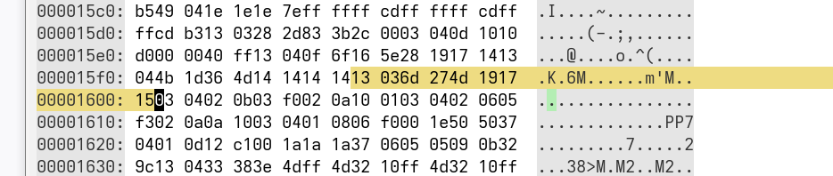
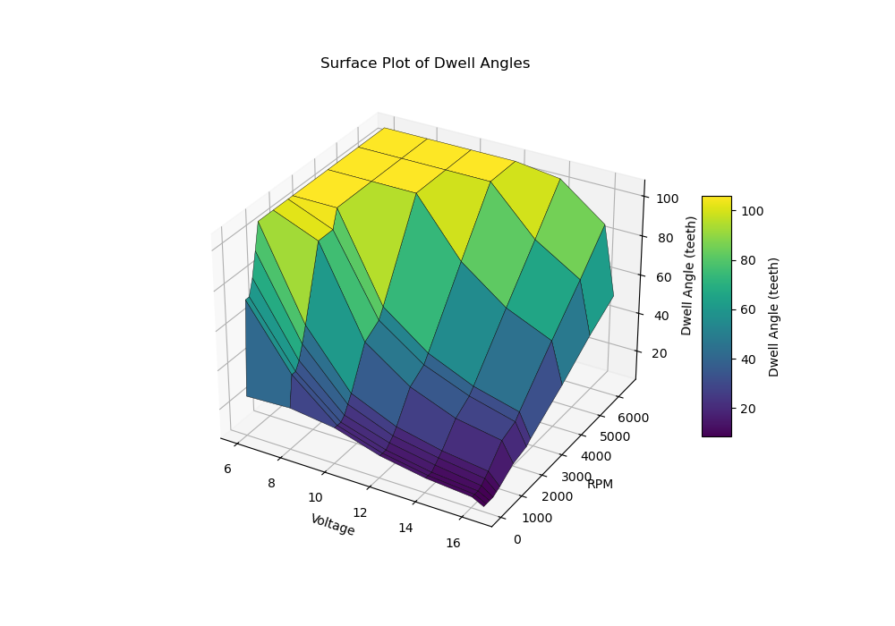

# How the Motronic DME Maps Work
The DME has many, many maps - over 80 in fact. They're stored in the second 4k of program memory. 

Extracting the map info can be useful for tools like TunerPro and also generally just for visualizing and understanding the parameters the engine was designed to work with. So let's dive into the Motronic map structure. 

We'll start with a small example to keep things simple. This map is located at 15F9 and it's the target rpm map for idle. There are various ways to visualize a map; for a simple one like this, just seeing a table with familiar units of measurement is enough for human-readability:

Temperature (degrees C) | -25 | 50 | 75
Target speed (in rpm) | 1000 | 920 | 840

For practical reasons, however, the DME code doesn't work directly in these familiar units. Here's how the map looks from a programmer's perspective:

30 | 139 | 178
25 | 23 | 21

This is much more obscure - clearly there's some translation needed to get from units (in the code) to common everyday units like degrees C and revolutions per minutee. 

But it's worse - even this less familiar representation is still not how it's actually stored! Here's what that same map truly looks like, in it's native setting, viewed in a hex editor:





It might be a little clearer to copy those raw bytes and format them here:

`13 03 6d 27 4d 19 17 15`

That's quite a bit different from the more readable ones we just looked at. So how does this pile of numbers represent a map of target engine speeds? In the following sections we'll break this down piece by piece and learn how that nice human-readable representations are derived from the raw data. 

First, note that the values I pulled from the raw source are in hexadecimal form. When we want to help with readability, we'll convert them to decimal. (Sometimes, I might even remember to tell you when I do that). Here's a breakdown of the structure of the raw map:

* first byte: input variable 
* second byte: axis length (let's call it "n" - in this case, n=3)
* next n bytes: axis values, i.e headings
* next n bytes: the actual values (this is what TunerPro XDF files generally consider to be the "start" of the map) 

Now each of these might seem a little cryptic so I'll explain them one by one. 

## First byte: the input variable
This value is the RAM address of the input variable. In the Motronic code, key engine parameters live in certain memory locations. They're stored there after being read by the ADC (and possibly after some post-processing) and then they always stay there; those locations are reserved just for their respective parameters. So the maps are written with the appropriate input variable location hard-coded. Here are the most important ones:

```
37h: rpm
49h: load
13h: engine coolant temp
11h: system voltage
```

So in our example map above, the first byte is 13 and that tells us that this map depends on engine temp (NTC). 

There are exceptions to this conention, though. There are some maps that don't use a fixed, global variable and so their purpose can be a little harder to ascertain. The [NTC sensor linearization map](ntc_info.md) is a good example. The DME has 2 of these sensors and they use the same linearization map. So for this map, the input value is read from the location __r4__, which is a general purpose register that gets re-used a lot. Other exaples include the [ISV closed loop gain maps](isv_routine.md). These maps use rpm as their input, but not the current rpm value located at 37h. The rpm value they use is the closed loop error (i.e. the difference between the current rpm and the target rpm). 

## Second byte: the length of the axis
This is pretty straightforward; the number 3 in this example just tells us that there are 3 values in the axis! So this map only cares about 3 different temperature ranges. As a rule, the right-most value in the map applies to all input values to the right, and vice-versa for the left. So for instance if the right-most axis number was 0 deg. C, then the value corresponding to that would apply for all temperatures below 0C. 

## Next n bytes: the axis values
This is where things start to get a little more complicated. We said earlier that the 3 values following the axis length are the headings of the map. Let's look at these values in decimal to make things clearer:

```109 39 77```

Now you might ask things like: what do these numbers mean? Are they C, or F? Don't tell me they're Kelvins?! Let's leave the question of units until a little later and for now just deal with questions like: why are they spaced so unevenly, and why don't they go in one direction? 

For reasons that will be clearer later, Motronic software encodes map headings as diffs or deltas instead of the values you'd expect. The best way to explain this is to explain what the code does. Let's say we have an input value of 177. The map routine will start at the right-hand end of the axis, and start adding the headings, one at a time, to the input value until the add results in an overflow. 

For example we'll get

1. ```177 + 77 = 254``` (no overflow, keep going)

2. ```254 + 39 = 293``` (this is > than 255, so we have an overflow). 

Once an overflow is detected, we have found the columns that our input falls between. Now we could just take the index of the column that triggered the overflow (2 in this example) and use that as an index into the values list, and return that value. In practice though, the Motronic code does something more sophisticated than that called linear interpolation. The short explanation of this is: for inputs that fall between column headings (which is what happens most of the time), the DME figures out the most appropriate in-between value and returns that even though it's not explicitly stored in the map. We'll leave the details til later.  

## Last n bytes: the actual map values
Finally we get to the part everyone actually cares about - the map values themselves! What do they represent? Generally to see what they represent we have to look at the code that uses them. Immediately after a map is read, the return value is usually compared to some known variable. For example, when the map in our example is read, the resulting value is then compared to the value in 37. You might recall that 37 is the location of engine speed. That tells us that this map contains engine speed values. Otherwise, why would the programmers want to compare the returned value to engine speed? You knew that at the start because I told you, but this is how I knew. 

What about units - what units are the map values in? That is the hardest question of all to answer. For one thing, there isn't one answer! Probably the most important observation we can make here is that it is not possible to figure out what the numbers in a map mean without knowing something about what's going on outside the little metal enclosure of the DME. 

Let's look at a few examples:

### Units: Engine speed
The short explanation here is that the units of engine speed are RPM/40. That is, the number 1 means 40RPM, 2 means 80RPM etc. 

How do we know that? The way engine speed is measured in Motronic is by counting the number of speed sensor pulses within a fixed timer interval. That part can be ascertained by reading the code. But to know that 1 unit equals 40RPM, someone had to go an count the teeth on the flywheel! And someone always has to do something like that to answer such questions. 

A word about units and naming conventions. Everyone and I mean everyone uses the term "rpm" interchangeably with "engine speed" and I don't want to be that guy so I will just keep doing that to avoid confusion. But the Motronic maps don't deal in rpm, strictly speaking they use units of rpm/40. 

### Units: Battery voltage
First let's address why this is necessary, and then how it's even possible. The DME needs to know the current battery voltage because many critial things in the engine perform differently depending on the voltage, for example fuel injectors, ignition coils etc. Pulse widths and dwell times need to be adjusted for the battery voltage. 

The DME measuring it's own supply voltage is possible because the ADC has a fixed 5v reference, and the supply voltage is divided by approximately 3.5 before being read into one of the ADC's channels. So it can measure voltages up to around 17.5v, and the measurement is not affected by the actual battery voltage as long as it's high enough to maintain the 5v supply for the ADC

My rough calculations give a conversion rate of 1 unit in the code equals 0.0686 volts. 


### Units: Engine temperature
Now we get into the territory that made me say this question of units is one of the hardest of all to answer. The DME uses an NTC temperature sensor which is not linear. Immediately after the temp sensor is read by the ADC, it's linearized using a special map. You can think of this map as a complementary curve that corrects the natural curve of the NTC sensor. The sensor value is also complemented (i.e. inverted) so that we end up with a linear scale where lower numbers correspond to lower temperatures. This is handy and intuitive, but the details of how all this is done can wait til another time. 

You can read all the details of how the NTC sensor is processed in the [How the DME reads engine temperature](ntc_info.md) section. To cut a long story short for now, the temperature ends up as a fairly straight line with an offset of around 62.6 and a slope of somewhere around 1.52. With that in mind we can take any value in the code, subtract 62.6 and divide the result by 1.52 to get a pretty good value for the temperature in degrees C. This is not perfect but it's close. Bear in mind that the NTC sensors have a very wide tolerance range, and as a result the map headings are very approximate. 

## 2-Axis (3D) Maps
The maps we have seen so far as 1-axis maps, also known as "2D" maps (2D because we can visualize them as graphs in 2D space). But many of the DME's maps use 2 axes. These are the so-called 3D maps. These maps require 2 input variables, so they can be visualized as tables with multiple rows and columns, or as surfaces in 3D space. 

Here's an example of each, using the ignition dwell map from the stock 951 DME (found at location 0x13DC). As a table:


| RPM \ Voltage | 6   | 8   | 10  | 12  | 14  | 16  | 16.5 |
|---------------|-----|-----|-----|-----|-----|-----|------|
| 40            | 25  | 26  | 23  | 16  | 12  | 10  | 7    |
| 160           | 73  | 42  | 23  | 16  | 12  | 10  | 7    |
| 320           | 73  | 42  | 23  | 16  | 12  | 10  | 7    |
| 480           | 81  | 46  | 25  | 18  | 14  | 11  | 7    |
| 640           | 93  | 53  | 29  | 20  | 16  | 13  | 8    |
| 800           | 106 | 61  | 33  | 23  | 18  | 15  | 9    |
| 1440          | 106 | 97  | 53  | 37  | 28  | 24  | 14   |
| 2080          | 106 | 97  | 58  | 42  | 33  | 27  | 16   |
| 2280          | 106 | 106 | 63  | 46  | 36  | 30  | 18   |
| 3840          | 106 | 106 | 106 | 78  | 61  | 51  | 30   |
| 5240          | 106 | 106 | 106 | 106 | 83  | 69  | 42   |
| 6480          | 106 | 106 | 106 | 106 | 103 | 86  | 51   |


And as a surface plot:




The basic layout of the Motronic 2-axis maps is very similar to the 1-axis version we've seen. The big difference is the first header (which contains the input variable and the axis values) is followed imediately by a second header of the same format, identifying the second input variable and its associated breakpoints. After that come the values in a list. 

In Motronic maps the first header represents the row and the second one represents the column. Similary, the values that follow the headers are listed in rows first. Here's what the raw bytes look like for the dwell map we just looked at:

```
37 0c 03 04 04 04 04 10 10 05 27 23 1f 5e 11 07 1d 1e 1d 1e
1d 07 0e 19 1a 17 10 0c 0a 07 49 2a 17 10 0c 0a
07 49 2a 17 10 0c 0a 07 51 2e 19 12 0e 0b 07 5d
35 1d 14 10 0d 08 6a 3d 21 17 12 0f 09 6a 61 35
25 1c 18 0e 6a 61 3a 2a 21 1b 10 6a 6a 3f 2e 24
1e 12 6a 6a 6a 4e 3d 33 1e 6a 6a 6a 6a 53 45 2a
6a 6a 6a 6a 67 56 33
```

So this means "37 (rpm), 12 values, 11 (battery voltage), 7 values...". Then the 12 values that follow form the first row of values, and so on. 

The same linear interpolation I mentioned in the section above on axis values applies to these 2-axis map values. 

## Other maps and constants

The majority of the DME's maps are of the 1 or 2 axis kind we discussed above. But there are exceptions. These are:

* maps with headers but no interpolation
* maps with no headers
* constants (i.e. "maps" with only one value)

### No interpolation
As discussed, the DME's standard map read routine (located at 0x051D) always does interpolation, on both 1 and 2 axis maps. But there is also a simpler map routine (located at 0x05CD) that just can read a 1-axis map without interpolation. This routine just returns the closest matching value (i.e. the column that first causes the overflow). This is used for the FQS (fuel quality switch), the altitude correction, and similar discrete variables. These are cases where interpolation is not needed, but the input space is still somewhat arbitrary. 


### Maps with no headers
These can be thought of as just lists of constants stored at consecutive locations, or as maps with implicit headings like 1, 2, 3... etc. The way these maps are read is by simply adding loading the base offset of the map into dptr and then adding the offset of the desired value. There's no interpolation for this type of lookup. The AFM linearization map (also known as the __AFM transfer function__) works this way:

```
	mov	a,rb2r0	        ;rb2r0 = 10h, i.e raw AFM value
	mov	b,#20h
	div	ab	            ; divide AFM by 32 
	mov	r2,a            ; now a contains AFM value % 32, i.e. 0-7
	mov	r3,b
	mov	dptr,#X10f4	    ; AFM transfer table1 base offset
	movc a,@a+dptr      ; load one of the 8 values from the map into a
```

This simple lookup with no explicit breakpoints makes sense when:

1. We don't need or want interpolation, and
2. The input space is just a range of consecutive numbers

### Constants
OK these are not really __maps__ at all, since they contain just one value - but they are often used for tuning, so for completeness let's take a quick look at how constants are looked up. 

General purpose tuning constants are stored starting at a base offset of 0x1160. The standard map read routine always restores the dptr to this location after looking up a value. This allows the various routines throughout the code to refert to constants using only their offset, after a map lookup. So a typical pattern looks like this:

```
	mov	r2,#37h ; we're going to read Map 55 (idle target rpm)
	lcall X051d ; read the value (based on temperature) and set dptr to 0x1160
	mov	b,a ; b <- target rpm from map 55
	jb t1,X0901 ; check if air conditioning is turned on
	mov	a,#39h ; load the offset for the AC idle rpm target constant (relative to 0x1160)
	movc a,@a+dptr ; a <- idle rpm target for when AC is on
```

This is convenient because 0x1160 requires 2 bytes to represent, so having to load both bytes into dptr every time we want to look up a constant would get pretty tedious. 
