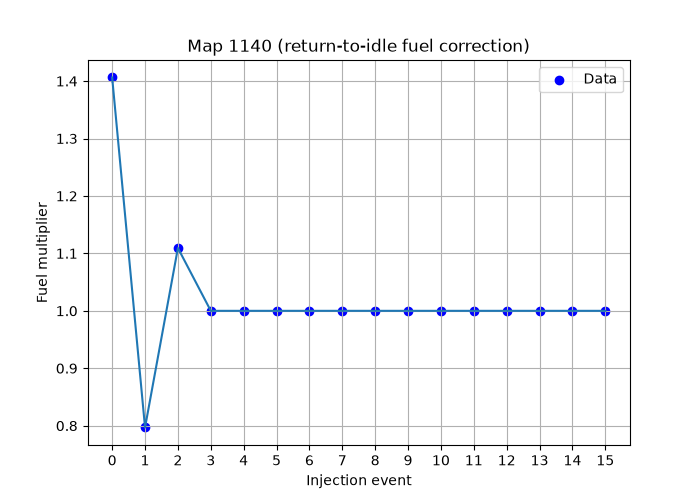
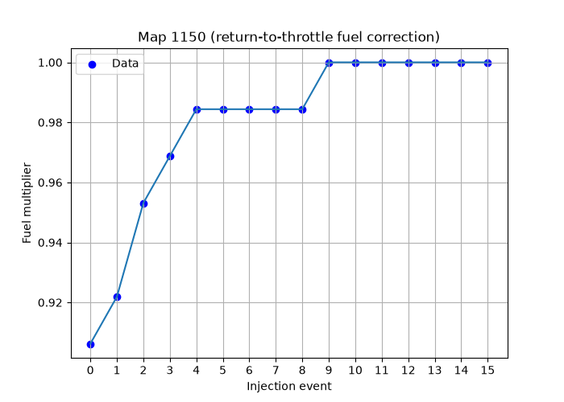

# The post ignition routine overview (timing changes and real-time fueling)

In the [real-time ignition timing code](ignition_timing_code.md) discussion, we looked at how the speed sensor interrupt routine starts the dwell period and fires the spark. We left things there because that was the end of the story for generating the actual spark signal - but that wasn't the end of that routine, and many other important things happen just after that point. These are things that, like the spark signal, need to be handled in real time, and are best just just after the spark fires. 

Here, we'll just discuss these things at a high level, and as usual there's a [code walkthrough](dme_post_ignition_code_walkthrough.md) if you want the gory details. 

## Outline

The over all sequence of events that happens in this routine is:

* move the current timing advance value (31h) towards its new target value (32h) according to some rules
* reset the reference sensor latch
* check if it's time to do fuel injection:
  * if it's just after the second spark for this rev, then it's definitely time to inject fuel
  * if it's just after the first spark, then it might be time to do a special supplementary injection
* check for the rev limit or any other fuel cut conditions (coasting, overload protection, all calculated elsewhere)
* apply any necessary transient fuel correction
* apply the [low-rpm, cold acceleration enrichment](dme_acceleration_enrichment_code_walkthrough.md) if necessary
* add the injector latency (aka dead time) value from 54h to the final pulse
* turn the injectors on (the timer0 interrupt will turn them off later)

That's a lot of stuff and it doesn't fall neatly into the categories of fuel-related or timing-related etc. These are just the things that need to happen at this point!

Next we'll discuss these things in a bit more detail (but still not to the level of reading code). 

## Timing adjustment
The main timing variable is 31h - this contains the angle BTDC at which the spark should fire (represented in half-tooth units of ~1.36 degrees). In the DME's main loop, a new timing value is calculated using [various maps](dme_ignition_timing_calculation_overview.md). But this new value doesn't simply overwrite 31h. Instead, the new value represents a target value (stored in 32h), and a fairly involved set of rules determine how the current value is allowed to progress towards the target. This way, we never have sudden abrupt timing changes, which would be bad for smooth driveability. 

The rules are implemented by a cascading set of flags. The flags are set and cleared by various driving conditions, and in the routine we're looking at now, they're checed in the order shown below.

flag  | update frequency (34h) | update step size (r5)
------|----|---
22h.6 | 01 | 01
22h.5 | 01 | 02
22h.4 | 01 | 08
None  | 08 | 01

Each flag sets a particular update frequency and step size. The update frequency is the number of spark events to count before allowing the timing to change. The step size is just how much the timing can change at a time. 

For example, if 22h.6 is set, then timing is updated after every spark, by up to 1 half tooth. If 22h.6 is clear but 22h.5 is set, then the update frequency is still every time, but the change can be up to 2 teeth. This step size is an upper limit - the actual target value might be only one tooth away!

Clearly, 22h.4 is by far the fastest regime, with with a maximum step size of 8 teeth (~10 degrees) after every spark (twice per rev). This can only happen if 22h.4 is set but 22h.5 and 22h.6 are both clear. 

When all the flags are clear we get the slowest rule of all: one tooth at a time, every 8 events (i.e. 4 revs). This slow rule is the normal one - the others are applied in roughly these circumstances:

* 22h.4: below 800rpm or above a load value of 60
* 22h.5: while coasting, before fuel cut
* 22h.6: while applying fuel-reactivation correction

## Ref sensor reset
There's not much I can say about this simply because I haven't been able to figure out the point. In the [crank sensor signal](dme_crank_sensor_hardware.md) article we saw that when the reference sensor's digitized output is triggered by the S100 chip, it's latched and won't go high again until it's reset. But the state of the ref sensor input to the 8051 is never read explicitly. It only triggers the external interrupt, and the 8051 interrupts are internally latched, and thus cannot be missed accidentally. So why doesn't the S100 just make the output go high again once the raw sensor signal goes back below the threshold? I don't know, but this section of the post-spark routine is where the 8051 asserts the reset line to the S100, putting the ref sensor digital signal back to the high state. 

## Check if we should do fuel injection
The general rule is that the injectors are fired once per revolution, after the second spark event. The way this is tracked is using the cylinder index variable 35h. It starts at zero and gets incremented after every spark, and reset when it gets to 2. 

There are two conditions that break that general rule:

1. cranking
2. low-rpm cold acceleration enrichment

For the cranking situation, we fire the injectors after every spark event. The cranking flag 23h.2 gets cleared when rpm exceeds the temperature-dependent threshold in Map 3, which is 800rpm for most cases. 

The second case is one of two kinds of acceleration enrichment (discussed in detail in the link above). The other kind doesn't trigger this extra injection event. You can think of this low-rpm acceleration enrichment as being somewhat analagous to a carburettor pump-shot - it's delivered just once but it should come as soon as possible when the airflow event that triggers it is detected. 

The need for this fuel shot is indicated by 21h.7. That flag gets set under certain acceleration conditions and if we find that it's set just after the first spark, then we do a special injection event just for this. Normally when this happens, the entire injector pulse is just whatever value the pump shot calls for. But it's possible that the injectors might still be turned on from the previous injection event, and in that case we just add our pump shot value to the timer without stopping inejection. 

## Fuel cuts
There are various conditions that require fuel to be completely cut:

* rev limit exceeded
* coasting with the throttle closed
* overload protection

The last two of these are calculated in different places and the condition is signified by setting 23h.5. So here, we check if the rev limit has been exceeded or if 23h.5 is set for any reason, and if so then we bail out of routine, skipping the whole fuel injector section completly. 

## Transient fuel correction
Generally when the throttle is at the idle position, and the rpm is above a certain threshold the fuel is turned off completlely. This condition is signified by 23h.5, as we saw earlier in the section that handles fuel cut off. In fact this is a pretty complicated feature with quite a few variables. We won't get too much into the details here, but there is a related conditions that's dealt with at this point: adjusting the fuel after is has been reactivated. 

If this situation exists, it's indicated by 21h.5, so that flag gates the whole section we're about to look at. Next, 21h.6 indicates whether the rpm returned to idle speed after fuel was cut or not. Based on the setting of 21h.6, we apply one of two corrections, which are best understood visually. 

For idle fuel reactivation, we apply the changes from this map for the first few injection events:

This has the effect of pulling the fuel pulse *rich*, then *lean*, then rich again (but less so), before settling down into having no effect towards the end. 

For fuel reactivation that happens before the rpm sinks back to idle speed (for example gear changes), we use this map instead:

The actual effect of these corrections is easy to understand. Their purpose is a little harder to decipher, and the best I can do is a reasonable guess. In normal operation, there's a film of fuel on the intake walls near the injectors, sometimes even a liquid pool. This fuel makes a contribution to the actual AFR (see the [acceleration enrichment](dme_acceleration_enrichment_code_walkthrough.md) article for more details). When the throttle is closed, the lack of injection and the strong vacuum result in this fuel drying up completely. So when fuel is reactivated at idle, there might be a brief lean condition for a few cycles. Thus we might expect the correction to go rich for a few cycles. And ultimately that might be the net effect of Map 1140, but it may be that it's necessary to go way too rich on the first cycle, then correct that on the next one, etc. This kind of thing probably had to be figured out by experimentation. 

As for the other correction, Map 1150, well we know for certain that there's a big overshoot in the AFM output signal when you open the throttle suddenly - that's how acceleration enrichment works, by design. This overshoot is present when you reapply the throttle after a gear change, since you're going from very low airflow back to at least the airflow you had before, maybe more. Again, experiments probably revealed that the first few cycles are just a bit too rich, and benefit from this gradual ramping up of the fuel. 

Those are my best guesses, but I'm open to correction on the reasons for these corrections. 
