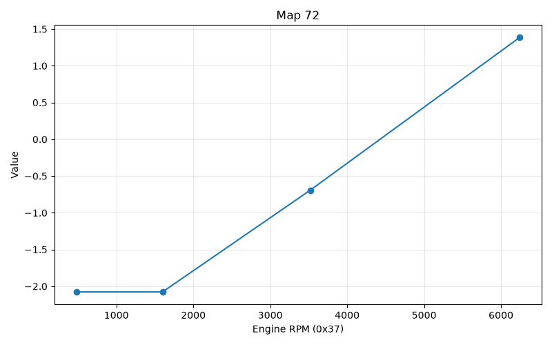
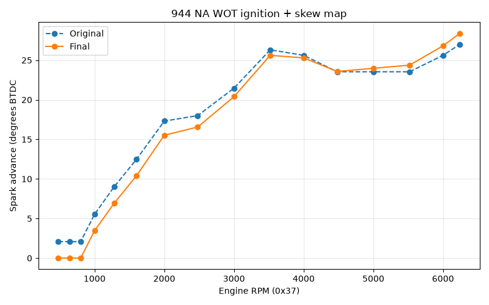
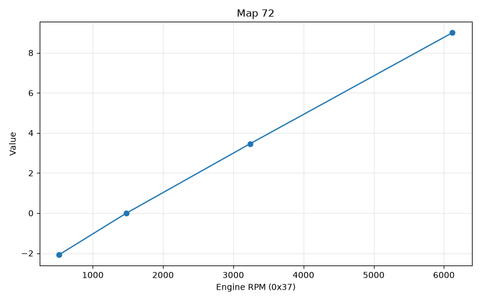
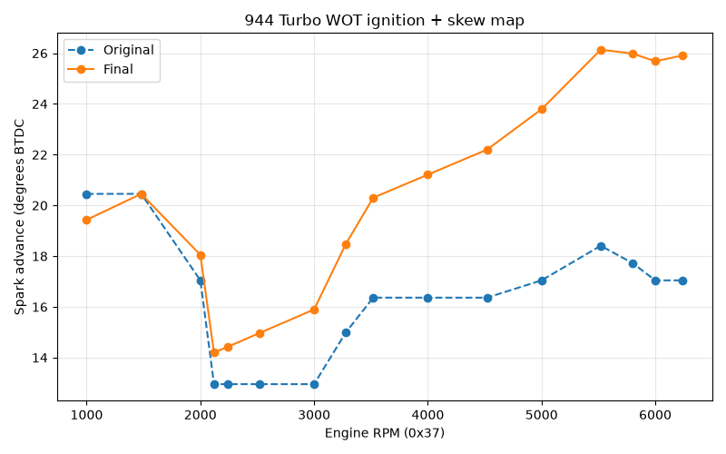
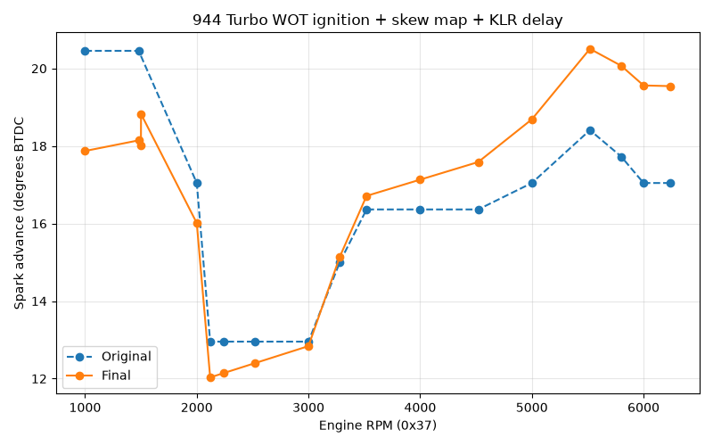

# DME timing skew map

In this article we'll examine a peculiar map used during ignition timing calculation in both the NA and the Turbo 944s. It's Map 72 (location __12C0__) and its a mostly linear function that's used to *skew* the main timing maps around a certain rpm - that is, timing is reduced below that rpm and increased above it, by an amount that's proportional to the change in rpm. 

It's essential to take the effect of this map into account if you want to know the actual ignition timing your car will have; the main driving mode maps don't tell the full story! Additionally this map might be useful for tuning - in fact that seems to be the most likely reason it exists. 

Although this project is mostly focused on the turbo model, sometimes it's instructive to compare the NA maps, because that can give us hints as to the purpose behind obscure things. 

In the main timing calculation routine (at __1C24__) our skew map gets added to the final calculation after the idle, part throttle or WOT map lookup (this addition happens at __1C8F).

Let's take a look at the NA and Turbo versions of this map, and what they actually do to the main maps. We'll use the WOT maps in each case, since they're more interesting than the idle maps, and the part throttle maps are harder to visualize, being 2-axis rpm/load based. 

Here's the NA Map 72:

And here's the effect it has on the NA WOT ignition map:

So it's a pretty subtle effect, presumably a convenient way of tuning the overall effect with respect to rpm, without having to change dozens of cells individually. 

But things get a little more interesting when we look at the turbo versions:

Note how much steeper it is - and as expected, the effect it has on the original map:

Clearly that's a huge change - what's going on there? If you have read the [KLR ignition signal](ignition_signal.md) explanation, or looked at the KLR's input/output signals on an oscilloscope, you might have an idea of what's happening here. Due to an unfortunate artifact of trying to do precise signal processing with a very primitive microcontroller (the Intel 8039 series), the KLR always creates a fixed latency in the ignition signal. 

The ignition signal generated by the DME goes to the KLR, and the KLR returns this signal to the DME enclosure, where it goes directly to the coil driver. That's what gives the KLR the ability to adjust the ignition timing to respond to knocking. But the returned signal from the KLR is always about 170us later than the input signal it gets from the DME, above 1500rpm (below 1500, it's a longer delay of around 260us). The exact reason is explained in the article linked above, but to summarize, it's a consequence of the need to keep the output signal phase locked to the input. 

Clearly a fixed delay like this corresponds to an increasing angle with increasing rpm, and if you crunch the numbers, it comes out to a little over 6 degrees at 6000rpm. 

So this is (presumably) why the turbo version of the skew map is so much steeper. Let's see what we get when we combine the skew map *and* the KLR latency with the original turbo WOT map:

Now that's much closer to what we saw with the NA map. 

In summary the turbo version of the map does a pretty good job of cancelling out the KLR latency. There's still that weird kink at 1500, which is an unavoidable consequence of the fact that the KLR's latency jumps at this point. But the actual change (about 90us) is only around 0.8 degrees at that rpm, and that's not really enough to notice anything. But it's also clear that cancelling out the KLR latency is not the only purpose of this map, not only from the residual effect it has on the original maps, but also from the fact that the NA version of the car has a similar map, albeit a bit less pronounced. 

Finally it's worth reiterating that while we only looked at the WOT maps in this discussion, this skew map is applied to all driving modes, so tuners might want to keep this in mind, both as a part of the actual timing achieved, and as a tuning tool. 

## Map details

### Map 72 - 944NA (130 flywheel teeth)

* Raw:

**1-Axis Map** (address `12c0`, input variable `Engine RPM (0x37)`)

| Engine RPM (0x37) | Value |
|---|---|
| 480 | 17 |
| 1600 | 17 |
| 3520 | 19 |
| 6240 | 22 |

* Translated: 
**1-Axis Map** (address `12c0`, input variable `Engine RPM (0x37)`)

| Engine RPM (0x37) | Value |
|---|---|
| 480 | -2.08 |
| 1600 | -2.08 |
| 3520 | -0.69 |
| 6240 | 1.38 |

### Map 72 944 Turbo, including S (132 flywheel teeth)

* Raw:

**1-Axis Map** (address `12c0`, input variable `Engine RPM (0x37)`)

| Engine RPM (0x37) | Value |
|---|---|
| 520 | 17 |
| 1480 | 20 |
| 3240 | 25 |
| 6120 | 33 |

* Translated:

|---|---|
| 520 | -2.05 |
| 1480 | 0.00 |
| 3240 | 3.41 |
| 6120 | 8.86 |
