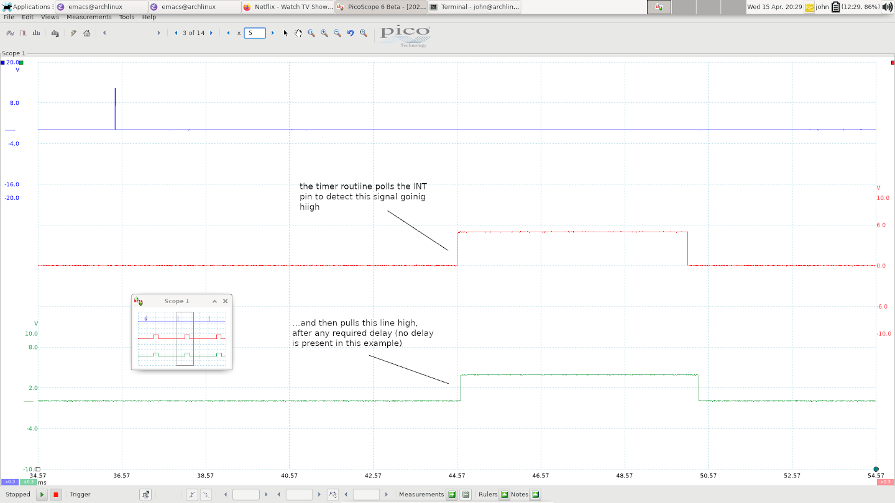
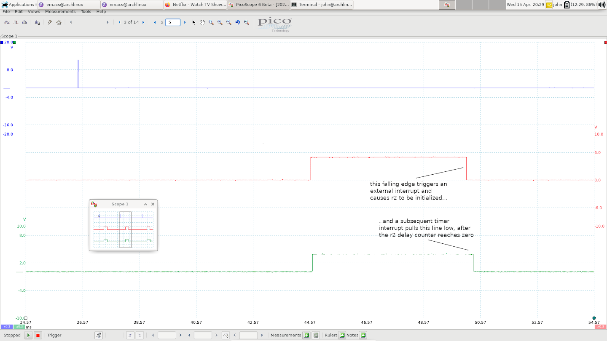

# How the Ignition Signal is Generated

Hopefully at this point you've had a look at the [basic signal timing](klr_signal_timing.md) and the [speed measurement logic](speed_measurement.md). This should make the ignition signal generation pretty manageable. *This section will not explain how the timing delay for knock control is actually calculated; that's more complicated and will come later*. For this section, we're going to assume that any necessary delay has already been calcualted. 

You might also want to refer to the [pin assignment](pin_assignments.md) info before or while reading this section. 

## Begin The Dwell Period

After the speed counter __r6__ is decremented, we jump to __0x010__ where the ignition code begins:

```asm
0x10 jnt1 $001A
0x12 en   i
0x13 djnz r3,$001A
0x15 inc  r3
0x16 anl  p2,#$BF
0x18 orl  p2,#$80
```

The first instruciton checks if the DME has begun the dwell period. The ignition input signal is wired to both the __INT__ pin (external interrupts) *and* the __T1__ pin, so the __jnt1__ instruction will jump if dwell has *not* begun. 

If dwell has begun, external interrupts are now enabled and the counter __r3__ is decremented and checked for zero. If it's not zero, we jump beyond the dwell code; the value in __r3__ therefore controls how much the dwell is delayed in the output signal relative to the input. For now, you'll just have to assume that __r3__ has been initialized correctly; soon you'll see how that initialization actually happens. 

Generally, when there hasn't been any knocking for the current cylinder, __r3__ will have the value 1, and so the code at 0x15 will run immediately.

The increment instruction just puts __r3__ back to 1 and the next 2 instructions actually pull the ignition output signal high. If you haven't seen this method of setting port pins on a microcontroller before, it might look strange. The idea is to turn a certain pin (or multiple pins) on or off without affecting the state of the others. It's much clearer if you look at the binary values involved:

Here's 0xBF:

```
1 0 1 1   1 1 1 1
```
And here's 0x80:

```
1 0 0 0   0 0 0 0
```

So the first instruction ANDs the current state of the port with the value shown; this guarantees that __bit 6__ is turned OFF (since 0 AND anything is 0). The other bits are unaffected, since anything ANDed with 1 is left unchanged. 

Next the port is ORed with the second value; this has the complementary effect of turning __bit 7__ ON, again leaving the other bits unchanged, since anything ORed with 0 is left unchanged. 

So the total effect of these 2 instructions is to turn Port 2 bit 6 OFF and Port 2 bit 7 ON. These two pins are always used in this complementary or *differential* way for the ignition signal. In fact  __bit 7__ is the one that matches the polarity of the signal sent back to the DME. 

This is the way port pins are always controlled in 8048 series code; when I'm reading code I always add a comment to show the binary values so that I can see exactly which pins are being toggled. 

Here's a quick look at where we are now on the scope - the blue channel is the trigger signal from the DME that resets the 8048. The red channel is the ignition input signal from the DME, and the green channel is the ignition output from the 8048:



## Fire The Coil

The next section of the timer routine is concerned with the falling edge of the ignition signal - that is what causes the coil to fire. Below is the first instruction for this part. It should look familiar - __r2__ is used as a counter to control the delay in firing, just like __r3__ was for the dwell. Why use 2 separate counters? After all, we want to delay both the rising and falling edge of the signal by the same amount, right? Well actually __r2__ and __r3__ will have the same value in a given ignition event. The reason they are separate counters is actually that their initialization is *staggered* - __r3__ must be initialized before the dwell period, but __r2__ doesn't get initialized until the DME pulls the igntion input signal low, triggering an external interrupt. 

For now, assume we're still in the dwell period, so the first instruction below will cause a jump to 0x36, which skips ignition related stuff and deals with the cycling valuve output. 

```asm
0x1a djnz r2,$0036
```

### The External Interrupt
In fact nothing interesting will happen until the DME pulls __INT/T1__ low. At that point, an external interrupt is triggered, so execution jumps to 0x03:

```asm
0x03 sel  rb0
0x04 dis  i
0x05 jmp  $030E
```

The __sel__ instruction selects between register banks - you can read more about that in the Intel MCS48 documentation, but for now it's enough to say that it's a way of preventing the main code and the interrupt routines from clobbering each other's variables. 

Next, external interrupts are disabled (to be enabled again when the next dwell period starts, as we saw earlier). Finally we jump to 0x30E where the main body of the routine is located. First, __r2__ and __r3__ are initialized from __25h__ and __21h__ respectively. Remember though, we've already used __r3__ on *this* cycle, so the value being initialized here controls the dwell delay for the *next* cycle. This is what I meant by "staggered" earlier. The value of __r2__ being loaded here is the one that will actually control firing ignition on this cycle. 


```asm
0x30e mov  @r0,a
0x30f mov  r0,#$25
0x311 mov  a,@r0
0x312 inc  a
0x313 mov  r2,a
0x314 mov  r0,#$21
0x316 mov  a,@r0
0x317 inc  a
0x318 mov  r3,a
```

The reason that both counters are incrememented is because the code that calculates the required timing delay leaves them at 0 if there's no delay required; but in order to test them, we need to use the __djnz__ instruction, which decrements them. We don't want them rolling over to 255, so we __inc__ them here. This is a common pattern you'll see everywhere. 

The next bit of code is less clear:

```asm
0x319 mov  a,r7
0x31a swap a
0x31b cpl  a
0x31c add  a,#$A
0x31e mov  r0,a
0x31f djnz r0,$031F
0x321 mov  r0,#$38
0x323 mov  a,@r0
0x324 retr
```

Now I promised you that you needed to know all about the timer interval __r7__ in the [speed measurement section](speed_measurement.md), and I wasn't joking. Here it's being used to produce a counter that will cause the code to delay in a loop (0x31F) for a length of time that's a little over 1 timer interval. 

Here's the reason for this delay: now that the ignition input signal has been pulled low, and __r2__ has been initialized, the ignition output signal will be fired in a subsequent timer interrupt. When will that timer interrupt occur? Well that depends - if the time between the trigger event (when the timer was first initialized) and now happens to be an *exact multiple* of the timer interval, then the timer interrupt will fire immediately after we return from this external interrupt. Great. But the chances of that are one in a million - after all, the engine speed and ignition timing vary all over the place. So in reality, if we return now, then there will be a *random* period of time (up to one timer period) before the next timer interrupt runs. This is a disaster! It means that the actual timing will drift back and forth by a random amount of up to one timer period. Unacceptable! So this delay loop guarantees that the external interrupt won't return until at least one full timer period has elapsed. This guarantees that there will be a pending timer interrupt when we return from here, and therefore the timer routine will run immediately. 

Let's take a quick look at where things stand now:



This has the unfortunate effect of delaying the ignition output signal by a fixed time *always*, even where there's no knocking - but at least it's consistent. I can only assume that the DME ignition timing maps take this into account. When you add this deliberate, fixed delay to the time it takes for all the instructions to run, it ends up being a total delay of around 260us below 1500rpm, and around 170us above that (it needs to be longer below 1500rpm because the timer period is longer - see the speed measurement section if that doesn't make sense). 

Here's a close up of this delay from an idling engine with measurement cursors to show the actual time involved; there's no knocking in this case - this is a combination of the time it takes for all this code to run, and the delay at __0x31F__.


After the delay loop, the final instructions just restore the accumulator to whatever it was before the interrupt, and then we return. 

### The Timer Routine Revisited

Now that __r2__ has been initialized, we can finally revisit the timer routine and see what happens. 

The way that timing delays are represented is with two counters: a *coarse* counter and a *fine* counter. The value in __r2__ is the coarse counter - it represents the number of timer intervals to wait before firing the coil. The value in __26h__ is the fine counter. It ranges from 0 to 30 and each "tick" is just a __djnz__ instruction, which takes 2.7us. This means that the fine counter is capable of representing a delay of up to one coarse unit, as you'd expect.

Recall from the Technik documentation that timing is always delayed by either 3 or 6 degrees, and is restored in increments of 0.3 degrees. There are some calulations that have to be done with the current engine speed in order to figure out how many timer interupts and fine counter ticks will make up the required *angle*. We'll see how that's done later, but for now, let's assume that they have their appropriate values. (We didn't see where __26h__ was initialized for this cycle. For some reason, it's not done in the external interrupt routine along with __r2__; it's done in the trigger routine.)

It might seem odd that the dwell period is delayed using only the coarse counter, but the firing is delayed using both. I can only presume that the purpose of delaying dwell is just to avoid charging the coil for any longer than necessary; it's not extremely time-sensitive. So it just wasn't worth the hassle of using both coarse and fine counters on the dwell period. 

So either immediately (when there's no knocking), or after a small number of timer interrupts, we'll get past this instruction:

```asm
0x1a djnz r2,$0036
```

...and on to this:

```asm
0x1c mov  r0,#$26
0x1e mov  a,@r0
0x1f inc  a
0x20 mov  r2,a
```

Here, we're just loading the fine counter from __26h__ into __r2__. Next, we scale the value of the fine counter to match __r7__ (the timer interval). The delay was calculated with the assumption that the timer was on it's "normal" interval of 254, so here we rotate __r2__ left (multiplying it by 2) for every step that __r7__ has been increased, relative to 254. This is just another one of the many places that the variable timer interval adds complexity. 

```asm
0x21 mov  a,r7
0x22 rrc  a
0x23 xch  a,r2
0x24 rlc  a
0x25 xch  a,r2
0x26 rrc  a
0x27 jnc  $0023
```

Next we sit in a tight loop, decrementing the fine counter __r2__ until it reaches zero, and then toggle the ignition output signal, pulling it low, which actually fires the coil. 

```asm
0x29 djnz r2,$0029
0x2b orl  p2,#$40
0x2d anl  p2,#$7F
```

That's it for generating the ignition signal! The rest of the timer interrupt routine is concered with the cycling valve PWM signal, and the ADC read routine, which we'll cover in later sections. We probably won't go into this level of detail on trival stuff though; some routines are much more complicated so we'll have to start biting off bigger chunks.  

