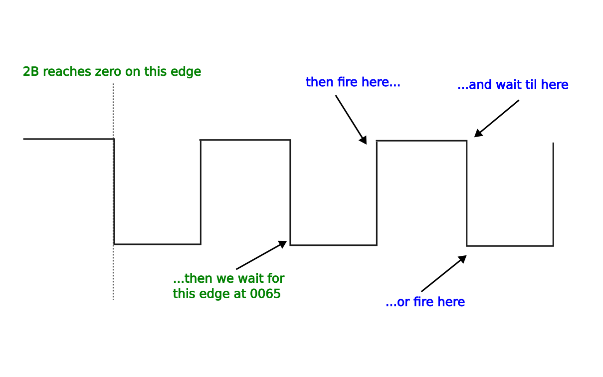

# DME ignition timing routine

## Overview

In [another article](dme_crank_sensor_hardware.md) we explored how the DME measures angles for ignition and other timing-critical events. 

In this article we'll take a detailed look at the real time part of the DME's ignition timing code. The real time part is concerned almost exclusively with generating the ignition signal that controls the coil, so we won't get into how the dwell and timing values are calculated here. I strongly recommend reading the crank sensor article linked above before tackling this - even if you're familiar with the basic idea of the crank sensor signals. There are subtle details explained there that have a profound effect on how the code is interpreted. You can read about how the actual timing values are calculated [here](dme_ignition_timing_calculation_overview.md).

Roughly speaking the ignition timing is achieved by:

* using the speed sensor pulses to count down a known number of half-teeth from a known angle before TDC, then
* starting the ignition event when that counter reaches zero, and 
* resetting the counter for the next ignition event. 

There are two types of ignition event that use this counter technique: dwell and spark. First, the counter counts down to the start of the dwell period, and we turn the coil current on. Then we immediately reload the same counter variable with the dwell period and the countdown begins again. When it reaches zero again, we turn the coil current off to fire the spark and reload the counter for the next ignition event. 

This next ignition event is the start of the dwell period for the next cylinder, which is around "180 degrees minus dwell angle" away from where we fire the spark (because two cylinders fire in every complete rotation). 

There is also a separate counter for the KLR trigger event. This trigger signal is a brief pulse that's fired about 71 degrees BTDC for every cylinder. This logic all happens within the speed sensor routine but otherwise it more or less independent of the ignition events. 

Fuel injection is always done just after the second spark event in the rotation, but is not timed precisely with reference to TDC. 

That's a very low resolution outline of what happens. But there are many details that need to be understood! So we'll walk through the relevant routines in pseudo-code.

## Hardware setup

The 8051's __port 1 pin 1__ (p1.1 in the code) is the ignition signal output. When it's low, we consider it "on" - that is, current is flowing through the coil. 

In case you haven't read the crank sensor stuff already, I'll give a brief introduction here. From this point on I'll asume some basic familiarity with that stuff. 

As a very brief summary:

* each crank sensor signal is digitzed and sent to one of the 8051's external interrupt pins, both of which which trigger on the falling edge
* the reference sensor triggers INT0 and the speed sensor INT1
* thus the ref sensor interrupt routine runs once per revolution at ~60 deg. BTDC and the speed sensor interrupt routine runs once for every flywheel tooth. 

That's no substitute for reading the complete crank sensor article, but it should be enough to get going. We'll start with the reference sensor routine. 

## 01F0 - Reference sensor handler

The reference sensor triggers external interrupt 0, and the actual location for that interrupt hander is 003. But the code at that location simply clears the ie1 edge flag and then calls 01F0, which is where most of the action happens. 

Throughout this discussion we'll assume a running engine. That can sometimes be confusing because there's no start or end to the process. The DME does have some special startup code where things are done differently to get the engine started. But ultimately it's best to leave that for another discussion. So although we'll starting at the ref sensor routine, we're assuming that the spark has already fired for the last cylinder beore that. 

Here's the original code

```
X01f0:	push	psw
	mov	c,int1
	orl	c,ie1
	mov	2bh,2ch
X01f9:	mov	2dh,2eh
	jc	X0202
	mov	c,22h.1
X0200:	ajmp	X0208
;
X0202:	anl	c,/22h.1
	jc	X0208
	inc	2bh
X0208:	mov	22h.0,c
X020a:	djnz	2bh,X0213
	inc	2bh
X020f:	dec	30h
	dec	30h
X0213:	mov	35h,#0
	mov	c,22h.3
	mov	p1.1,c
	pop	psw
	reti
```

This routine is short but quite subtle. Here's a pseudo-code walkthrough:

* 2B is the ignition event counter used in the speed sensor routine
* 2C is a previously calculated counter value, relative to the ref sensor position
* 2D is the KLR trigger counter, and 2E is a previously calcualted value based on the ref sensor position
* 30 is the duration of the dwell period
* 22.0 is the bit that adds the final half-tooth correction
* 22.1 is the second bit for half-tooth correction

```
c = int1 OR ie1

2B = 2C (overwrite 2B with the replacement calculated in 021D)

2D = 2E (do likewise for the KLR counter)

if c:
	c = c AND NOT 22h.1
	if c: (in other words, "if (int1 OR ie1) AND NOT 22h.1...)
		22h.0 = 1 (we need 1 half-tooth correction)
	else:
		2B++
		22h.0 = 0 (we need 2 half-tooth corrections, which is one extra whole tooth)
else:
	22h.0 = 22h.1

if 2B > 1:
	2B--
else if 2B == 1:
	30 -= 2 (we can't decrement 2B to zero, so shorten the dwell period instead)

35h = 0

p1.1 = 22h.3

```

Later we'll see how 2C and 2E are calculated. As noted in the comments above, these are the counter values relative to the reference sensor's position BTDC. The locations that they overwrite here (2B and 2D) already contain suitable values, but they're relative to the next-TDC value previously calcualted. Thus if the ref sensor pulse doesn't happen for some reason, the engine will continue to run using those redundant counter values. 

The tricky part is next - this is where we consolidate the two sources of half-tooth error. These errors are explained in detail in the crank sensor article, but as a quick recap: we might need to add one or two extra half-teeth to the counter values because:

1. we might have lost a half-tooth count to a rounding error when the half-tooth values were converted into whole-tooth values via rrc
2. we're assuming that the relationship between the ref sensor trigger screw and the flywheel gear might vary from one car to another

So the logic goes like this:

 * if int1 *is not* set at the same time as int0, then we only care about the half-tooth rounding error from the division (if there is one)
 * if int1 *is* set at the same time as int0, then:
   * if we already have a half-tooth rounding correction, then add a *whole* tooth and remove the half-tooth correction
   * if we didn't already have a half-tooth correction, add one now

The resulting, final half-tooth correction is stored in 22h.0, which is the location that actually controls the half-tooth correction logic we'll see soon in the speed sensor routine. 

Now suppose we don't get any more ref sensor pulses after the engine starts, for some reason. We have to get at least one to get started - but from that point on, 22h.0 will include the ref sensor/speed sensor phase correction. For this reason, the current value of 22h.0 set here is later preserved during both the dwell (0097) and spark (00B8) calculations, and added to the calculation before being overwritten with any new rounding error. 

Next we decrement our counter 2B. The reason for this is that when the counter reaches zero and it's time to fire the ignition event, we will end up delaying for one whole tooth before firing the event. This helps to guarantee that the event is fired with refernce to a very precise position, but it does need to be compensated for. Decrementing the counter here has the effect of advancing the timing by one edge, so that takes care of it. 

There's an exception to this though - if 2B is equal to exactly 1, then we can't decrement it because the counter would roll over to 255 upon the first speed sensor interrupt! The workaround for this is that we decrement the dwell period 30h instead. This will cause the dwell to end sooner, thus advancing the spark to compensate for the delay. A short reduction in dwell time typically won't hurt anything, and it's the best we can do in this scenario, which is fairly unlikely to happen anyway. Why decrement 30h *twice*? Because 30h represents the dwell period in half-teeth, whereas 2B is whole teeth. 

Then we set 35h to zero. This is an index variable that keeps track of which of the two cylinders in the rotation is going to fire next. 

Finally we set the coil to a predetermined state in 22h.3. The reason for this is that at higher rpm, the dwell may need to start before or during the ref sensor routine. This flag indicates if the state needs to be set immediately within the ref sensor routine. Later we'll see how this flag gets determined. 

## The speed sensor interrupt routine (countdown)

The interrupt handler is located at 13h, but the code there just increments the rpm counter and then jumps to the main handler routine at 005C. We're not interested in the rpm measurement aspect right now so we'll take a look at 005C. 

The main variables to remember here are
* 2B - the counter to the upcoming ignition event (dwell or spark), in *whole* teeth
* 2D - the counter to the KLR trigger event in whole teeth
* 22.0 - half-tooth error correction
* 30 - the duration of the ignition event 
* 33 - tooth count to the next TDC

We start with the "short circuit" path, where the the ignition counter hasn't reached zero yet. 

```
X005c:	
	djnz	2bh,X0090
...
...
...
X0090:	
	djnz	2dh,X0096
	lcall	X1000		; trigger the KLR
X0096:	
	reti

```

In pseudo code it's like this:


```
2B--
if 2B !=0:
	2D--
	if 2D == 0:
		trigger KLR
	else:
		reti
```

And that's it - most of the time the speed sensor interrupt routine returns without doing anything else at this point. 

For everything after this, we can assume that 2B has reached zero (though 2D, the KLR counter, typically will not have). So now we'll go through the rest of the routine and see what happens when 2B reaches zero. 

```
	djnz	2dh,X0065
	lcall	X1000		; trigger the KLR
X0065:	
	anl	ie,#0eah	; 0000 1110 1010
	acall	X0096		; reti
X006a:	
	jnb	ie1,X006a
	inc	36h		; increment rpm counter
	clr	ie1
	djnz	2dh,X0077	
X0074:	
	lcall	X1000		; trigger the KLR
```

We check the KLR counter again, disable external interrupts, and leave the interrupt context via __acall 0096__ (without returning to the main routine). Why leave the interrupt context? Well it's very important that we don't miss any flywheel teeth. Right now, we have disabled interrupts, but we are going to count a few teeth manually to get the ignition event timing just right. After that, there's a lot more code to run before we're finished and there will definitely be flywheel teeth passing by during that time. So we will enable interrupts again soon, and we want the first part of the routine to run again so that those teeth are counted. Leaving the interrupt context is a necessary step to make sure that subsequent interrupts work correctly. 

Now we wait for one more ex1 pulse (that is a falling edge of the speed sensor signal) and manually update the rpm and KLR counters (since we just manually waited for a pulse that would normally have triggered an interrupt - but we have disabled that). The reason why we wait for this falling edge should be clear in a moment.

Now comes the interesting part - we use 22h.0, the half-tooth error correction that we discussed previously:

```
X0077:	
	jb	22h.0,X0087	
X007a:	
	jb	int1,X0080	; poll for rising edge
	jnb	ie1,X007a   ; or falling edge if we miss the rising edge somehow
X0080:	
	cpl	p1.1
X0082:	
	jb	ie1,X008c   ; poll for a falling edge
	ajmp	X0082
;
X0087:	
	jnb	ie1,X0087	; poll for a falling edge
	cpl	p1.1
X008c:	
	setb	ex1		; enable ext int. 1 (speed sensor)
	ajmp	X0097
```

We can read ths logic as:

```
if 22h.0:
	wait for ie1 to be set
	toggle p1.1
	wait for ie1
	enable ex1
else:
	if not int1:
		wait for int1 or ie1, wichever comes first
	toggle p1.1
	wait for ie1
	enable ex1

```

In 8051 assembly, __ie1__ is the INT1 edge flag - it indicates if there has been a falling edge on the INT1 pin, and __int1__ is the actual current state of the pin (1 or 0). So in the code above we can read __ie1__ as the falling edge of a flywheel tooth and __int1__ as the rising edge of the next one. 

We know we *just* detected a falling edge, immediately before this code ran. So if there's no correction needed, we fire the event on the next rising edge. If a correction is needed, we wait for *another* falling edge, that is one half-tooth longer than normal. Hopefully it's now clear why we had to expiciltly wait for a falling edge just before this code block - we need to make sure that the rising/falling edge decision being made here is referenced to a known position. 

Note that next we *always* wait for another falling edge, regardless of which edge we fired on. That means another whole tooth after the one we manually counted. This guarantees that the phase of the flywheel teeth is always the same at this point, regardless of whether we took the half-tooth correction branch or not. This of course means that the next calculation of 2B must decide again if a half-tooth correction is needed - it doesn't automatically propagate. So in total we are now at 2 teeth after the counter reached zero, but the ignition event might have been *just now* or one half-tooth ago. 

This diagram explains the timing of the event:




Why don't we manually count this extra edge so that the rpm and KLR counters are up to date? That's a subtle point - note that immediately afterwards, we enable external interrupts on EXT1 again. But we didn't clear the edge flag from this extra edge. That means that the interrupt is still pending as far as the 8051 is concerned, and it will trigger immediatley upon being enabled. So the extra edge that we waited for will actually be counted by another instance of the routine that interrupts *this* one. If you didn't think that was possible, bear in mind that we are technically not in an interrupt any longer, because we called reti earlier. The call stack still has the program location from somewhere in the main loop when the original interrupt was triggered, but the reti instruction tells the 8051 that we're finished servicing the interrupt and new interrupts are allowed to happen. If this is too tricky to understand, read up on 8051 interrupts and the reti instruction - that will clear things up. 

The careful reader may noticed that the ignition output signal (p1.1) is alway *toggled* here, never set to 1 or 0 explicitly. The reason is that we don't know or care what the actual state of the signal is at this point. Firing the ignition coil consists of a 2 step process:

* coil ON to start dwell, i.e. charge the coil
* coil OFF to fire the spark

We treat these 2 steps the same in this part of the code, so we don't bother to keep track of which one is happening at this point. If the event that we're handling is dwell, then the cpl instruction will turn the coil ON. If the event is spark, the cpl will turn the coil OFF.

With that said, in the next section we *do* check explicitly the actual state of p1.1, because from this point on we really do need to handle dwell and spark differently. 

Starting at 0097, we store the acc and psw registers (since we're in an unofficial interrupt, and the main loop code we'll be returning to  might be in the middle of using them for some calculation)

```
X0097:	
	push	acc
	push	psw
	jb	p1.1,X00b8
	clr	a
	mov	c,22h.0
	addc	a,30h
	rrc	a
	dec	a
	mov	22h.0,c
	clr	ex1
	add	a,2bh
	mov	2bh,a
	setb	ex1
	clr	ie0
	setb	ex0
X00b3:	
	pop	psw
	pop	acc
	ret
```

In pseudo-code (recalling that 30h is the previously calculated duration of the dwell period),

```
if not p1.1 (coil is ON, so we have just started dwell):
	disable ex1
	2B = 2B + ((30h + 22h.0)/2)  - 1 (convert half-teeth to whole teeth)
	22h.0 = remainder (from the carry flag)
	clear ie0 (ref sensor edge flag)
	enable ex0 (ref sensor interrupt)
	pop psw, acc
	ret
```

Recall that earlier we saw 22h.0 being used to control whether an extra half-tooth is counted before the ignition event. Here the current value of 22h.0 is preserved in the next counter calculation. The reason for preserving this is that we won't get another ref sensor interrupt before the next ignition event. Including it in our calculation here means that whatever half-tooth correction was calulated in the ref sensor routine will now propagate to the new event. 

Another interesting thing here is that we add the *existing* value of 2B. Wait, isn't that zero? We're in the speed sensor interrupt routine, in the code path where 2B reached zero right? Well, yes but we exited the interrupt context, and later re-enabled the interrupt after firing the ignition event. So now we're just in a plain old routine that can be interrupted. And since 2B had previously reached zero, any subsequent interrupts will roll over to 255 and keep decrementing from there! So when we add our dwell calculation to 2B, an existing value of 255 has the effect of adding -1; 254 means -2 and so on. This makes sense because the dwell has already been on for that number of teeth. 

Note also that we subtract 1 from the whole tooth count. Recall that when preparing to fire the event earlier, we waited for an extra tooth that wasn't part of the count - so this corrects that. Now you might object to this, noting that the ref sensor routine already accounts for this by decrementing 2B. But remember that the ref sensor routine *overwrites* 2B with 2C - and as we'll see a little later, 2C doesn't have this subtraction baked in. 

When we do integer division of an odd number of half-teeth, we lose one half-tooth. This lost bit is in the carry flag because the division was done with "rrc". So now we store this bit in 22h.0. As you saw earlier, this controls whether we'll delay ignition by an extra half-tooth or not. 

So now we have accounted for both sources of half-tooth error, with the final result in 22h.0.

Now we return (to whatever was happening before the original interrupt). We're in the dwell period now and the logic at the start of this routine will be repeated each time the speed sensor interrupt routine runs, until this new 2B counter value reaches zero. When that happens, then p1.1 will be toggled again, turning the coil OFF to fire the spark, and when we get to the *if* statement we just looked at, we'll take the other branch, which we explore now:

```
X00b8:	push	dph
	push	dpl
	push	b
	mov	dptr,#X1160
	clr	a
X00c2:	
	mov	c,22h.0
	addc	a,33h
	subb	a,31h
	clr	c
	subb	a,57h
	clr	c
	subb	a,2fh
	rrc	a
	dec	a
	mov	22h.0,c
	clr	ex1
	add	a,2bh
	mov	2bh,a
	setb	ex1
	mov	a,#3
	add	a,35h
	movc	a,@a+dptr
	clr	ex1
	add	a,2dh
	mov	2dh,a
	setb	ex1
	acall	X021d
	clr	ie0
	setb	ex0
	mov	psw,#18h
X00f0:	
	ljmp	X1029
```

The logic is like this (following on from the __if__ statement in the last block we looked at):

```
else: (coil is OFF, so we just fired the spark)
	push dptr
	push b
	
	# Now we calcultate the count to the next ignition event
	2B = 2B + ((33h+22h.0) - (31h + 57h + 2Fh)) / 2	(see below for an explanation)
	2B--
	22h.0 = remainder of the division, i.e. any missing half-tooth	
	Look up the constant at fire event index + 3 (35h+3)
	Add that to the KLR count
	Call 021D 
	Clear ie0 edge flag
	Enable ref sensor interrupt
	Continue with fuel injection stuff...
```

The value in 35h keeps track of which of the two cylinders will fire next. Recall that we have 2 cylinders firing per rotation. One reaches TDC soon after the reference sensor pulse, and the other reaches TDC 180 degrees later. This variable allows us to keep track of which cylinder we're working with (although most of the time we don't really care)

We push some registers that we're going to use, for the same reason as before. 

Now let's break down the 2B calculation formula. It's pretty simple and can be written like this:

* take the counter value for next TDC (33h) and add any half-tooth error previously stored in 22h.0
* subtract from that:
  * base timing (31)
  * accel/decel adjust (57)
  * dwell count (2F)
* divide by 2 to convert from half-teeth to whole teeth
* store any new rounding error caused by the division in 22h.0
* decrement the result 2B

Again (as with the dwell calculation) we include the *previous* value of 22h.0 in the new calculation. And again we add the result to the existing 2B which might now have counted down past zero into some negative value. Hopefully everything here makes perfect sense by now. I haven't shown where the next TDC value 33h came from, but we'll see that next in 021D. 

After this, the ex1 routine continues to run fuel injection logic and some other things, but we'll leave that for a separate investigation to keep things focused on ignition for now. 

Next we need to explore this 021D routine.

## Preparing for the next rotation: 021D

The purpose of this routine is twofold: 

1. prepare for the reference sensor interrupt routine. 
2. calculate the number of half-teeth to TDC for the next cylinder (stored in 33h)

We usually get here from the speed sensor interrupt, in 00B8, after the spark has been fired. Back there, we calcualted the counter values we need to handle the next cylinder, 180 degrees away. But here in 021D we will get ready to take advantage of the upcoming reference sensor routine to re-sync, and calculate the values again. 

If we're calling this from the spark event for the first cylinder, then the re-sync part of this routine is useless because we won't get a ref sensor pulse before the second cylinder needs to fire. So we will just use the values we already calculated in 00B8. I know that's confusing - there is some redundancy in the calculations which should become clearer when you've seen the whole thing. 

First we initialize the KLR counter 2E from 1162. This will replace 2D in the reference sensor routine. 

We set 22h.3. This flag will be used by the reference sensor routine to check if the dwell period should be on immediately. For now just note that *setting* this flag indicates that the dwell should be *OFF*. 

The next section should now seem mostly familiar:

```
X0224:	
	mov	a,#0
	movc	a,@a+dptr
	setb	c
	subb	a,31h
	clr	c
	subb	a,57h
	clr	c
	subb	a,2fh
```

Here we loading the ref sensor half-tooth count which is stored as a constant at 1160. On the 951, with 132 flywheel teeth, this value is 44, corresponding to 60 degrees. 

Next we subtract our base timing value (31h) plus one (from the setb c), acceleration timing adjustment (57h) and our dwell angle (2Fh). (Note that subb always subtracts the carry flag as well as the intended value - that's why it's cleared manually between each subb). Note the extra -1 here via the carry flag. This means that the timing is advanced one half-tooth from where it otherwise would be. Recall from earlier that the speed sensor routine waits for a falling edge (one whole tooth) and then fires on the next rising edge if there's no correction (one half-tooth later). This advance compensates for that half-tooth delay. 

Anyway, the result of the code above is the number of half teeth we must count from the ref sensor to reach the start of the dwell period - but there are some more details we need to take into account. 

The jnc instruction after the above block will jump if the sutraction of the dwell value 2Fh caused an overflow - that is, the total number of half-teeth we need to subtract was more than 44. 

So,

```
	jnc	X0237
	clr	c
X0233:	
	clr	22h.3
	addc	a,2fh
X0237:	
	clr	c
X0238:	
	rrc	a
	jz	X0233
	mov	2ch,a
	mov	22h.1,c
```

The logic goes like this

```
If subtracting the dwell angle resulted in carry:
  clear c
  clear 22h.3 (will cause ref int routine to set ignition ON)
  add 2F dwell angle back again
```

This ensures that if the dwell should have started before the reference sensor interrupt routine, then at least it'll start in that routine instead of waiting for the next speed sensor pulse. This could happen at higher rpm where there's very little time available between ignition events. 

Adding the dwell angle back to the total ensures that the next ignition event that happens in the speed sensor routine will be firing the spark. 
Next we convert our counter value into whole teeth:

```
clear c
divide a by 2
if zero:
  clear 22h.3
  add 2F dwell angle back again
```

Here we repeat the same logic as we had with the dwell period above - if the division results in zero, this means the original value was 1 (this is because the division is really a rrc, rotate-right-into-carry). This again means that the total count we subtracted from 44 was too big, so we need to signal to the reference sensor routine that it should turn on the coil immediately. But in that case we should not include dwell in the counter that the speed sensor routine uses. 

Now we store our final count value into 2C. This is essentially a "next counter value" variable. The ref sensor int routine will swap this into 2B, the one that the speed sensor actually uses. 

You might have noticed a couple of key differences in how this coutner value was calculated compared to the one in 00B8:

* we don't include the previous 22h.0 value before the division this time
* we don't subtract 1 this time as we did in 00B8. 

The reference sensor routine handles these details, as we saw earlier. 

We store carry into 22h.1 - this is the carry from the rrc, so it indicates if we lost a half-tooth in the division (just like 22h.0 in 00B8). 

Next we calculate the half-tooth count for the next TDC value, 33h. 

```
	mov	a,#7
	add	a,35h
X0243:	
	movc	
	a,@a+dptr
	add	a,31h
	add	a,57h
	mov	33h,a
	mov	30h,2fh
	ret
```

We load a constant from 1167+35h. Recall that 35h is the index of the firing event - it's always either 0 or 1, indicating which of the two cylinders will fire next in the current rotation. On the 951, this constant is set to 84h (132) for the only possible values of 35h (0 and 1). This is 180 degrees in half-teeth. 

Then we add base timing and acceleration timing adjustment, and store the result in 33h. (Next time around in 00B8 we'll subtract the latest spark advance and dwell count from that TDC value to get the countdown to the next ignition event, i.e. start dwell period). 

Finally we store the dwell count 2F into 30h, which the speed sensor routine will use to measure out the duration of the dwell. 

This routine then returns to 00B8, which continues to do some timing calculations for the next cycle, and then handles fuel injection. The next interesting thing from the spark timing point of view is the reference sensor interrupt handler. 


## The KLR

In the NA 944, this signal we just generated goes directly to the coil driver circuitry and thence to the coil. In the 944 Turbo, it's a little more complicated. The signal we just generated goes from the DME to the KLR, where it may be delayed to protect the engine from pinging/knocking. Then KLR returns the final ignition signal to the DME enclosure (because that's where the coil driver is located). The DME doesn't do any further processing on the returned signal from the KLR. 

We touched on the so-called trigger signal for the KLR earlier. The KLR needs to receive this signal at a known angle BTDC for the next cylinder so that it can prepare to monitor the knock sensor and make any required adjustments to ignition and boost. 

The way that the KLR trigger timing is handled can be a little confusing when reading the code. In years past, knowledgeable people have posted on forums that the KLR trigger signal is 11 degrees before the ignition signal. This is not correct but it's an understandable mistake. 

The place to start is in 021D where the counter 2E is initialized with the constant value 252. This value replaces 2D in the ref sensor routine, so the speed sensor pulses will start decrementing this counter from 252 starting at 22 teeth BTDC. When the spark fires, in 00B8 we add the constant value 66 to the 2D KLR counter. Now 66 teeth is 180 degrees, so we are really intializing the KLR trigger counter for the next cylinder at this point. This is very likely where the 11 degrees mistake came from - when we add 66 to 252, it's going to overflow and so we're essentially adding 180 degrees minus 4 teeth (which is ~11 degrees). That corresponds to ~11 degrees before the next spark event (assuming the timing stays the same). 

But recall that the 2D counter starts decrementing at the ref sensor routine, not the spark event. So we are really initializing 2D to a point that's 4 teeth or 11 degrees before the ref sensor pulse. Therefore the KLR trigger will fire at 26 teeth or 71 degrees BTDC. 


## Summary

So that's everything that happens in the real time part of the program to create the ignition signal. As I mentioned earlier, the routine that handles the speed sensor interrupts continues after firing the coil to do some housekeeping and some fuel related calculations, before turning on the fuel injectors. The injectors are turned off by the interrupt routine for Timer 0. But that's for another day. 

One thing that can be very confusing about this whole process is the myriad of ways that our timing values are incremented and decremented, in whole or half-teeth, or the ways we wait for another falling edge, or rising edge, and so on. Keep track of these while reading the code is quite tricky, so it's worth having a short summary here at the end to balance the books, as it were. 

Let's count this in whole teeth. 

* As we saw in the speed sensor routine, we always wait for one more edge after 2B reaches zero. That's a delay of 1. 
* Next, we wait until the next rising edge to fire the event. We can ignore the half-tooth correction now, because that's only used if it was part of the desired value. Right now we're just counting the stuff that *always* happens. So this is a delay of 0.5
* In 021D, the timing calculation always has an extra -1 via the __setb c__ at 227. But this is in half-teeth, so this is an advance of 0.5
* Elsewhere, we always decrement 2B by 1, either just after the final calulation (in 0097 and 00B8), or in the ref sensor routine. Since 2B is in whole teeth, this is an advance of 1. (The exception is when 2B=1 in the ref sensor routine; then we compromise by reducing the dwell duration 30h by 2 half-teeth). 

Also recall from the crank sensor article that the ref sensor interrupt pulse fires around 1.5 teeth before the true zero-crossing point of the sensor signal. As a result there's an extra falling edge counted by the speed sensor routine. The ref sensor trigger screw is located at 21.5 teeth BTDC, or 58.64 degrees. But this advance of the digital pulse puts the ref sensor interrupt routine at a little over 60 degrees BTDC. There doesn't appear to be anything that compensates for this but it's probably not a big deal because it's a small angle and it's consistent. 

So although it's very confusing, it does all work out in the end. 

## Appendix: variables, flags, maps and constants

Everything the ref sensor routine (01F0), the speed sensor routine (005C) and the 021D routine touch. See the [memory map](dme_memory_map.md) for the master list.

### Byte variables

| Location | Purpose |
|----------|---------|
| 2Bh | ignition event counter to the next dwell or spark, in whole teeth |
| 2Ch | pre-calculated replacement for 2Bh, relative to the ref sensor position |
| 2Dh | KLR trigger counter, in whole teeth |
| 2Eh | pre-calculated replacement for 2Dh, relative to the ref sensor position |
| 2Fh | dwell angle in half-teeth (calculated elsewhere) |
| 30h | dwell duration in half-teeth, as used by the speed sensor routine |
| 31h | base ignition advance in half-teeth |
| 33h | half-tooth count to the next TDC |
| 35h | cylinder firing index (0 or 1) |
| 36h | speed sensor pulse counter, used for rpm measurement |
| 57h | acceleration/deceleration timing adjustment |

### Bit flags

| Flag | Purpose |
|------|---------|
| 22h.0 | final half-tooth correction applied to the next ignition event |
| 22h.1 | half-tooth rounding error left over from the 021D calculation |
| 22h.3 | coil state to apply in the ref sensor routine (set = dwell off) |
| p1.1 | ignition signal output (low = coil on) |
| int1 / ie1 | speed sensor pin state and edge flag |
| ie0 / ex0 / ex1 | ref sensor edge flag, and the two external interrupt enables |

### Maps and constants

| Reference | Address | Purpose |
|-----------|---------|---------|
| 1160+0 | 1160h | ref sensor position in half-teeth (44, i.e. 60 deg. BTDC on the 951) |
| 1160+2 | 1162h | initial value for the KLR trigger counter 2Eh (252) |
| 1160+3+35h | 1163h/1164h | half-teeth added to the KLR counter for the next cylinder (66) |
| 1160+7+35h | 1167h/1168h | 180 degrees in half-teeth (132 on the 951) |


