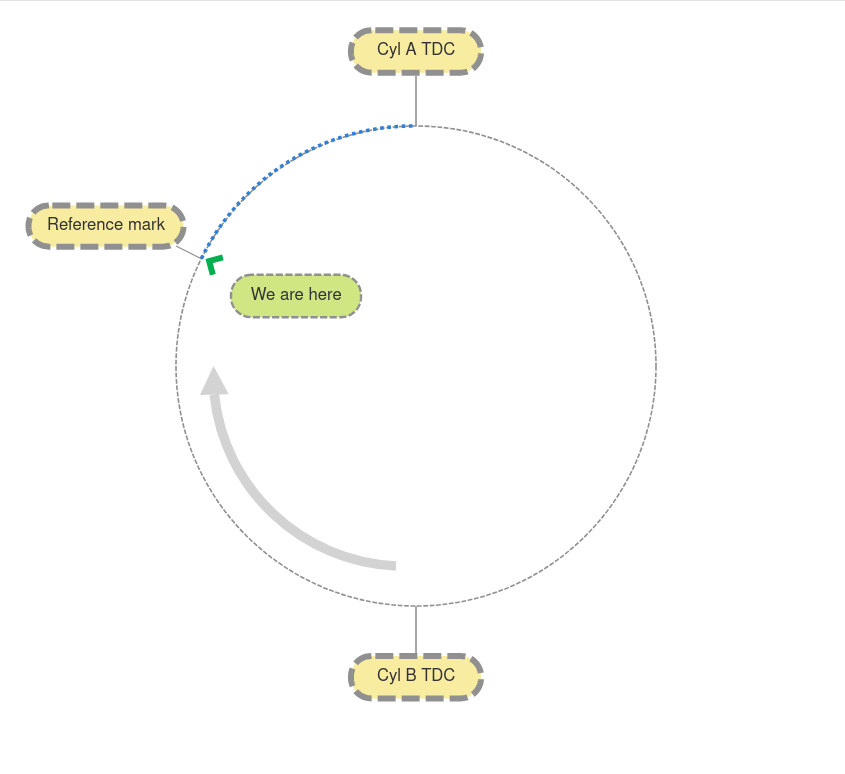
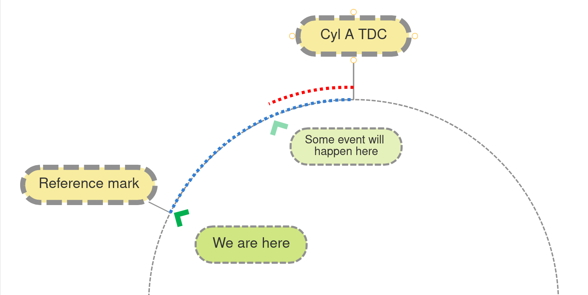
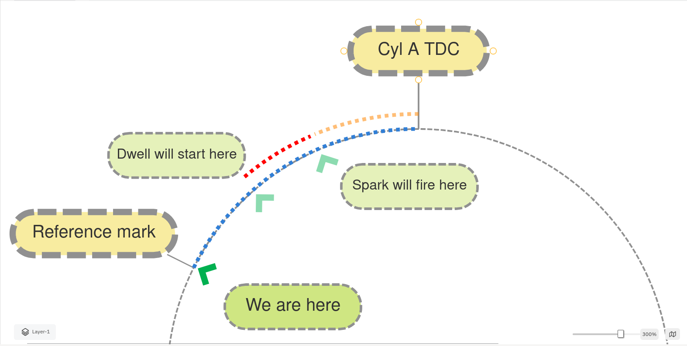
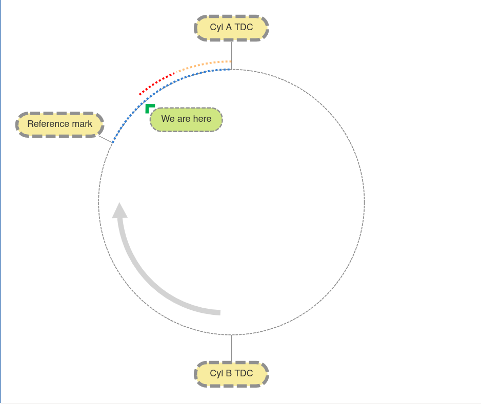
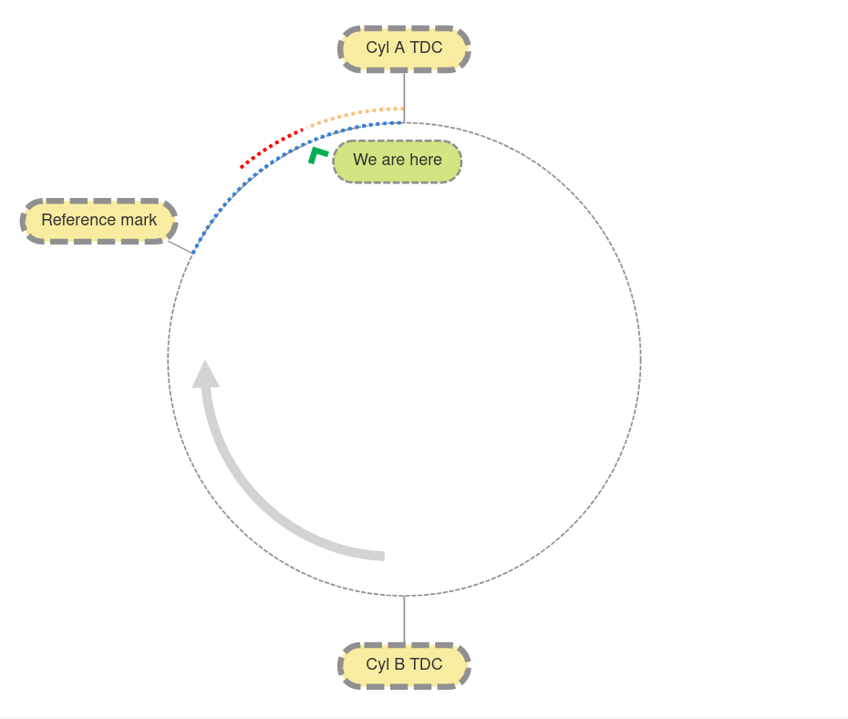
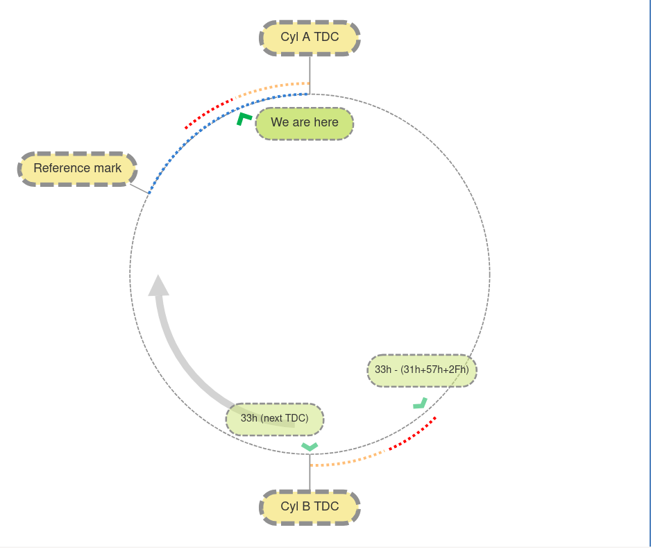
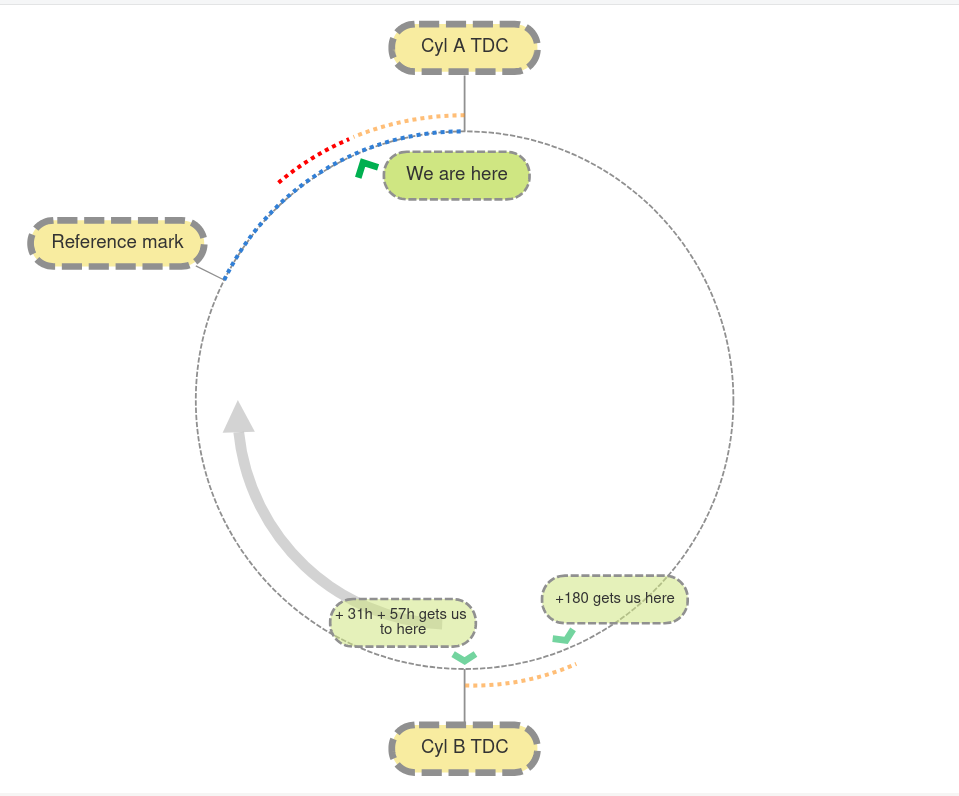

## Motronic DME ignition timing

In order to control ignition timing, the DME needs the ability to meausure fairly precise crankshaft angles relative to top-dead-centre for the cylinder in question. This is what the crankshaft sensors are for. 

The reference sensor provides a pulse at 60 degrees BTDC for cylinder #1. But ignition events come some time after that, and at angles that vary quite a bit. Additionally, there's only one ref sensor pulse per revolution - but there are two cylinder power strokes! Clearly we need a way to measure angles all the way around the cycle. It's the so-called "speed" sensor that gives us this ability. Yes it's true that it does measure engine speed too, but it's fundametally an angle measurement sensor. The ref sensor provides the synchronization pulse, and the speed sensor allows us to meaure out angles relative to that sync pulse with fine resolution. 

How fine? Well there are 132 flywheel teeth on the 951, so that's 360/132 = 2.2727... degrees per tooth. But each tooth makes the sensor cross the zero volt line twice - once for each edge, and it's these zero crossings that the DME detects (via the S100 chip). So we can detect both edges of the tooth and measure angles to within a half-tooth, or 1.363... degrees. 

Now, the ref sensor pulse arrives 44 flywheel half-teeth before cyl #1 TDC. So if we have some angle that we want to measure, represented in terms of half-teeth BTDC, all we have to do is subtract that value from 44, and then count that number of half-teeth from the time the ref sensor interrupt routine runs. We can do the arithemetic any time - all that matters is that we start the countdown after the ref sensor interrupt happens. 

The devil of course is in the details. But we'll break it down step by step. We can use a basic diagram to help understand what's happening at an abstract level, and then dive into the code in more detail later. 

Let's assume we're starting at the reference sensor interrupt routine:

The speed sensor interrupt outine will count 44 half-teeth from this point to TDC for cyl #1. 

Note that I called the cylinders A and B in this diagram. That's because we don't always know which cylinders they really are (and we never care). What we know is that *some* cylinder (either 1 or 4 based on the 1-3-4-2 firing order) reaches TDC 60 degrees after the pulse, and the next cylinder that needs to fire reaches TDC 180 degrees after that. This is important because we won't get another ref sensor pulse to sync with before that second cylinder fires. 

I find that it helps enormously to visualize the target angles being subtracted from the ref sensor BTDC value of 44, by working backwards from TDC like this:

Here, the red line represents the actual number that the DME program has calculated for that event. 

Now in practice, we actually subtract 3 values from the ref sensor base value:

* basic spark advance (31h)
* acceleration adjustment (57h)
* dwell angle (2Fh)

Since the first two of these add to give the true spark advance, lets just treat them as one value visually. By subtracting the sum of these 3 values from the ref sensor advance, we get the number of half-teeth we need to count to begin the dwell period. The dwell value itself 2Fh is the number of half-teeth we must then count before firing the spark:

Now this business of counting half-teeth has some subtle issues that we'll get into in detail when we look at the code. For now, let's just say that we can do this accurately in the speed sensor interrupt routine. For convenience we always count *down*, because the 8051 provides handy instructions for checking if something is zero. Also for convenience, we always use the same counter variable, reloading it with the next appropriate value every time we reach an event. This counter variable is 2B.

So now let's assume we have counted down the number of half-teeth in 2F, we've reached zero, and we're in the speed sensor routine. We turn on the ground path of the coil to start the dwell period. 

Now we load the counter 2B with the number of half-teeth that make up the dwell period and return from the interrupt. It'll count down to zero again and we'll be ready to fire the spark:

So far this has been trivial and the diagrams have hardly been necessary. But now things get a little more complicated. We fire the spark by turning the coil current off. Now we need to get ready for the next ignition event, for cyl B. But we won't get a ref sensor pulse to measure things relative to that one. So I'm going to cheat and tell you that we *do* know the number of half-teeth to TDC for cyl B. You haven't seen where we got that from because we started our exploration with the engine already running! But don't worry, you'll see exactly how that's calculated very soon. For now just assume that we have this value, stored in 33h. 

So all we need to do is subtract the sum of our spark advance values and our dwell value from 33h, and we'll have the number of half-teeth we need to count to et to the start of the dwell period for cyl B:

We do this at 00B8 and load that value into 2B. 

Next we calculate the half-tooth count to the next TDC. This (among other things) happens in the routine at 021D.  We start with the half-tooth count for 180 degrees (132), and we add our total spark advance count (31h + 57h). We don't take dwell into account here because this next-TDC value will later be used relative to the ignition event:

And that's where the next TDC value that we used previously came from (on the previous cycle). 

This is a good time to point out that the speed sensor routine that does this logic doesn't make any distinction between the two cylinders in a given rotation. Everything we just discussed happens again at the dwell and ignition angles for cyl B. The observant reader will notice that this is redundant - we already discussed how the ref sensor routine sets everything up for cyl A. Now I'm telling you that the same logic that sets up cyl B will run again when cyl B fires, thus setting up the ignition events for cyl A again. This leads to the surprising but inescapable conclusion that the engine can continue to run even if it doesn't get the next ref sensor pulse. And indeed this is true! Try it if you don't believe me - unplug the reference sensor on a running car, and it'll keep running. You can go for a drive if you like - nothing will happen. 

When the ref sensor interrupt routine happens, it'll overwrite the counter value for cyl A with the appropriate value relative to the ref sensor position - but if the interrupt doesn't happen for any reason, the counter value calculated at the spark event for cyl B will get the job done. Clearly though, the engine does need at least one ref sensor pulse to get things started - that's the only way it ever knows the absolute angle of the crankshaft. And using the ref sensor pulse every time gives us some resilience - if we drop the occasional speed sensor pulse for any reason (bad wiring, incorrect sensor gap etc.) then we'll have an error in our timing, but it will get reset at the next ref sensor pulse. 

