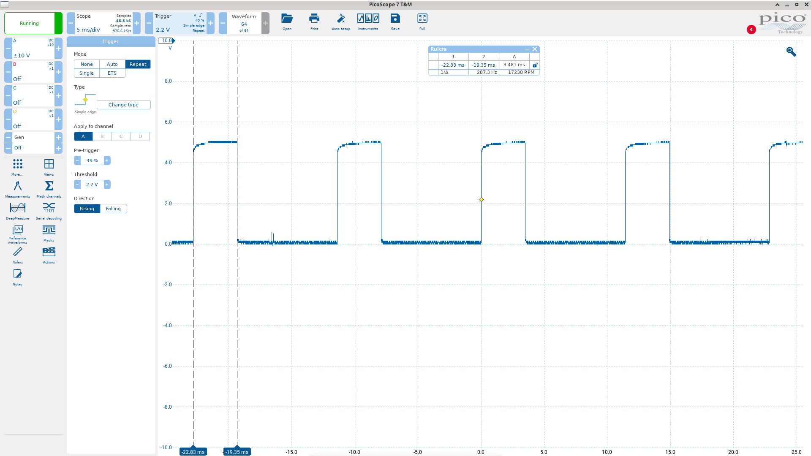

# Idle Stabilizer Valve (ISV) routine

Here we'll explore how the DME controls the ISV in detail. 

## Overview

Pysically, the ISV is opened or closed by the choice of 2 ground pins. From the 8051's perspective, this is achieved by a simple PWM signal. During the on-time, the DME's circuitry gounds one ISV pin, and during the off-time it grounds the other pin instead. So the 8051 and its program are not concerned with grounding one pin or the other; we simply set the output high or low with the appropriate duty cycle. 

The actual signal is generated using one of the 8051's two 16-bit timers (timer1). During the timer1 interrupt routine, we load the timer with a precalculated on-time value and toggle the ISV pin ON, and in the next interrupt with load it with the precalculated off-time value and toggle the pin OFF. This article is mainly concerned with exactly *how* these two values (on-time and off-time) are calculated.

Software-wise, the ISV is controlled with the usual combination of open loop and closed loop control. The open loop values are provided by a 2-axis map (RPM and temperature). These values almost always apply, and are modified by the closed loop correction. The open loop map values are chosen to get the idle speed close to the target; the closed loop logic makes fine-tuning adjustments.

The closed loop part uses a combination of proportional and integral control.This closed loop control routine will always try to keep the idle speed at a certain target. This target speed is defined by a 1-axis map that depends on temperature. But as we'll see a little later, there is an interesting quirk where the DME actually has 2 different idle target maps, one of which was not intended to be used (but it can be!).

Various adjustments are made to the control logic depending on a range of conditions, for example:

* if air conditioning is turned on, then the idle target speed is raised to a higher minimum value
* if the engine is starting, or returning to idle during deceleration, the target rpm is held higher than normal and allowed to sink down gradually (henceforth I'll call this the *flare*). 
* various limits and adjustments are applied to the closed loop correction to prevent saturation and windup. 

The ISV routine doesn't just handle idle; it needs to handle all possible running conditions:

* cranking
* idle
* part throttle (PT)
* wide-open throttle (WOT)
* both PT and WOT (closed loop defeat for idle screw adjustment)
* coasting (i.e. high rpm with throttle closed)

Some of these conditions are handled with very simple logic. Some just modify the main idle logic. The idle logic itself is by far the most complicated section because of the closed loop control. 

The ISV control routine uses a staggering number of maps, constants and control flags. Here's a list of just the maps: 

* cranking target rpm
* normal target rpm
* alternate target rpm
* coasting w/fuel cutoff pwm adjustment
* integral term + gain
* integral term - gain
* proportional gain (only +)
* idle target load (presumaly emissions related; there are actually 3 maps for this, chosen by the code plug)
* open loop PWM

A complete list of the maps and their values in human-readable form is in the Appendix section. 

## Entry point

The entry point for this routine is at location 1068. Here we check for the basic conditions:

0895:

TODO

08A6:
Here we check which driving condition we're in and jump to an appropriate routine for each case. The default is PT/WOT. In this case we set 20h.6 which indicates that we'll need to flare upon returning to idle. We clear 20h.0 which means the flare will be the return to idle variant, not the startup variant. 
Then we jump to 09C5 which is the base, open-loop PWM calculation. 

## 08BE (cranking):
This is the cranking logic (i.e. rpm < 160). Here we set 20h.6 (flare needed) and set 20h.0 (startup flare). We read map 53 which returns target rpm (depends on engine temp), and store it in 7F. We then jump to the idle routine at 092D which skips the flare logic (it will run next time). 

## 08CB (coasting, fuel cutoff):
This is determined by 23h.3. If we're in this state, we set 20h.6 (flare needed) and clear 20h.0 (indicating that the flare will be the return to idle flare instead of the startup flare). 

Next we call 0A4A to initialize the correction values to r1:r0 = 0 and 7E:7D = 32767 (midpoint). 

Then we jump to 09C5 (open loop PWM). 

## 08CB (idle and WOT): 
This section runs if both the idle and WOT signals are present. This means someone has connected a jumper in the diagnostic port in order to defeat the ISV control, for idle screw adjustment (see the factory documentation). 

Here we load a constant from 1160+3C, which has the value 17h (23 decimal). We divide that by 2 to get 11. The PWM correction r1:r0 is initialized to 2816(i.e.r1=11). Then and then we jump to 0A05/1B40, skipping all further ISV logic and going straight to the timer1 high/low time calculation. 

Generally the base PWM map value is multiplied by 128 before the timer1 calculation routine is called. Then *that* routine multiplies by 2 (via <<1). This constitutes a multiplication by 256. This explains why the constant 3C is divided by 2 and then loaded into r1; this gives it the same scale that the open loop map values (map 60) have upon entering the final timer calculation routine (since loading it into the high byte means *256). 

Note: using ((22 * 138) + (66*256))/(256**2) we get ~30% duty cycle. 

## 08A6 (default - PT or WOT):
This is the default condition in 08A6 if we don't jump away for one of the other conditions. We set 20h.6 (indicating we will need to flare upon returning to idle) and clear 20h.0 (indicating that the flare will use the longer, coasting flare countdown instead of the short startup countdown). 

Then we jump stvraight to 09C5 where the open loop pwm values are loaded, thus skipping the closed loop control entirely. 

## 08DE (idle):
This is by far the most complicated part of ISV control. As with the other conditions we check for this mode in 08A6. We jump to 08DE if we have idle and not WOT. 

This section is complicated enough to benefit from a quick low-resolution outline. The main sections are:

* choose normal or *alternate* idle path (based on DME pin 28 grounded or not)
* look up target rpm map accordingly
* in the normal path, do the flare logic
* alternate path rejoins the normal path
* closed loop control
  * calculate integral term
  * calculate proportional term
  * perform clamping/anti-windup checks and target load check

We'll dive into these sections in more detail soon. 

First, the *alternate path* deserves some explanation. 

### What's the "alternate idle path"?
A stock 944 will only ever use what we're calling the *normal* path. My guess is that the alternate path was either an experimental thing that was abandoned, or a test mode of some kind. The choice is made based on the state of 23h.3. This flag is clear if the value from the ADC channel 5 is at or below 128 (i.e. <= 2.5v input). Otherwise the flag is set and the alternate path is used. Now ADC channel 5 is fed by pin 28 of the DME harness, which is grounded. 

The only case I'm aware of where the alternate path is used is when you use the FTech9 aftermarket DME. Because there's a convention that the "unused" ADC channel is often used for a MAP sensor input in aftermarket setups, the FTech9 DME did not ground this pin like the stock DME. Thus a stock chip in the FTech9 DME will get the alternate idle path instead of the normal one. 

The differences with the alternate path are:

* idle target speed is 800rpm regardless of temperature (whereas the normal map is 840 at normal temps, and higher at lower temps). 
* there is no flare for startup or idle return after coasting
* turning AC on does not change increase the target idle speed as it does with the normal path. 

If you're seeing these behaviors and wondering why, check if ADC channel 5 is grounded!

### 08DE: Alternate idle path
At 08DE we check for the normal or alterate path, via 23h.3. If this bit is set then we take the alternate path. Otherwise we take the normal path.

In this path, we read map 54 into 7F. It's a temperature based map, but all the values are set to 800rpm. 

### 08DE: Normal idle path
Read map 55 into a (target idle speed depending on temp). Ultimately the value will end up in 7F but first we go through the flare logic. 

If AC is on, then look up the min rpm for AC on from 1160+39 and if it's greater than the current target (read form the map) then replace the target with this value (the target is stored in b for now). 

Next we do the flare logic:

```
if 20h.6 is set then:
	if 20h.0 is not set:
		load the current rpm into 7F
	else if 20h.0 is set:
		load #1 into 7ch (7C is the flare hold counter)
		clear 20h.6
```

0912:
Load target rpm from b into a and compare it with 7F. If 7F is higher, then we replace the target with 7F. 

```
if current target rpm < 7F then:
	dec 7C and check if 0
	if 7C has reached 0 then:
		dec 7F
		if 20h.0 is set:
			reload 7C with 01 (from 1160+40)
		else if 20h.0 is clear:
			reload 7C with 02 (from 1160+3F)
	replace the target rpm with 7F (which was decremented if the counter 7C had reached 0)
```

So the flare is achieved by holding the current rpm (if it's above the normal target) for a short time and allowing it to sink down gradually. 

Now we replace 7F with the target rpm (map value or AC value). Depending on the previous section, we ight have already overwritten the target rpm with 7F - now 7F contains our target rpm regardless. 

Next, the alternate path rejoins at 092D. 

### 092D (Both idle paths):
Now we begin the closed loop correction. The open loop calculation is done later. That might seem backwards but it doesn't matter because we'll just be adding a positive base value to a positive or negative correction value. So the order is not really important. 

Here is where we calculate that positive or negative correction. 

First, here's a quick outline of the overall correction process:

* the correction consistes of P + I terms (proportional + integral)
* the I term is accumulated in 7E:7D.
* the correction (P+I) is offset to be centered around a midpoint bias of 32,767
* later, this bias is removed to produce a 2's complement, signed value

We look up 1160+38=1198 (contains 04, i.e. 160rpm). 
 
```
if 7fh (target rpm) >= current_rpm + 160rpm then:
	if 7eh (high byte of integrated correction) > 128:
		call 0A4A (initialize 7E:7D to midpoint and r1:r0 to 0)
```
So if the current rpm is below target by more than 160rpm, we zero out the correction. 

0942:
Subtract current rpm from target rpm 7F, storing the difference in a. 

If current rpm > target (carry is set), set the flag 20h.2. Thus 20h.2 is the sign of the idle rpm error; 0=positive (rpm too low) and 1=negative (rpm too high). 

```
if rpm error is negative:
	clear 20h.3 (this flag indicates that the correction was previously clamped to the max positive value)
	rpm error = |rpm error| i.e. absolute value (since we have the sign in 20h.2)
else if rpm error is positive:
	clear 20h.4 (complementary flag to 20h.3, i.e. negative correction was clamped)
	
```
0953:
Store the current rpm error in r3
Load 7E:7D into r1:r0 (i.e the integral term, which is preserved)

Next we see how integration is guarded by the clamping flags:

```
if NOT 20h.3 AND NOT 20h.4:
	if 20h.2 (i.e. current rpm is > target rpm):
		read map 39h (map 57)
	else if not 20h.2 (rpm is < target rpm):
		read map 38h (map 56)
	store the map value (correction gain) into b	
	load r3 (rpm error) into a
	call the integrator routine
	store r1:r0 into 7e:7d
```
Note that from the previous block, a positive rpm error condition clears the negative clamping flag, and vice-versa. In other words, if we previously flagged that the error correction was too negative, then that blocks further *negative* integration. A positive error clears the flag and so is not blocked. The reverse is true for the other flag. Later we'll see how these flags are actually set. 

The integrator routine takes a and b as its inputs (which now contain the current rpm error and the gain value from the appropriate map, respectively). It scales, clamps, and if necesary negates the product of a and b and adds the result to r1:r0. So the integral term is actually proportional to the error, but the gain is low. 

We store the result into 7E:7D (in the next cycle, r1:r0 will be initialized with this value - that's how the *integration* is achieved). 

0971:
Now 20h.3 and/or 20h.4 are cleared implicitly from the jbc instruction at 0953. 
We next calculate the P term:

```
if not 20h.2 (i.e. if current rpm < target rpm):
	read map 58 (higher correction gain)
	store map value into b
	store rpm error r3 into a
	if error >=3f (i.e. 2520rpm):
		replace a with the value from 3f (TODO: investigate 3f)
	a = a*4
	call the integrator routine 0BDD:
		a=rpm error * 4
		b=map gain value
```
Note that the same "integrator" routine is used to add the P term to the total correction r1:r0. But the resulting total is not stored back into 7E:7D, and thus will not be included in the next cycle. Proportional correction is a bigger, more powerful correction, but it's calculated afresh every time. Thus the P term only exists while there is an error, hence the need for an integraiton term to close the gap. 

0988:

Now we jump to 1B82, which is the clamp routine for the ISV correction. 

Recall in mind that the corrections are centered around the midpoint (high byte 128) so that > 32767 is "positive" and < is negative. The clamping routine removes this bias so that the correction value in r1:r0 is in standard 2's complement form. It also stores the carry bit in 20h.5 when the bias is removed. Later, if the final correction value overflows we use 20h.5 to determine whether to clamp high or low. 

The details of the clamping routine are left to the Appendix section; for now we return to the main ISV routine. 

NOTE: 09C5 just ljmps back to 09C8 below

## 09C8: All paths (except ISV defeat mode):
This is where we load the open-loop PWM values from the map, add the closed loop correction (if any) and make a few other small adjustments. 

This is where we get to after the idle part of ISV control (both paths), but also we jump here for both part throttle and coasting fuel-cut. So almost all paths converge to this part - only the idle+WOT mode for setting the idle screw bypasses this. 

09C8:
We look up base ISV pwm map (map 60, which is RPM x NTCII) and store the value into b.

```
if 23h.5 (fuel cutoff mode):
	load map 59 (4 values by rpm)
	add map value to base value (but cap at 255 if rollover)
if 23h.3:
	look up value 1160+3BH=119B (contains 00!)
	add to a
if AC is on:
	look up value 1160+3A=119A (contains 18)
	add this value to a
```
Recall that 23h.3 being set indicates that we are using the alternate idle path. Earlier the alternate path skipped the target rpm bump for AC-on. Here it looks like the intent might have been to provide some extra air for AC-on in the alternate path, but now it does nothing. 

Adding air for the AC-on condition makes sense since we bumped the target rpm earlier. We could let the closed loop control figure out that more air is needed to achieve this target, and let it make the adjustment - but why wait if we already know we need it? That's the essence of combining open loop and closed loop control. 

We multiply current base value by 128 (8x8=16 bit value in b:a). This is the basic scaling operation to turn the map's 8-bit values into sensible values for the timer. Recall that the constant we loaded for the closed loop defeat mode earlier was loaded into the high byte (r1), and divided by 2. That's the same thing as multiplying by 128. The correction values that the closed loop routine calculated are generally already the product of two 8-bit numbers, so they are already in the right order of magnitude. 

(NOTE: the ljmp to 107A jumps back to 09EF)

09EF:
Add the low byte of the current correction (r0) to the low byte of base value
Add the high byte of the correction r1 to base high byte (in b)

Now we do a sanity check: if bit 7 of the final PWM value is set, that represents a negative value which is invalid. So we must clamp it to one extreme or the other. Which one? This can be a bit confusing!

Recall that the correction value is a 2's complement signed value, so 0-32767 represent positive values and 327678-65536 represent negative values. Now we just added that to a positive 16-bit value (with a maximum of 32767), and ended up with something greater than 32767, but why? 

It could have been the case that both the base value and the correction were both high positive values. Then we should clamp high. But it's also possible that this happened because the correction was a negative value:

Literal sum | 2's Cpl Meaning | Bit 7 set? | Clamp?
------------|------------------|-----------|------
127 + 130 = 1 | 127 - 126 = 1 | no| no
120 + 130 = 250 | 120 - 126 = -4 | yes | low
127 + 1 = 128 | 127 + 1 = -1 | yes | high


That's where 20h.5 comes in. This flag is set if the correction in the clamp routine earlier was negative, and clear if it was positive. So we have a record of how the value became invalid, and now we can simply do:

```
if updated correction high byte > 128:
	if flag 20h.5 (i.e. pwm correction overflow direction):
		set correction to 0
	else:
		set correction to high=127, low=255
```

0A05 -> 107D -> 1B40:
## 1B40: All paths - calculate final timer1 reload values
Finally all paths, including the ISV defeat mode, converge to here. 

This is where we finally load the ISV PWM values for Timer1

Note: the timer period is ~11.36ms which is 5681 timer ticks (1631h, which is the value stored at 116B). So the high period + low period = 5681

That means that the duty cycle of our PWM signal will be 

```
timer_on_time/5681
```

First we load r1:r0 into r7:r6 and multiply it by two via the left shit routine at 0509. 
We store the high byte r7 in 7B. 

We multiply r7:r6 by the value from 1160+41=11A1, which is 8A (138), via 04D9. This is an 8x16 multiply routine with a 24 bit result in r7:r5:r5. 

We add the constant from 1160+42=11A2, which is 42 (66) to r7.

Next we load the 16-bit value from 1160+0B and 0C into r1:r0 - this value is 1631, or 5681 decimal, i.e the number of ticks that make one complete timer period (high+low time). 

Now we multiply this value by r7:r6. But recall that r7:r6:r5 was a 24 bit result of the previous multiply; thus by discarding r5 we are dividing by 256. So we really have

r7:r6:r5 <- (r7:r6:r5 / 256) * 5681

But next we discard r5 again to give another division by 256. Additionally since we want the duty cycle (i.e. percentage on time vs off time) we need to divide all this by 5681, so ultimately the duty cycle comes down to

((input * 138) + (66*256))/(256**2)

Here we're multiplying 66 by 256 because 66 was added to the high byte of a 16-bit value, and diving the whole thing by 256 twice because we twice discarded the lower byte of a 24-bit result (r5). 

This formula gives us a good way to visualize the meaning of the base PWM values. If we put 0 into this formula, we get approximately 0.25 and if we put 255 we get approximately 0.8. Thus the ISV duty cycle is always between ~25% and 80%. Recall that the closed loop defeat mode resulted in the value 22 being used in place of the usual open loop map; plugging this value into our formula gives ~30%. Here's a screenshot of the PWM signal on a scope with the car idling, and a test lead connecting pins B and C of the diagnostic port:



As you can see it's ~30% as expected. 

Of course we must finally calculate the balance (i.e. off time) and store that too. We want to end up with the on time in one pair of bytes and the off time in another, with the the two values adding to 5681. 

The timer1 interrupt routine will load the on time value and toggle the signal on. When the interrupt routine triggers again, it will load the off time and toggle the signal off. 

The last section of this routine calculates the off time by complementing the on time and then subtracting 5681 from the result. 

Next, interrupts are disabled and the on and off times are loaded into the locations that the timer1 interrupt routine will use:

44 <- r7 (timer1 low time low byte)
45 <- r3 (timer1 low time high byte)
42 <- r0 (timer1 high time low byte)
41 <- r1 (timer1 high time high byte)

Interrupts are re-enabled, and we return. 


## Appendix: error integrator 0BDD

Map gain values are unsigned (i.e. absolute). The rpm error
is absolute (complemented/inc'd in the case of rpm > target) and the sign is stored in 20h.2 (0=positive, 1=negative) 

0BDD:
```
b:a <- rpm_error*4 * integrator map gain
if b >= 128:
	b <- 127
if 20h.2, that is if rpm > target (error is negative):
	c = ~c
	a = ~a
	b = ~b
```

Now b:a is effectively the 2's complement of the error product ab.

0BEC:
```
r0 <- r0+a
r1 <- r1+a
a <- 0
```

Now c indicates if r1 overflowed. 

```
if rpm < target (error is positive):
	c = ~c
	a = ~a (so a now=255)
```

Now c was complemented in the case of a positive error, so here c=1 means the add overflowed on a negative error or didn't overflow on a positive error. 

Thus "not c" means either it didn't overflow for a neg. error or it did overflow for a positive error. 

Overflowing on a positive error addition clearly means an invalid result so it makes sense that we would clamp the result to the max positive valie. 

Overflowing on a negative error addition is not so clear. 

127 + 129 = 0, and this means 127 - 127
127 + 130 = 1 (c=1) and this means 127 - 126

So in this case, c=1 indicates the 2nd number was smaller than the first

The only way we can have c=0 is if the 2nd number was >= the first, e.g.

126 + 128 = 254 (c=0) and this means 126 - 128 = -2

In other words, when we do subtraction by adding a 2's complement number, the carry flag indicates which number had the bigger modulus:

c=1 if A > B
c=0 if A <= B

So here we zero out r1:r0 if the correction we're subtracting was bigger than the current total. 

if not c:
	r1:r0 <- a:a
ret

## Appendix: closed loop clamp routine
1B82:
load r1 (high byte of current rpm correction) into a

```
if correction is > midpoint (i.e. > 32767, this is a "positive" correction):
	if not cranking (i.e. 23h.2):
		look up 1160+3D=119D which contains c0 (192)
		divide 119D by 2, so a=96 (decimal)
		add 128 (adjust to the midpoint bias) to 96 = 224
		if correction high byte >= 224:
			clamp correction high byte to 224
			set 20h.3 flag (i.e. clamped high flag)
else if correction is pseudo-negative:
	look up 1160+3E=119E which contains 27 (i.e. 39 dec.)
	divide 39/2, then complement to 236
	add 128 (to get 108)
	if correction <= 108:
		clamp correction high byte to 108
		set flag 20h.4 (i.e clamped low flag)

1BA9:
select a map from 87 to 90 (depending on code plug setting)
read map
if map value >= current load:
	set flag 20h.4 
```

## Appendix: ISV routine maps, constants and flags

### Flags

23h.0 - idle closed (1=closed)
23h.1 - WOT signal (1=WOT)
23h.2 - cranking (rpm < 160)
23h.3 - normal or alternate isv path. Set via ADC Ch. 5 (DME pin 28).
23h.5 - fuel cut off for coasting
20h.6 - trigger the idle flare (rpm increase above normal target)
20h.0 - control how long the idle flare hangs for:
	* 20h.0=0 -> 7ch gets 02 (from 1160+3F=119F)
	* 20h.1=1 -> 7ch gets 01 (from 1160+40=11A0)
	* 7ch is the counter that determines how long the flare target rpm is held for before being decremented by 40rpm
20h.2 - idle rpm correction sign: 1=rpm too high, 0=rpm too low (i.e. 0 means the *correction is positive*. 
20h.5 - isv pwm correction overflow sign flag (tells us whether to clamp to 0 or max if we had an overflow)
20h.3 - prevents integration when a positive correction is clamped
20h.4 - prevents integration when a negative correction is clamped, or when the current load < the value in map 87

### Maps:

53 - target rpm for flare (by NTC)

| NTC  | -33  | -23  | 50   | 65   |
|------|------|------|------|------|
| RPM  | 1600 | 1000 | 920  | 800  |

54 - target rpm for alternate path (pin 28 not grounded)

| NTC  | -28  | 21   | 40   | 76   |
|------|------|------|------|------|
| RPM  | 800  | 800  | 800  | 800  |


55 - normal target rpm

| NTC  | -21  | 50   | 76   |
|------|------|------|------|
| RPM  | 1000 | 920  | 840  |


87-90 - depending on code plug; max load for engine temp (clamps ISV correction but is ultimately overridden by the idle routine)

| NTC   | -33  | 18   | 37   | 65   |
|-------|------|------|------|------|
| Load  | 40   | 27   | 22   | 20   |


56 - idle rpm correction I gain (rpm > target)

| ΔRPM | 0 | 40 | 480 | 600 |
|------|---|----|-----|-----|
| Gain | 2 | 10 | 16  | 1   |


57 - idle rpm correction I gain (rpm < target)

| ΔRPM | 0 | 40 | 280 | 480 |
|------|---|----|-----|-----|
| Gain | 2 | 10 | 10  | 16  |


58 - idle rpm correction P gain (rpm < target)

| ΔRPM | 0 | 40 | 360 | 600 |
|------|---|----|-----|-----|
| Gain | 0 | 30 | 80  | 80  |


60 - base (feed-forward) ISV values by RPM and NTC (in C as usual)

|     | 800 | 1000 | 1200 | 1560 | 2000 | 4000 |
|-----|-----|------|------|------|------|------|
| -35 | 79 | 79 | 79 | 79 | 79 | 79 |
| -3  | 46 | 46 | 46 | 49 | 58 | 68 |
| 11  | 45 | 45 | 45 | 45 | 55 | 65 |
| 76  | 31 | 31 | 31 | 31 | 37 | 53 |
