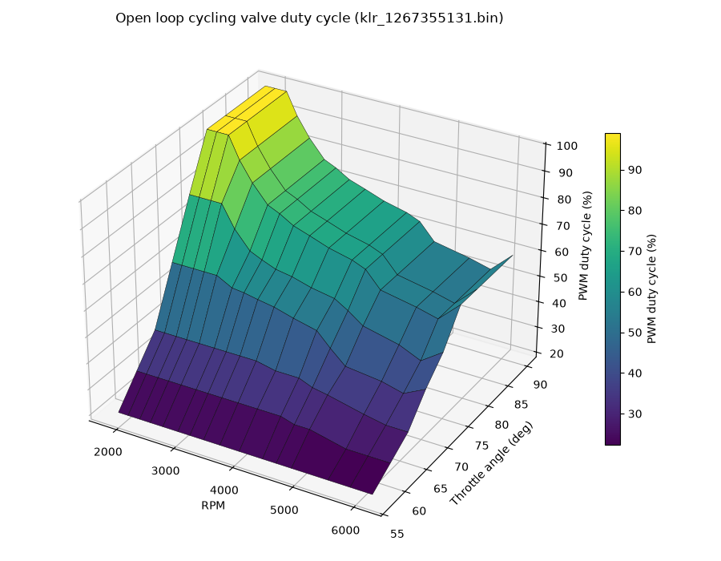
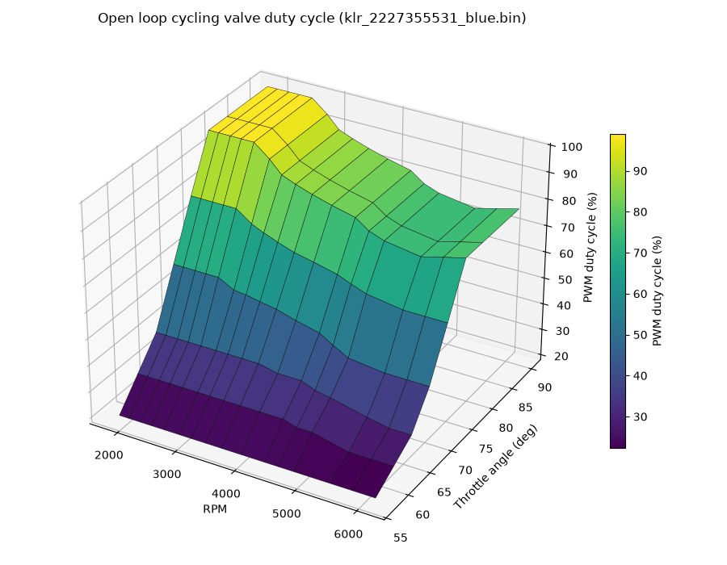
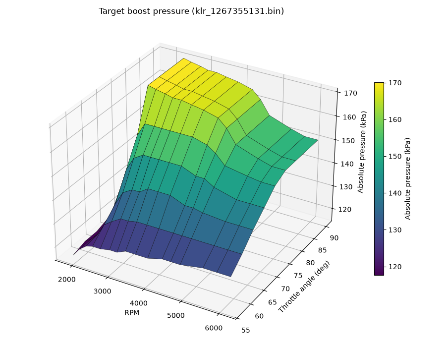
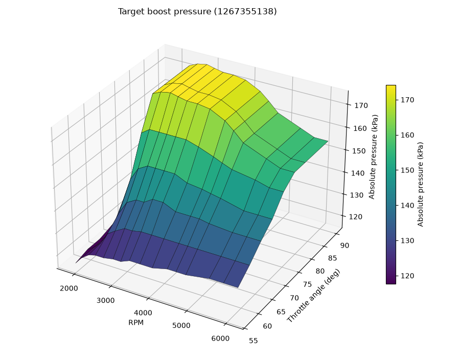
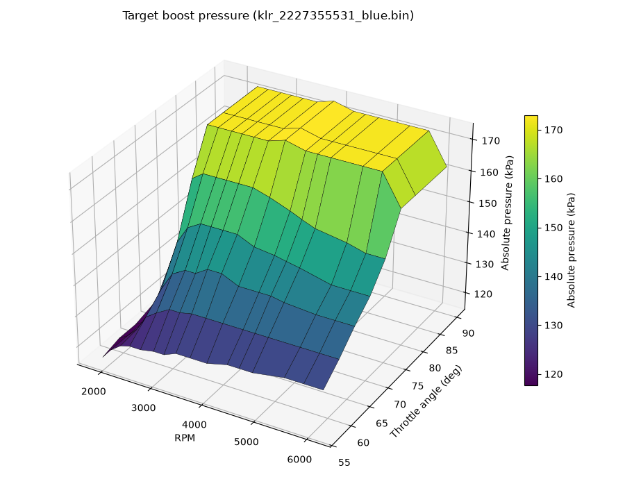

# KLR Boost control maps

## CV Open loop

* CV open loop, early version, chip label 1267355131:

| Throttle deg \ RPM | 1832 | 2003 | 2208 | 2393 | 2611 | 2873 | 3079 | 3316 | 3594 | 3922 | 4316 | 4544 | 4798 | 5401 | 5763 | max |
|---|---|---|---|---|---|---|---|---|---|---|---|---|---|---|---|---|
| 57 | 38 | 38 | 38 | 38 | 38 | 38 | 38 | 38 | 38 | 38 | 38 | 38 | 38 | 38 | 38 | 38 |
| 61 | 57 | 57 | 57 | 57 | 57 | 57 | 57 | 57 | 57 | 57 | 57 | 54 | 54 | 48 | 48 | 48 |
| 65 | 76 | 76 | 76 | 76 | 76 | 76 | 76 | 76 | 76 | 73 | 73 | 69 | 67 | 61 | 58 | 58 |
| 69 | 115 | 115 | 115 | 115 | 115 | 109 | 108 | 106 | 104 | 100 | 96 | 86 | 76 | 73 | 69 | 77 |
| 73 | 154 | 154 | 154 | 154 | 138 | 125 | 121 | 117 | 115 | 111 | 108 | 102 | 94 | 88 | 81 | 92 |
| 77 | 191 | 191 | 191 | 175 | 161 | 148 | 144 | 138 | 134 | 129 | 125 | 121 | 109 | 104 | 100 | 115 |
| 81 | 191 | 191 | 191 | 175 | 161 | 148 | 144 | 138 | 134 | 129 | 125 | 121 | 109 | 104 | 100 | 115 |
| 90 | 191 | 191 | 191 | 175 | 161 | 148 | 144 | 138 | 134 | 129 | 125 | 121 | 109 | 104 | 100 | 115 |

* CV open loop, later version, chip label 1267355138*:

| Throttle deg \ RPM | 1832 | 2003 | 2208 | 2393 | 2611 | 2873 | 3079 | 3316 | 3594 | 3922 | 4316 | 4544 | 4798 | 5401 | 5763 | max |
|---|---|---|---|---|---|---|---|---|---|---|---|---|---|---|---|---|
| 57 | 38 | 38 | 38 | 38 | 38 | 38 | 38 | 38 | 38 | 38 | 38 | 38 | 38 | 38 | 38 | 38 |
| 61 | 57 | 57 | 57 | 57 | 57 | 57 | 57 | 57 | 57 | 57 | 57 | 54 | 54 | 48 | 48 | 48 |
| 65 | 76 | 76 | 76 | 76 | 76 | 76 | 76 | 76 | 76 | 73 | 73 | 69 | 67 | 61 | 58 | 58 |
| 69 | 115 | 115 | 115 | 115 | 115 | 109 | 108 | 106 | 104 | 100 | 96 | 90 | 84 | 81 | 81 | 81 |
| 73 | 154 | 154 | 154 | 154 | 154 | 146 | 142 | 138 | 134 | 131 | 127 | 123 | 119 | 115 | 115 | 115 |
| 77 | 191 | 191 | 191 | 191 | 191 | 182 | 173 | 169 | 165 | 161 | 157 | 150 | 146 | 142 | 146 | 150 |
| 81 | 191 | 191 | 191 | 191 | 191 | 182 | 173 | 169 | 165 | 161 | 157 | 150 | 146 | 142 | 146 | 150 |
| 90 | 191 | 191 | 191 | 191 | 191 | 182 | 173 | 169 | 165 | 161 | 157 | 150 | 146 | 142 | 146 | 150 |

* CV open loop, 1989/Turbo S version, chip label 2227355531

| Throttle deg \ RPM | 1832 | 2003 | 2208 | 2393 | 2611 | 2873 | 3079 | 3316 | 3594 | 3922 | 4316 | 4544 | 4798 | 5401 | 5763 | max |
|---|---|---|---|---|---|---|---|---|---|---|---|---|---|---|---|---|
| 57 | 38 | 38 | 38 | 38 | 38 | 38 | 38 | 38 | 38 | 38 | 38 | 38 | 38 | 38 | 38 | 38 |
| 61 | 57 | 57 | 57 | 57 | 57 | 57 | 57 | 57 | 57 | 57 | 57 | 54 | 54 | 48 | 48 | 48 |
| 65 | 76 | 76 | 76 | 76 | 76 | 76 | 76 | 76 | 76 | 73 | 73 | 69 | 67 | 61 | 58 | 58 |
| 69 | 115 | 115 | 115 | 115 | 115 | 109 | 108 | 106 | 104 | 100 | 96 | 90 | 84 | 81 | 81 | 81 |
| 73 | 154 | 154 | 154 | 154 | 154 | 146 | 142 | 138 | 134 | 131 | 127 | 123 | 119 | 115 | 115 | 115 |
| 77 | 191 | 191 | 191 | 191 | 191 | 182 | 173 | 169 | 165 | 161 | 157 | 150 | 146 | 142 | 146 | 150 |
| 81 | 191 | 191 | 191 | 191 | 191 | 182 | 173 | 169 | 165 | 161 | 157 | 150 | 146 | 142 | 146 | 150 |
| 90 | 191 | 191 | 191 | 191 | 191 | 182 | 173 | 169 | 165 | 161 | 157 | 150 | 146 | 142 | 146 | 150 |

## Boost

* Target boost, early version, chip label 1267355131:

| Throttle deg \ RPM | 1832 | 2003 | 2208 | 2393 | 2611 | 2873 | 3079 | 3316 | 3594 | 3922 | 4316 | 4544 | 4798 | 5401 | 5763 | max |
|---|---|---|---|---|---|---|---|---|---|---|---|---|---|---|---|---|
| 57 | 137 | 141 | 144 | 145 | 145 | 146 | 146 | 148 | 148 | 148 | 150 | 150 | 150 | 152 | 152 | 152 |
| 61 | 139 | 141 | 145 | 151 | 154 | 157 | 157 | 158 | 158 | 158 | 158 | 158 | 158 | 158 | 158 | 158 |
| 65 | 139 | 141 | 148 | 157 | 164 | 167 | 167 | 170 | 170 | 170 | 167 | 167 | 166 | 165 | 165 | 165 |
| 69 | 141 | 142 | 159 | 170 | 177 | 180 | 180 | 180 | 180 | 180 | 177 | 177 | 174 | 171 | 171 | 171 |
| 73 | 143 | 145 | 171 | 183 | 190 | 190 | 190 | 190 | 190 | 190 | 188 | 185 | 180 | 178 | 177 | 177 |
| 77 | 145 | 152 | 180 | 204 | 203 | 202 | 201 | 201 | 200 | 199 | 197 | 193 | 186 | 182 | 180 | 180 |
| 81 | 145 | 152 | 180 | 204 | 203 | 202 | 201 | 201 | 200 | 199 | 197 | 193 | 186 | 182 | 180 | 180 |
| 90 | 145 | 152 | 180 | 204 | 203 | 202 | 201 | 201 | 200 | 199 | 197 | 193 | 186 | 182 | 180 | 180 |

* Target boost, later version, chip label 1267355138*:

| Throttle deg \ RPM | 1832 | 2003 | 2208 | 2393 | 2611 | 2873 | 3079 | 3316 | 3594 | 3922 | 4316 | 4544 | 4798 | 5401 | 5763 | max |
|---|---|---|---|---|---|---|---|---|---|---|---|---|---|---|---|---|
| 57 | 137 | 141 | 144 | 145 | 145 | 146 | 146 | 148 | 148 | 148 | 150 | 150 | 150 | 152 | 152 | 152 |
| 61 | 139 | 141 | 145 | 151 | 154 | 157 | 157 | 158 | 158 | 158 | 158 | 158 | 158 | 158 | 158 | 158 |
| 65 | 139 | 141 | 148 | 157 | 164 | 167 | 167 | 170 | 170 | 167 | 167 | 167 | 166 | 165 | 165 | 165 |
| 69 | 141 | 142 | 159 | 170 | 177 | 180 | 180 | 180 | 180 | 177 | 176 | 175 | 174 | 171 | 171 | 171 |
| 73 | 143 | 145 | 171 | 190 | 193 | 193 | 193 | 193 | 193 | 191 | 188 | 186 | 184 | 182 | 180 | 180 |
| 77 | 145 | 152 | 180 | 206 | 208 | 209 | 208 | 207 | 207 | 206 | 202 | 198 | 193 | 188 | 185 | 185 |
| 81 | 145 | 152 | 180 | 206 | 208 | 209 | 208 | 207 | 207 | 206 | 202 | 198 | 193 | 188 | 185 | 185 |
| 90 | 145 | 152 | 180 | 206 | 208 | 209 | 208 | 207 | 207 | 206 | 202 | 198 | 193 | 188 | 185 | 185 |

* Target boost, 1989/Turbo S version, chip label 2227355531:

| Throttle deg \ RPM | 1832 | 2003 | 2208 | 2393 | 2611 | 2873 | 3079 | 3316 | 3594 | 3922 | 4316 | 4544 | 4798 | 5401 | 5763 | max |
|---|---|---|---|---|---|---|---|---|---|---|---|---|---|---|---|---|
| 57 | 137 | 141 | 144 | 145 | 145 | 146 | 146 | 148 | 148 | 148 | 150 | 150 | 150 | 152 | 152 | 152 |
| 61 | 139 | 141 | 145 | 151 | 154 | 157 | 157 | 158 | 158 | 158 | 158 | 158 | 158 | 158 | 158 | 158 |
| 65 | 139 | 141 | 148 | 157 | 164 | 167 | 167 | 170 | 170 | 167 | 167 | 167 | 166 | 165 | 165 | 165 |
| 69 | 141 | 142 | 159 | 170 | 177 | 180 | 180 | 180 | 180 | 177 | 176 | 175 | 174 | 171 | 171 | 171 |
| 73 | 143 | 145 | 171 | 190 | 193 | 193 | 193 | 193 | 193 | 191 | 188 | 186 | 184 | 182 | 180 | 180 |
| 77 | 145 | 152 | 180 | 206 | 206 | 206 | 206 | 206 | 206 | 208 | 206 | 206 | 206 | 206 | 206 | 194 |
| 81 | 145 | 152 | 180 | 206 | 206 | 206 | 206 | 206 | 206 | 208 | 206 | 206 | 206 | 206 | 206 | 194 |
| 90 | 145 | 152 | 180 | 206 | 206 | 206 | 206 | 206 | 206 | 208 | 206 | 206 | 206 | 206 | 206 | 194 |
