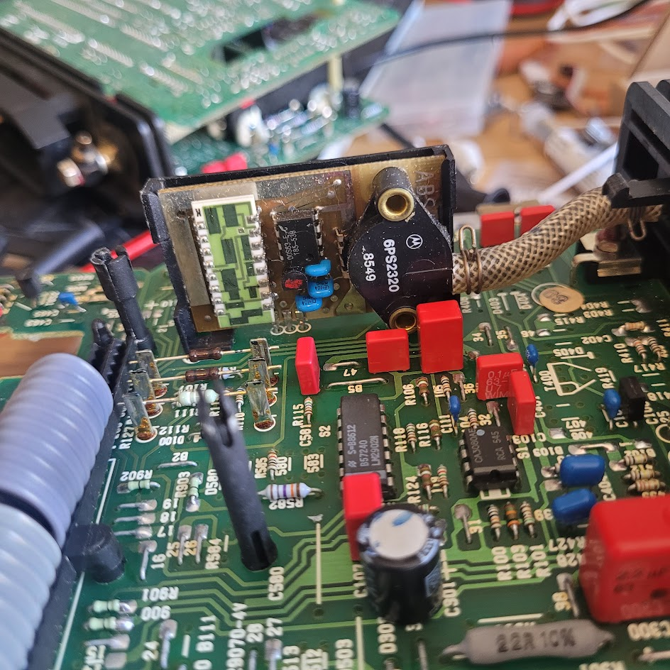
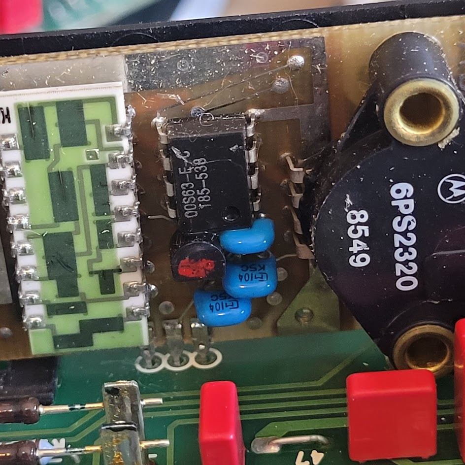
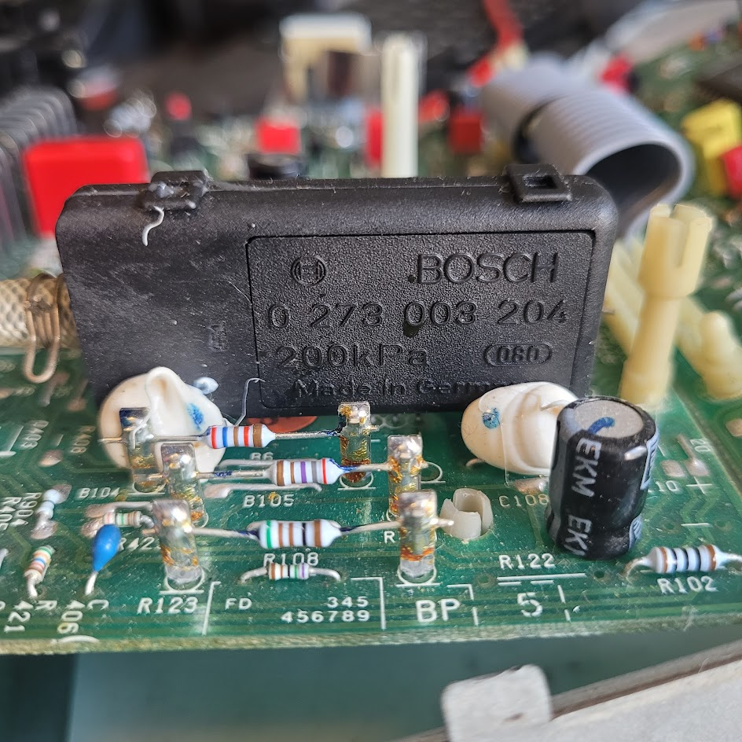

# KLR master memory map

## Byte variables

Location | Purpose
---------|--------
24h | engine speed (complemented from r6; literally the number of 87us timer ticks per 180 degrees)
2Eh | battery voltage
2Fh | knock sensor (noise level diagnostics)
39h | throttle position (power supply)
3Ah | throttle position (degrees)
3Ch | throttle position (raw)
3Fh | ??
38h | ??
46h | knock sensor (proper)
24h | engine speed (in timer ticks per 180 degrees)
51h | target boost read from map
52h | current MAP pressure
53h | target boost, low-pass filtered (51h->55h->52h)
55h:56h | intermediate target boost for filtering
33h | current blink code
22h | angle to begin ADC initialization routine (in timer ticks)
23h | angle to read ADC (after 22h, in timer ticks)
44h | rpm range (map axis 60 means < ~1842rpm, 0 means > 6068rpm)
43h | throttle position (map axis; 0 means <53 deg., 1 means 53 deg., 28 means >= 81 deg.)
70h - 73h | per-cylinder timing delay
74h - 7Bh | per-cylinder knock threshold
60h | boost control PID error (target boost - actual boost)
61h | boost control PID I term (centered on 128)
62h | boost control PID D term (spool assist, centered on 128)
63h | boost control PID final output (2's cpl signed)
64h | D-term peak value
65:66 | D-term filtered value (trails the peak to provide smooth decay)
67h | boost control PID trim/slow-I term (centered on 128)
68h | boost control feedforward value (CV duty cycle)
41h | final CV duty cycle
57h | total boost reduction for knock control (increments of 5)

### Blink Code Error Counters

Location | Error Type
---------|-----------
30h|    knock/MAP
35h|    boost high/low
36h|    TPS/TPS power supply

## RPM Dependant Constants

These are loaded from a series of 2D maps (rpm only) located at 0x925. 

Location | Purpose
---------|---------
0x2A|    for calculating the angle to start ADC stuff (22h)
0x2B|    for calculating the angle for ADC read (23h)
0x47|    coefficient for knock threshold (comparison with 46h)
0x4A|    cycle count before restoring 0.3 deg. timing (49h)
0x50|    cycle count before restoring boost (15 to 37)
0x4E|    cycle count before pulling boost (31 to 125)
0x4B|    max timing retard (18 dec. for all rpm)
0x48|    throttle position threshhold for knock control
0x4C|    threshold for pulling boost
0x3E|    angle for WOT (set to 66 decimal for all rpm)
0x45|    minimum knock threshold value (10 for all rpm)
0x69|    counter for 6A (set to 4 for all rpm)


## Units

### Cycling valve PWM
The cycling valve PWM signal is handled by the timer interrupt routine, which runs at 87us ticks. Within the cycling valve logic in the timer interrupt routine, the on and off time are each maintained for a futher 4 counts. The period is 193, and ```193*4*87 = 67164us``` which corresponds to ~14.8Khz. So that's the PWM frequency, and the duty cycle values from the map can just be divided by 193. The final CV output processing caps the on time to 177, or about 92%. 

### Throttle position

Here's some quick reference info; for a detailed explanation of the TPS processing logic, read [this](klr_tps_processing.md). 

The variable __3Ah__ represents the throttle angle in degrees. But most of the code including map lookups use __44h__. This is just the angles from 53 to 81 degrees mapped to the range 0-28, without scaling. Thus we have

TPS angle (deg.) | 44h
-----------------|----
0 - 52 | 0
53 | 1
54 | 2
... | ...
81 -90 | 28

So we have 29 values in total, with 0 meaning "below 53 deg.". The remaining 28 values are the values that are actually used for the cycling valve PWM; there's __no CV activity below 53 degrees__.

The maps typically use just 7 throttle angle values - this is achieved by just dividing 44h by 4 (rrc twice) before using it to look up a map value. But in many other places, 44h is used for threshold checks, and in those cases it's generally used as the full 28-value range.

The wide-open-throttle signal is sent to the DME when __3A>= 66__. That means WOT is active __above 65 degrees__. People frequencyly confuse degrees with percent. This angle is about __72%__ of the full throttle opening.

### RPM

Reference info on the RPM range variable, 43h. More detail can be found in:

* [How the KLR Measures Engine Speed](speed_measurement.md) 

* [RPM Map Axis](rpm_axis.md) (Note: *these measurements didn't take account of the fact that there's a few timer ticks of latency in the trigger routine before the raw speed measurement is processed, so they're a little high - fixing that is on my to do list.*)

The KLR code uses a map to convert the raw timer-ticks-per-180-degrees measurement (__24h__) into a value from 0-60, where 0 represents the highest rpm range and 60 the lowest. The rpm ranges are not evenly spaced! Instead, they're smaller where the boost curve needs the best resolutoin, and larger where it's mostly straight. 

As with the TPS ranges, 0 is treated as a special one, leaving a total of 60 ranges, which can then be divided by 4 for map lookups, so that the maps actually have 15 rpm breakpoints. 

Every time the trigger routine runs, it takes the value from the timer counter and stores it as the raw engine speed measurement, in 24h. But it doesn't do this *immediately*. There's a few dozen instructions first. It's not worth counting exactly how many cycles there are - it's about 2.6 timer ticks worth. These ranges I've shown below take account of that latency in the trigger routine, so they should be about as accurate as we can realistically get: 

| Engine speed (RPM) | 44h | [24] ticks |
|---|---:|---:|
| 1832 - 1872 | 59 | 181 - 184 |
| 1872 - 1913 | 58 | 177 - 180 |
| 1913 - 1957 | 57 | 173 - 176 |
| 1957 - 2003 | 56 | 169 - 172 |
| 2003 - 2050 | 55 | 165 - 168 |
| 2050 - 2101 | 54 | 161 - 164 |
| 2101 - 2153 | 53 | 157 - 160 |
| 2153 - 2208 | 52 | 153 - 156 |
| 2208 - 2252 | 51 | 150 - 152 |
| 2252 - 2297 | 50 | 147 - 149 |
| 2297 - 2344 | 49 | 144 - 146 |
| 2344 - 2393 | 48 | 141 - 143 |
| 2393 - 2444 | 47 | 138 - 140 |
| 2444 - 2497 | 46 | 135 - 137 |
| 2497 - 2553 | 45 | 132 - 134 |
| 2553 - 2611 | 44 | 129 - 131 |
| 2611 - 2672 | 43 | 126 - 128 |
| 2672 - 2736 | 42 | 123 - 125 |
| 2736 - 2803 | 41 | 120 - 122 |
| 2803 - 2873 | 40 | 117 - 119 |
| 2873 - 2922 | 39 | 115 - 116 |
| 2922 - 2972 | 38 | 113 - 114 |
| 2972 - 3025 | 37 | 111 - 112 |
| 3025 - 3079 | 36 | 109 - 110 |
| 3079 - 3135 | 35 | 107 - 108 |
| 3135 - 3193 | 34 | 105 - 106 |
| 3193 - 3254 | 33 | 103 - 104 |
| 3254 - 3316 | 32 | 101 - 102 |
| 3316 - 3382 | 31 | 99 - 100 |
| 3382 - 3450 | 30 | 97 - 98 |
| 3450 - 3520 | 29 | 95 - 96 |
| 3520 - 3594 | 28 | 93 - 94 |
| 3594 - 3671 | 27 | 91 - 92 |
| 3671 - 3751 | 26 | 89 - 90 |
| 3751 - 3834 | 25 | 87 - 88 |
| 3834 - 3922 | 24 | 85 - 86 |
| 3922 - 4013 | 23 | 83 - 84 |
| 4013 - 4109 | 22 | 81 - 82 |
| 4109 - 4210 | 21 | 79 - 80 |
| 4210 - 4316 | 20 | 77 - 78 |
| 4316 - 4371 | 19 | 76 - 76 |
| 4371 - 4427 | 18 | 75 - 75 |
| 4427 - 4485 | 17 | 74 - 74 |
| 4485 - 4544 | 16 | 73 - 73 |
| 4544 - 4605 | 15 | 72 - 72 |
| 4605 - 4667 | 14 | 71 - 71 |
| 4667 - 4732 | 13 | 70 - 70 |
| 4732 - 4798 | 12 | 69 - 69 |
| 4798 - 4935 | 11 | 67 - 68 |
| 4935 - 5081 | 10 | 65 - 66 |
| 5081 - 5236 | 9 | 63 - 64 |
| 5236 - 5401 | 8 | 61 - 62 |
| 5401 - 5487 | 7 | 60 - 60 |
| 5487 - 5576 | 6 | 59 - 59 |
| 5576 - 5668 | 5 | 58 - 58 |
| 5668 - 5763 | 4 | 57 - 57 |
| 5763 - 5861 | 3 | 56 - 56 |
| 5861 - 5963 | 2 | 55 - 55 |
| 5963 - 6068 | 1 | 54 - 54 |
| 6068 and up | 0 | [24] <= 53 |

### MAP
There are two different MAP sensors used in the KLRs. The early version used a daughter board with a Motorola transducer (probably an [MPX200](reference/MPX201.PDF)) along with various other componenets. The later version used a __Bosch 0 273 003 204 200 (200kpa)__ sensor in a plastic case. 

Here's the early one:





And here's the later Bosch one:



I'm not sure if they're interchangeable. But the presence of those resistors installed on the standoffs suggest that they might have been hand picked to match the individual MAP sensor. The relevant code seems to be identical though. 

There's presumably no datasheet for the early one, being a custom design, but there is a [datasheet](reference/0273 003 204.pdf) for the later Bosch one. It gives a formula for the output voltage:

```((4.55 * P_abs)/180) - 0.256```

(assuming a 5v reference, which it has in the KLR). 

So we should see ~2.271v for 100kpa. 

The early one appears to be close to this. For instance, on an early version, at rest, I saw ```2.21 - 2.24``` from the map sensor, when the ambient pressure should have been in the neighborhood of 100kpa.

With both versions, the signal is reduced by a voltage divider and  we see the value at Channel 4 (pin 2) at around ~0.94x the raw map sensor output. That would give us around ```2.145v``` at the ADC input, or around __109__ units. 

#### Transfer function

I did some tests with some early KLRs I have (numbers #2 and #3). I used a Mityvac and checked the calibration against a modern MAP sensor, a MPX4250. 

Using KLR #3, we had 100kpa = 2.089v and 175kpa = ~3.87 (after correcting for the calibration of the mityvac based on the MPX4250) we can work out the slope and offset:

```
m = (3.872 - 2.089)/(175-100) = 0.02375
b = 2.089 - 100m ~= -0.286
```

Again, with the corrected data for KLR #2:

```
m = (3.906 - 2.115)/(175-100) = 0.02388
b = 2.115 - 100m ~= -0.272
```

So the 2 MAP sensors have essentially identical slope and the offset is about 13mv different, not enough to really matter. 

The datasheet for the later Bosch sensor predicts

```
(((4.55 * 175)/180) - 0.256)
```

...and attenuating this by the divider ratio ~0.945 (based on comparing the sensor voltage to the ADC input voltage) gives 3.938, so very close. This would be about 1.5 units higher than the higher of the 2 early units, and about 3 units higher than the other one. 

So my best guess here is that the early and late sensors are intended to have exactly the same transfer function, and my examples vary a bit, almost entirely in the offset. 

So we know the offset is in the order of 14 units (hard to say if the Bosch offset is deliberately lower or just tolerance) and we also add 10 in the MAP routine. So the final offset is -4 units. 

This comes out to something like

```x = 1.22 * P - 4```

where P is pressure in kpa and x is ADC units

Then

```
P = (x+4) / 1.22
```

For example, we know that KLR #3 showed 3.872v for 175kpa, s;

```
>>> 256 * (3.872/4.985)
198.84292878635907
```

Then the MAP routine adds 10 to get 208.8

Using our formla:

```
>>> 1.22 * 175-4
209.5
```

The discrepancy is due to the fact that 4 is an approximation for the offset, since we have variations in the real values and the Bosch datasheet. 


Putting all this together gives us something very close to __1kpa = 1.22 units__ in the software. Here are some important numbers assuming that's true:

* overboost threshold: 32 = 0.26 bar
* underboost threshold: 55 = 0.45 bar (early KLR) 64 = 0.53 bar (late KLR)
* boost reduction for knock: 5 = 0.042 bar

(The service manual quotes exactly 0.45 as the underboost threshold. The Technik document doesn't specify over/underboost thresholds but does say that boost reduction for knock is "*taken back in steps of 30 to 50 mbar (0.030 to 0.050 bar)....*".


## Maps

### Boost

* '86:

| Throttle% \ RPM | 0 | 1864 | 2041 | 2254 | 2446 | 2674 | 2948 | 3164 | 3415 | 3708 | 4057 | 4479 | 4724 | 4998 | 5653 | 6050 |
|---|---|---|---|---|---|---|---|---|---|---|---|---|---|---|---|---|
| 57.0 | 137 | 141 | 144 | 145 | 145 | 146 | 146 | 148 | 148 | 148 | 150 | 150 | 150 | 152 | 152 | 152 |
| 61.3 | 139 | 141 | 145 | 151 | 154 | 157 | 157 | 158 | 158 | 158 | 158 | 158 | 158 | 158 | 158 | 158 |
| 65.6 | 139 | 141 | 148 | 157 | 164 | 167 | 167 | 170 | 170 | 170 | 167 | 167 | 166 | 165 | 165 | 165 |
| 69.9 | 141 | 142 | 159 | 170 | 177 | 180 | 180 | 180 | 180 | 180 | 177 | 177 | 174 | 171 | 171 | 171 |
| 74.2 | 143 | 145 | 171 | 183 | 190 | 190 | 190 | 190 | 190 | 190 | 188 | 185 | 180 | 178 | 177 | 177 |
| 78.5 | 145 | 152 | 180 | 204 | 203 | 202 | 201 | 201 | 200 | 199 | 197 | 193 | 186 | 182 | 180 | 180 |
| 82.8 | 145 | 152 | 180 | 204 | 203 | 202 | 201 | 201 | 200 | 199 | 197 | 193 | 186 | 182 | 180 | 180 |
| 87.1 | 145 | 152 | 180 | 204 | 203 | 202 | 201 | 201 | 200 | 199 | 197 | 193 | 186 | 182 | 180 | 180 |

* '87:

| Throttle% \ RPM | 0 | 1864 | 2041 | 2254 | 2446 | 2674 | 2948 | 3164 | 3415 | 3708 | 4057 | 4479 | 4724 | 4998 | 5653 | 6050 |
|---|---|---|---|---|---|---|---|---|---|---|---|---|---|---|---|---|
| 57.0 | 137 | 141 | 144 | 145 | 145 | 146 | 146 | 148 | 148 | 148 | 150 | 150 | 150 | 152 | 152 | 152 |
| 61.3 | 139 | 141 | 145 | 151 | 154 | 157 | 157 | 158 | 158 | 158 | 158 | 158 | 158 | 158 | 158 | 158 |
| 65.6 | 139 | 141 | 148 | 157 | 164 | 167 | 167 | 170 | 170 | 167 | 167 | 167 | 166 | 165 | 165 | 165 |
| 69.9 | 141 | 142 | 159 | 170 | 177 | 180 | 180 | 180 | 180 | 177 | 176 | 175 | 174 | 171 | 171 | 171 |
| 74.2 | 143 | 145 | 171 | 190 | 193 | 193 | 193 | 193 | 193 | 191 | 188 | 186 | 184 | 182 | 180 | 180 |
| 78.5 | 145 | 152 | 180 | 206 | 208 | 209 | 208 | 207 | 207 | 206 | 202 | 198 | 193 | 188 | 185 | 185 |
| 82.8 | 145 | 152 | 180 | 206 | 208 | 209 | 208 | 207 | 207 | 206 | 202 | 198 | 193 | 188 | 185 | 185 |
| 87.1 | 145 | 152 | 180 | 206 | 208 | 209 | 208 | 207 | 207 | 206 | 202 | 198 | 193 | 188 | 185 | 185 |

* '89/S:

| Throttle% \ RPM | 0 | 1864 | 2041 | 2254 | 2446 | 2674 | 2948 | 3164 | 3415 | 3708 | 4057 | 4479 | 4724 | 4998 | 5653 | 6050 |
|---|---|---|---|---|---|---|---|---|---|---|---|---|---|---|---|---|
| 57.0 | 137 | 141 | 144 | 145 | 145 | 146 | 146 | 148 | 148 | 148 | 150 | 150 | 150 | 152 | 152 | 152 |
| 61.3 | 139 | 141 | 145 | 151 | 154 | 157 | 157 | 158 | 158 | 158 | 158 | 158 | 158 | 158 | 158 | 158 |
| 65.6 | 139 | 141 | 148 | 157 | 164 | 167 | 167 | 170 | 170 | 167 | 167 | 167 | 166 | 165 | 165 | 165 |
| 69.9 | 141 | 142 | 159 | 170 | 177 | 180 | 180 | 180 | 180 | 177 | 176 | 175 | 174 | 171 | 171 | 171 |
| 74.2 | 143 | 145 | 171 | 190 | 193 | 193 | 193 | 193 | 193 | 191 | 188 | 186 | 184 | 182 | 180 | 180 |
| 78.5 | 145 | 152 | 180 | 206 | 206 | 206 | 206 | 206 | 206 | 208 | 206 | 206 | 206 | 206 | 206 | 194 |
| 82.8 | 145 | 152 | 180 | 206 | 206 | 206 | 206 | 206 | 206 | 208 | 206 | 206 | 206 | 206 | 206 | 194 |
| 87.1 | 145 | 152 | 180 | 206 | 206 | 206 | 206 | 206 | 206 | 208 | 206 | 206 | 206 | 206 | 206 | 194 |

### Cycling valve duty cycle:

* '86

| Throttle% \ RPM | 0 | 1864 | 2041 | 2254 | 2446 | 2674 | 2948 | 3164 | 3415 | 3708 | 4057 | 4479 | 4724 | 4998 | 5653 | 6050 |
|---|---|---|---|---|---|---|---|---|---|---|---|---|---|---|---|---|
| 57.0 | 38 | 38 | 38 | 38 | 38 | 38 | 38 | 38 | 38 | 38 | 38 | 38 | 38 | 38 | 38 | 38 |
| 61.3 | 57 | 57 | 57 | 57 | 57 | 57 | 57 | 57 | 57 | 57 | 57 | 54 | 54 | 48 | 48 | 48 |
| 65.6 | 76 | 76 | 76 | 76 | 76 | 76 | 76 | 76 | 76 | 73 | 73 | 69 | 67 | 61 | 58 | 58 |
| 69.9 | 115 | 115 | 115 | 115 | 115 | 109 | 108 | 106 | 104 | 100 | 96 | 86 | 76 | 73 | 69 | 77 |
| 74.2 | 154 | 154 | 154 | 154 | 138 | 125 | 121 | 117 | 115 | 111 | 108 | 102 | 94 | 88 | 81 | 92 |
| 78.5 | 191 | 191 | 191 | 175 | 161 | 148 | 144 | 138 | 134 | 129 | 125 | 121 | 109 | 104 | 100 | 115 |
| 82.8 | 191 | 191 | 191 | 175 | 161 | 148 | 144 | 138 | 134 | 129 | 125 | 121 | 109 | 104 | 100 | 115 |
| 87.1 | 191 | 191 | 191 | 175 | 161 | 148 | 144 | 138 | 134 | 129 | 125 | 121 | 109 | 104 | 100 | 115 |

* '87 and '89/S:

| Throttle% \ RPM | 0 | 1864 | 2041 | 2254 | 2446 | 2674 | 2948 | 3164 | 3415 | 3708 | 4057 | 4479 | 4724 | 4998 | 5653 | 6050 |
|---|---|---|---|---|---|---|---|---|---|---|---|---|---|---|---|---|
| 57.0 | 38 | 38 | 38 | 38 | 38 | 38 | 38 | 38 | 38 | 38 | 38 | 38 | 38 | 38 | 38 | 38 |
| 61.3 | 57 | 57 | 57 | 57 | 57 | 57 | 57 | 57 | 57 | 57 | 57 | 54 | 54 | 48 | 48 | 48 |
| 65.6 | 76 | 76 | 76 | 76 | 76 | 76 | 76 | 76 | 76 | 73 | 73 | 69 | 67 | 61 | 58 | 58 |
| 69.9 | 115 | 115 | 115 | 115 | 115 | 109 | 108 | 106 | 104 | 100 | 96 | 90 | 84 | 81 | 81 | 81 |
| 74.2 | 154 | 154 | 154 | 154 | 154 | 146 | 142 | 138 | 134 | 131 | 127 | 123 | 119 | 115 | 115 | 115 |
| 78.5 | 191 | 191 | 191 | 191 | 191 | 182 | 173 | 169 | 165 | 161 | 157 | 150 | 146 | 142 | 146 | 150 |
| 82.8 | 191 | 191 | 191 | 191 | 191 | 182 | 173 | 169 | 165 | 161 | 157 | 150 | 146 | 142 | 146 | 150 |
| 87.1 | 191 | 191 | 191 | 191 | 191 | 182 | 173 | 169 | 165 | 161 | 157 | 150 | 146 | 142 | 146 | 150 |

### PID gain

* all models:

| Throttle% \ RPM | 1864 | 2254 | 2674 | 3164 | 3708 | 4479 | 4998 | 6050 |
|---|---|---|---|---|---|---|---|---|
| 57.0 | 227 | 227 | 231 | 234 | 230 | 230 | 233 | 233 |
| 65.6 | 227 | 195 | 167 | 138 | 134 | 166 | 169 | 201 |
| 74.2 | 227 | 131 | 103 | 106 | 102 | 134 | 137 | 169 |
| 82.8 | 227 | 163 | 103 | 106 | 102 | 134 | 169 | 201 |

