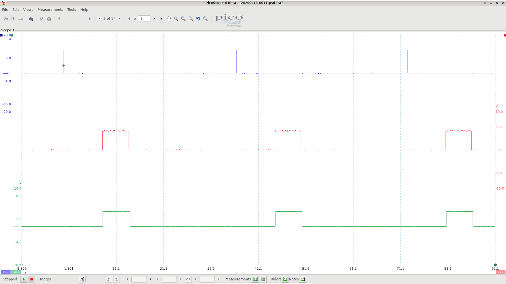

# KLR Signal Timing

 *KLR trigger and ignition signals*

This scope trace shows the 3 most important signals as far as the KLR is concerned; without these 3 signals, the car cannot run. They are:

* the trigger signal from the DME (blue trace)

* the ignition input signal, from the DME (red trace)

* the ignition output, to the DME (green trace)

The probe for the trigger (blue) is hooked up to __pin 24__ of the KLR connector. The probe for the ignition input (red) is hooked up to __pin 39 (T1)__ on the 8048. The ignition output (green) is from __pin 38 (P2.7)__. See the pin assignments document for more info. 

The DME sends the trigger signal ~11 degrees before ignition; it then pulls the ignition signal high to begin the dwell period, and low to fire the coil. The KLR must return this signal, either unchanged (if there's no knocking) or delayed (if there is knocking). (Note: the DME's processor does not receive this returned ignition signal. It only goes back to the DME enclosure because that's where the coil driver circuit is located).

There is one very important timing component *not* shown here: the timer interval. The 8048 has a single asynchronous timer that's set up to  generate an interrupt every __87us__ (or __174us__ when below 1500rpm). To put this in perspective, the timer interrupt will run many times between each trigger pulse (blue trace). Even at the highest rpm there would be over 50 timer interrupts between 2 trigger pulses. 

When the trigger signal is pulsed, the 8048 gets reset and starts executing code at location __0x000__. In general, the 8048's RAM is not affected by the reset; it just affects the program counter and various configuration registers. So the reset feature is really being used as a sort of pseudo external interrupt. There's only one true external interrupt, which is used by the ignition input signal. 

When the ignition input signal (red) goes *low*, an external interrupt is triggered, and execution jumps to the ext int routine at location __0x003__. An interrupt is *not* triggered by the rising edge of the ignition input - only the falling edge.  More info on the way 8048 interrupts and resets work can be found in the Intel MCS48 pdf document. 

The ignition output signal (green) is generated by the code in the timer interrupt routine located at __0x007__. You might expect that the falling edge of the ignition output signal would be generated in the external interrupt routine, when the input signal falling edge occurs. But actually it happens in the timer routine, because the timer is needed to measure a preceise timing delay when knocking occurs. This has the unfortunate side effect that the KLR can never return the signal without a certain delay, and this delay must always be a little longer than the timer interval. This must have been taken into account when the DME timing maps were created.

