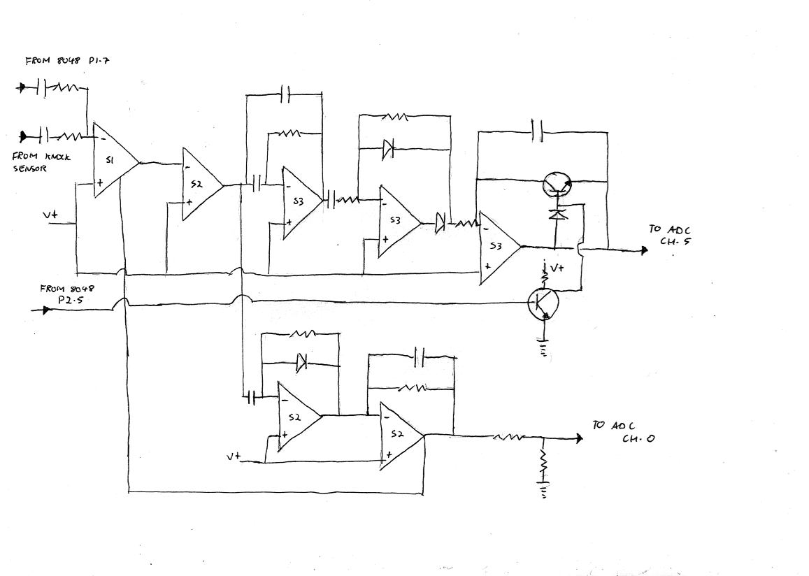
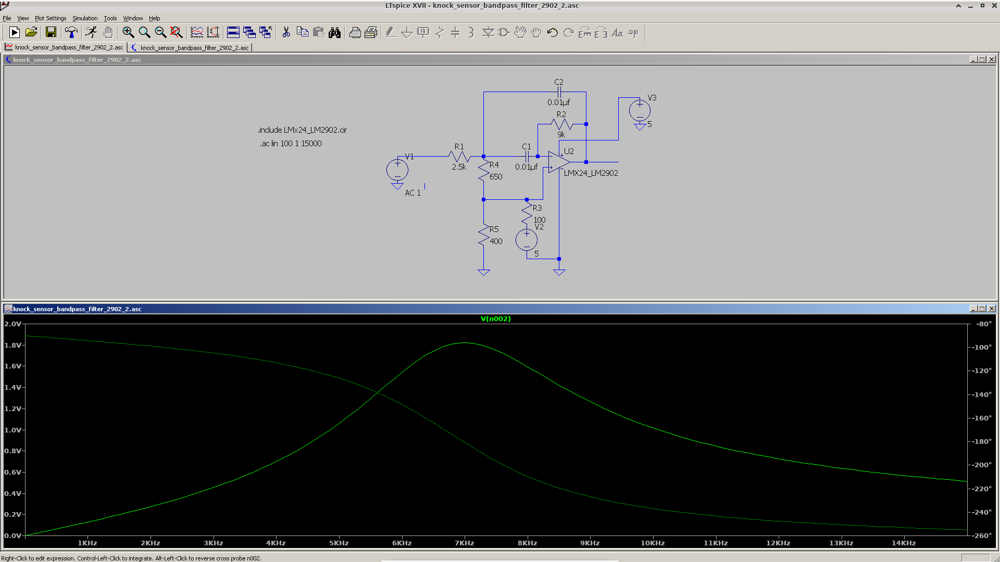
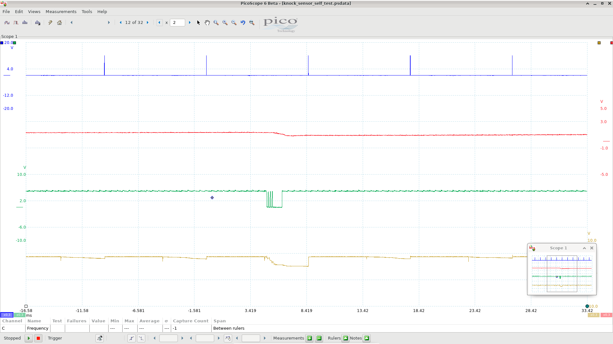
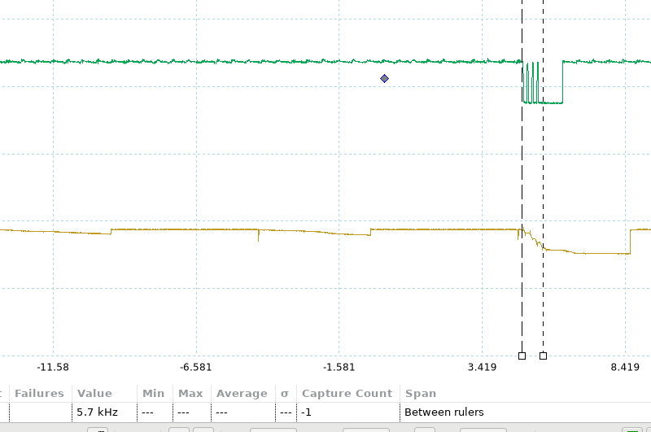

# Knock Detection Hardware

In this section we'll see how the hardware side of the knock sensing system works. The knock system is the only part of the KLR circuitry that's not extremely simple, and even then it's not hugely complicated. 

## Schematic Diagram

Here's a *very* rough hand drawn diagram showing the signal conditioning stages for the knock sensor. Apologies for the nastiness of this drawing; I haven't finished working out an accurate schematic yet, and I wanted to get something up on the site that gives you a rough idea of what's going on. So I haven't bothered to show the component values. The op amp biasing shown here is also a simplification. I just wanted to show you the configuraiton of each amplifier stage:

Hopefully this picture is enough to help illustrate what each stage does. I've kept the IC numbers from the original board. 

The first stage (S1) is a [CA3080](reference/ca3080_marked_as_710.pdf) *operational transconductance amplifier* (OTA). The input from the knock sensor goes into the inverting input. Also note that the 8048 has a connection to this input; that's for the self-test feature that we'll discuss later. 

All the subsequent stages are op amps from a pair of LM2902 (quad op amp) ICs. S2 is on the board that the harness connects to, and S3 is on the other board (below the ADC). The knock sensor amplifier uses 3 op amps from each LM2092. That leaves 2 op amps *not* used for the knock sensor - one from each LM2902. We might as well dispense with these 2 here and now: one (from S2) is used for the MAP sensor signal (to the boost guage in the dashboard), and the other is unused. This covers it completely for op amps in the KLR. 

So let's get into the remaining stages of our knock sensor amplfier now. 

The second stage filters out high frequency noise and buffers the signal from the OTA. The OTA actually outputs current rather than voltage, so this op amp turns it into a voltage. 

At this point the amplifier splits into two sections, each with it's own output to the ADC. We'll discuss the section at the bottom of the diagram first. That section is used for 2 things:

1. Detecting a missing or broken knock sensor

2. Detecting excessive engine noise (bad bearings, lifters etc.)

The upper section is used for detecting actual engine knock. We'll look at that one afterwards. 

## Noise Level

The first stage of the bottom section is just a half-wave rectifier; it removes the negative going portion of the signal. Usually there would be a second diode here. For some reason they left it out, but it doesn't make a huge difference. 

The next stage (still in the bottom section) is just a low-pass filter that turns the pulses from the recitifer into a more or less constant voltage. 

So the final output of this lower section is a voltage that indicates the strength of the knock sensor signal! 

A few things need to be noted here:

* the final stage is *inverting*, so the stronger the knock sensor signal, the lower the voltage at this output. 

* The output goes through a 0.5 voltage divider, so it really ranges from 2.5v (weak signal) to 0v (strong signal). This is important because all ADC channels use the same reference voltage (5v) so the code must take into account that the highest value on this channel is 128, not 255. 

* The output of this final stage feeds back into the OTA at pin 5. This is the input bias current for the OTA and I believe it acts as as automatic gain control. Weaker signals will be amplified more, stronger signals less. 

* perhaps most importantly: __the signal from the knock sensor is not filtered at all before this final low-pass filter stage__. This means that the output of this section of the amplifier is based on everything that the knock sensor "hears". I'm not sure what the frequency range of the sensor is, but it's probably at least the audio range (up to 20Khz or so). So this is just a general noise level measurement - __it can't distinguish true detonation from any other noise source__!

This knock sensor signal strength indicator goes to channel 0 of the ADC. If this voltage is very close to 2.5v, that tells the 8048 that there's very little signal coming from the knock sensor. The blink code routine interprets this as a missing or broken knock sensor (blink code 2-2).

If the voltage is very low, that indicates that the signal from the knock sensor is unusually strong. The blink code routine interprets this condition as a noisy engine (blink code 2-1).

## Knock Detection

Now let's backtrack to the second amplifier stage again - we see that its output goes into the first of the S3 op amps. This one is configured as a bandpass filter. I haven't shown the component values (I will when I produce a proper schematic) but from testing I found that the filter is tuned to pass signals from about 5.5Khz up to around 8Khz, centred around 7Khz (it's not perfecly symmetrical). 

This is a very important stage - it's is how actual knocking (detonation) is distinguished from everything else!

A few words about the actual frequency range of the filter: engine knock is generally around the 5 - 7Khz range. there's a [popular formula](https://www.haltech.com/knock-control/) among tuners on the internet for calculating the frequency of the knock signal for an engine based on it's cylinder bore:

> Knock Frequency = 900,000/(π×0.5 × cylinder bore diameter )

For a 100mm bore this gives approximately 5.7Khz. I can't personally vouch for the validity of this formula, but it is probably not a coincidence that the code in the KLR uses exactly 5.7Khz as the frequency for the test signal during the knock amplifier self-test (more on that below). 

[This paper](reference/spra039.pdf) from Texas Instruments is also well worth a read - here's a relevant quote (emphasis added):

> When engine knock occurs, a shock wave is generated inside the combustion chamber. The shock wave excites a characteristic frequency in the engine, which is typically in the __5 kHz–7 kHz__ range. Cylinder borediameter  and  combustion  chamber  temperature  are  the  main  variables  that  affect  this  fundamental frequency. Variations in the fundamental frequency for a given engine configuration can be as much as± 400 Hz. Larger diameters and/or lower temperatures result in a lower fundamental frequency

So the passband of our filter seems to be pretty much spot on for engine knock, according to Texas Intstruments, and the all-knowing internet - good enough for me! From my experiments with a signal generator, it's actually at its most sensitive at 7Khz, but that could be deliberate. Note the above paper says that lower temperatures result in a lower frequency. So maybe Porsche were allowing for higher temperatures that might push the frequency up. Or maybe it's just not that precise. 

I put together a quick simulation in LTSpice based on the component values used in this filter. It agrees quite well with what I observed with my signal generator and scope, so here's a screenshot showing the response in a sweep from 1Khz to 15Khz (linear scale):

After the filter, we have a rectifier similar to the one from the lower section. But this time both diodes are present which makes it more precise. 

The final stage is an [*integrator*](https://en.wikipedia.org/wiki/Op_amp_integrator). Now, the capcitor in the feedback path is what makes this amp behave as an integrator, but the transistors require a little explanation. Their purpose is to allow the microcontroller to disable/reset the integrator. When the tranistor in the feedback path is "on", then current can flow back to the inverting input, making the amp behave as a follower. When that transistor is "off", it starts to work as an integrator. 

The reason for this reset feature in the integrator is that engine knock occurs within a specific range of angles after top-dead-centre. We need to make sure that the integrator is reset (capacitor discharged) when we're ready to monitor for knock, and then allow the amplifier to integrate for a specific window after TDC. All this anglular timing is done by the code in the ADC read routine for each cylinder. We'll get into that code elsewhere. 

After the appropriate angle, the 8048 reads the volage level from the integrator via the ADC, and later uses it to determine if that cylinder is knocking. As with the other section of the amplifier, this final output is inverted with respect to the original signal, so a lower voltage indicates more noise (in the specific bandpass range of 5.5 - 8 Khz)

Even after this voltage is read by the 8048, that is by no means the end of the story for knock detection. The software part is actually quite sophisticated too, using individual adaptive thresholds for each cylinder. But we'll get into all that in the code section. 

## Self Test

In the schematic, you can see an input to the knock sensor amplifier coming from the 8048. I mentioned that that was for a "self-test" - now we'll look into what that's all about. 

I have to admit that this baffled me when I first saw it in the circuit, but after very careful reading of the code, it evneutally became clear that this is for a special self-test that the KLR performs at regular intervals. I haven't figured out exactly how often the test is run; it varies, and I'm still working on the logic of that. 

Here's how it works: every now and then the 8048 injects a 5.7Khz signal into the knock sensor amplifier input, and then it expects to detect this as knock. If it fails to detect knock after injecting the fake signal, it keeps count of this fact, and after 6 consecutive failed attempts, it throws blink code 2-3 ("Faulty unit; replace"). 

I'd never heard of anything like this before, so I thought it would be cool to hook up an oscillscope and see if I could catch it in the act!

Take a look:

Here's a breakdown of what's happening in this scope capture:

* the blue trace is the trigger signal, just for reference (see the [signal timing](klr_signal_timing.md) section for more information if you're not sure what the trigger signal is.) 

* the red trace is the noise level output (the lower section of the knock sensor amplifier output discussed above)

* the green trace is port 1 bit 7 (pin 34) of the 8048. 

* the tan trace is the output of the integrator, as discussed earlier

Now, if you look carefully at the tan coloured trace, you'll see that it ramps downwards on every ignition cycle, but doesn't get very far before being reset when the trigger pulse occurs. So that's the *normal* amount of knock-frequency noise from each cylinder, when there's no knock (remember, the integrator is an inverting amplifier, so it ramps downwards). 

The action begins when the green trace starts pulsing. This is done by the code in the 8048 (which we'll look at eventually in another section). For now, just remember that this pin on the 8048 is coupled to the input of the OTA - the same place the knock sensor signal goes to. And sure enough, we see the system responding - the integrator's output suddenly spikes much lower than normal - this will be detected as knock, proving that all is well with the circuitry. 

(Note also that the noise level indication (red trace) goes significantly lower in reponse to this induced knock signal. That's not used for detecting knock, but the noise level does affect the way the self test works. When the noise level is *low*, the 8048 generates fewer pulses for the self-test. I haven't figured out exactly why yet; it's by design, but it's a little strange.)

One more thing: here's another image with the measurement cursors showing the frequency of the induced knock signal. The frequency is shown in the bottom left - 5.7Khz, as promised. 

## Summary

We've covered a lot in this page, so let's recap. The knock system has 3 self-diagnosis features:

* if the sensor is missing or open circuit, you get a blink code

* if the engine is so noisy that knock detection would be impossible, you get a blink code

* if anything goes wrong with the knock sensor amplifer, you get a blink code

Clearly the system was designed with the intent that there's __no way for the knock sensing system to fail silently__. The engineers went to a lot of trouble to protect your engine!

Now, for completeness, I have to add that there have been reports on the forums of people who did *not* get the appropriate blink codes when they unplugged the knock sensor. I have no explanation for that so far, but I'm giving it some thought, and I'll post an update when I know more. 

