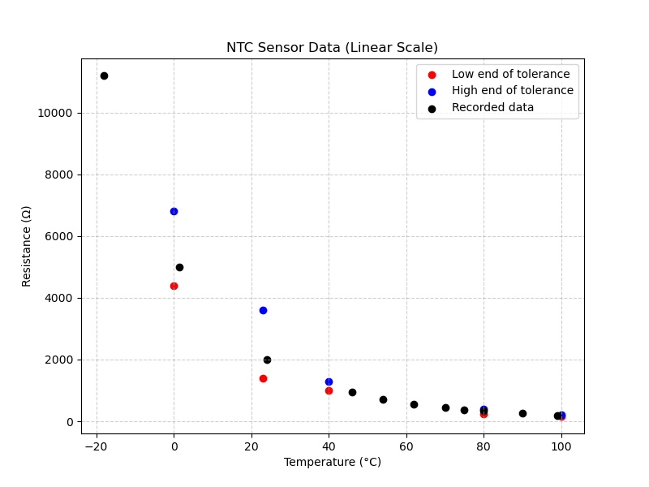
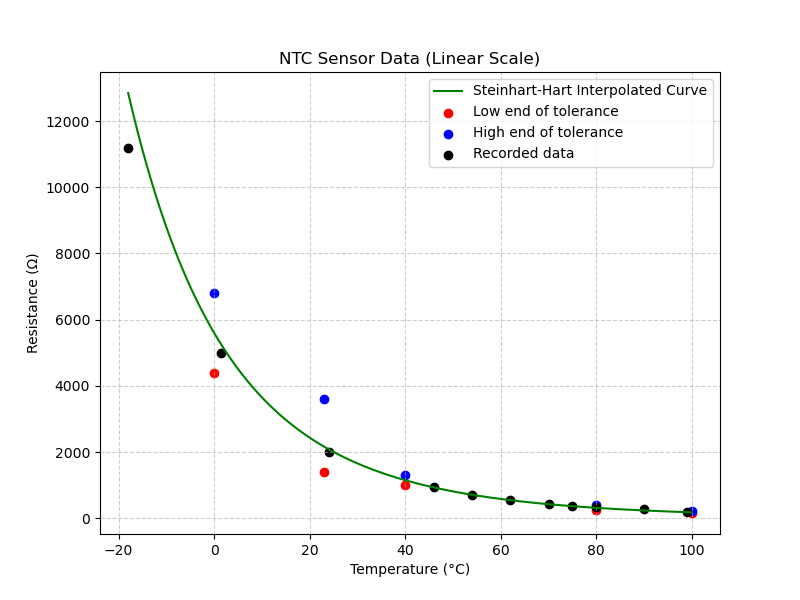
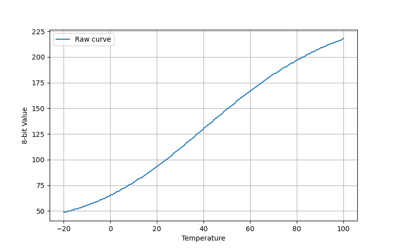
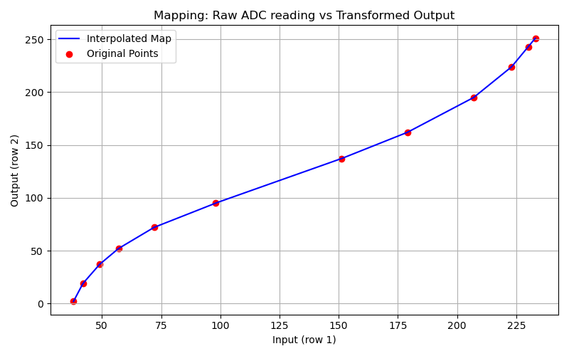
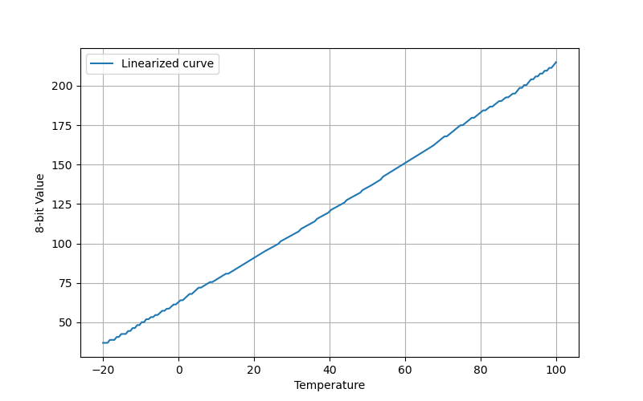

# How the DME reads engine temperature

The DME needs to know engine temperature for lots of things. It's used as an input variable to many of the DME's maps. Here we'll look at how it's measured, and learn how to make sense of the units used. 

## A quick overview. 
The DME gets temperature info from a sensor that's screwed into the block near the front of the engine. It's imersed in the engine coolant. Porsche documentation calls this sensor NTC II - that is, negative temperature coefficient 2. There's also an NTC I - that's the temperature sensor in the airflow meter. 

The NTC is a thermistor, that is a resistor whose reistance varies with temperature. It's wired up to a 5v voltage divider in the DME enclosure, and the output of that voltage divider goes to the ADC (channel 3/pin 1). So the program reads a number between 0 and 255 that represents the engine temperature. 

If that was all there was to it, we would just work out a simple formula to convert between 8-bit units and degrees C and call it a day. But there's a couple of reasons why it's more complicated than that:

1. The "negative" part of NTC; the resistance has an inverse relationship with temperature, and this results in higher temperatures appearing as lower voltages at the ADC, which isn't ideal
2. The relationship between reistance and temperature is highly non-linear. This is a much bigger problem than the inverse relationship!

Next we'll examine these issues in more detail and see how they are overcome in the DME.

## Temperature vs resistance
A good first step is to vizualize this relationship. We have two approaches open to us for this: we can resistance take meaurements from an NTC sensor at various known temperarures, or we can use the info from the Porsche documentation. Let's do both!

The DME/KLR Test Plan gives the following resistance ranges for the sensor:

Temperature (C) | Resistance (k)
----------------|------------
0 | 4.4 - 6.8
15-30 | 1.4 - 3.6
40 | 1.0 - 1.3
80 | .250 - .390
100 | 160 - 210

And I got the following results from testing an NTC sensor in water of various temperatures (and my freezer!):

Temperature ( degrees C) | Resistance (k) 
-------------------------|------------
-18C | 11.2k
1-2C |  5k
24C | 2k
46C | 0.95k
54C | 0.712k
62C | 0.552k
70C | 0.446k
75C | 0.365K
80C | 0.345K
87C | 0.313k
90C | 0.271k
99C | 0.193k

These results are definitely not perfect, especialy considering that some of these temperatures are not that certain (mainly the lower ones where I used crude thermometers). With that said, you can see from the Porsche documentation that the tolerance is very wide. So it's pretty clear that we don't need to be too precise here. 

Nonetheless, when overlayed with the official specs on a plot, it turns out pretty much as expected. In the graph below, we see three plots:

* blue - the upper limit of the allowed range from the official specs quoted above
* red - the lower limit
* black - the measured samples that I took

So far so good!

But it would certainly help with both visualization and with testing the processing logic if we had a smooth curve that passed through the ideal points. There are various ways to join a given set of points with smooth curves, but the simple ones generally will not be an accurate match for the true NTC curve. Fortunately, there is a well-known equation for exactly this purpose, called the Steinhart-Hart equation. It's based on the physical characteristics of thermistors and produces a very accurate interpolation from just 3 known data points. 

I'll leave the details of generating this curve for another time and place, but below is how it looks with the info we already gathered about the sensor, overlayed with the Steinhart-Hart interpolated curve (for the requried 3 known points, I used 3 mid-points between the Porsche spcified tolerances):

It's pretty good except for the very low end of the temperature range. There, the interpolated curve misses my measured data point. But it's very likely that the termometer I used for that wasn't terribly accurate anyway, and we don't have Porsche factory info for anything below 0C. 

## Resistance to voltage

The NTC sensor converts temperature to resistance (inversely). For the ADC to read the value, it needs to be turned into a voltage. From the schamtic of the DME we can see it's a pretty simple setup: the NTC sensor is wired to a voltage divider with a 5v supply. The upper leg is a 1k resistor. The lower leg consists of the parallel resistance of a 6.2k resistor, and the NTC sensor. Thus it's a simple matter to calculate the lower total resistance (using the classic parallel resistor formula R=1/(1/R1 + 1/R_2 + ... + 1/R_n) ) and the equally well known voltage divider formula V = V * R_2/(R_1 + R_2).

## Inversion and Linearization 

Now we have a voltage that varies with temperature, that the ADC can read and turn into an 8-bit number. But it still inverted (i.e. the higher the temperature, the lower the voltage) and more importantly, it's still not linear. This makes it hard to work with when creating maps that depend on temperature. 

Fixing the inversion issue is trivial - we just complement the value from the ADC reading with a cpl instruction. 

Let's take a look at what we have at this point

This is a graph of the raw (but inverted) temperature readings as 8-bit values in the DME code. We're getting somewhere; the values go up as temperature goes up. But that curve is going to make life difficult. 

Solving this problem is harder than the processing done do far: linearizing the reading. The DME does this using a linearization map. This is a map much like any other in the DME's ROM, with one major difference. Most maps take some engine parameter as their input - let's say rpm, and return some other parameter as output, for example spark advance. But this map's job is to transform the engine temp value into an engine temp value, but to change the shape of the curve into a straight line. Immediately after reading and inverting the NTC voltage, the DME calls the map read routine with this linearization map, and replaces the NTC value stored in 13h with the output of the map. 

The linearization map looks like this (with the raw Motronic headings translated into the true breakpoints):

----|----|----|----|----|----|----|----|----|----|----|----|
38 | 42 | 49 | 57 | 72 | 98 | 151 | 179 | 207 | 223| 230| 233 |
2 | 19 | 37 | 52 | 72 | 95 | 137 | 162 | 195| 224| 243| 251	 

(If you would like to see how to extract maps like this one and other from the DME code, check out the [How the Motronic DME Maps Work](dme_map_info.md) section).

What's the best way to visualize this? The best way is probably to show the input and output on linear scales but with the data points from the map like this:

Now take a look at the shape of this curve and compare it to the raw temperature curve above. Do you see how they are more or less oppositely shaped? Don't worry about the scale; that's not meant to match in these images. The shape is the thing! This linearization curve zigs exactly where the temperature curve zags and vice versa. Note that the map routine has interpolation built in so we will get a sane, reasonable output for any input to the linearization map. 

Finally let's take a look at what the linearized 8-bit values look like as a function of temperature:

And there it is, an almost perfectly straight line. It's not 100% perfect, but it's close, and more than good enough. I want to stress that this isn't just a picture of a straight line! This was really generated using the actual NTC data and the actual DME's linearization map. So I didn't cheat, but it came out looking pretty good. 

## Finally a simple formula

I used the resistance values from the Steinhart-Hart function I mentioned earlier, then calculated the final resistance we get from the DME circuit, the voltage that this results in, the 8-bit value this corresponds to, and finally I complemented that value and put it through the linearization map, to get what you see here. 

I also pulled out a couple of specific values from this curve:

Temperature (C) | 0 | 100
----------------|---|----
Curve value | 62.6 | 214.9

With a little reworking of the classic y = mx+b for the slope of a line, we end up with temp = (8-bit value - 62.6) / 1.52. 

This forumla gives really plausible results for the maps I have checked it against and while I'm sure it's not perfect, it's pretty close and it's the best I know how to do theoretically. The reader is reminded of the enormous tolerance range allowed for the NTC sensor; this formula was derived from the ideal values taken right down the middle. 

